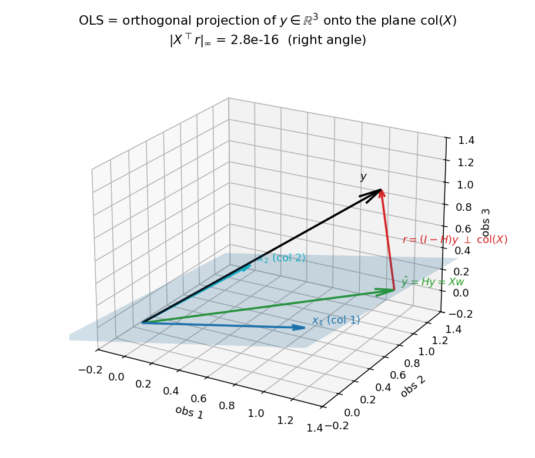
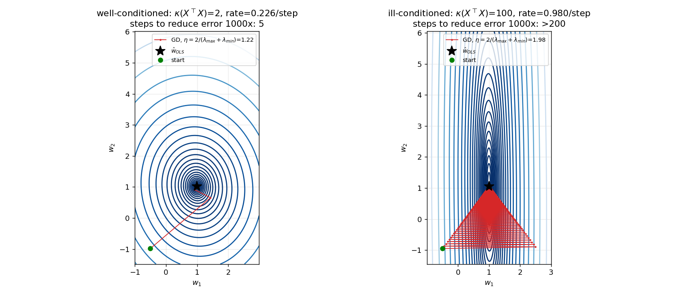
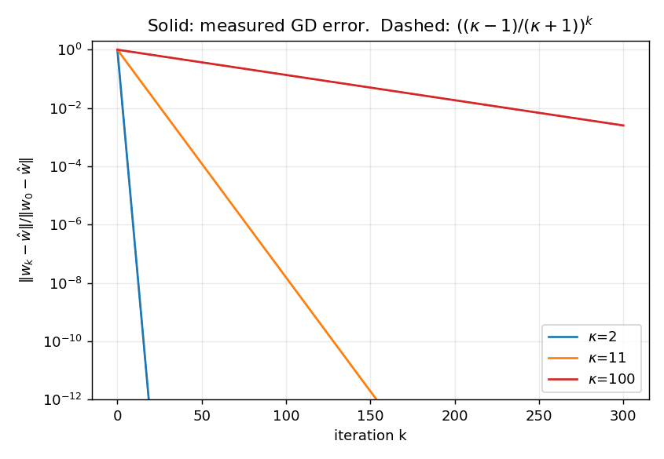
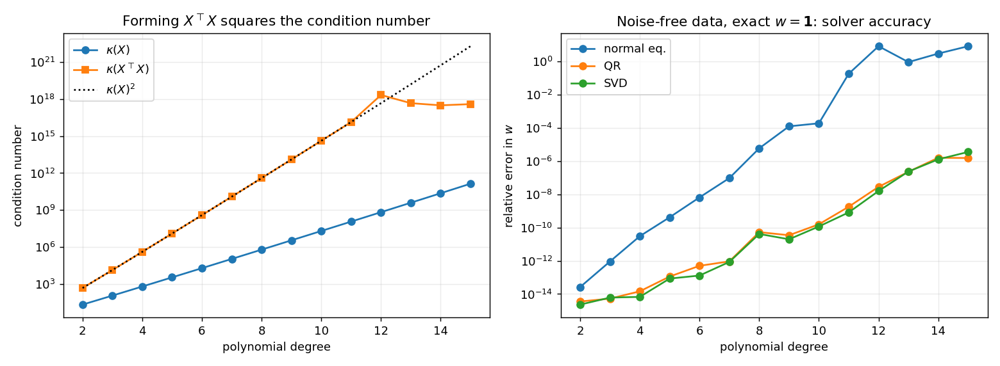
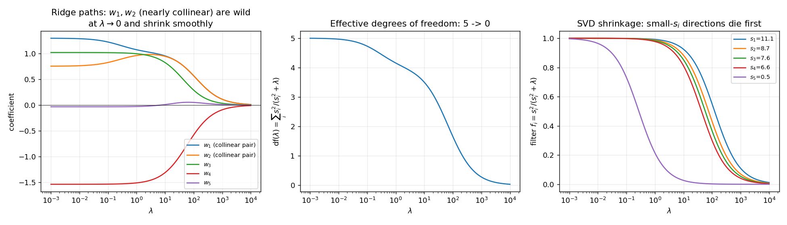
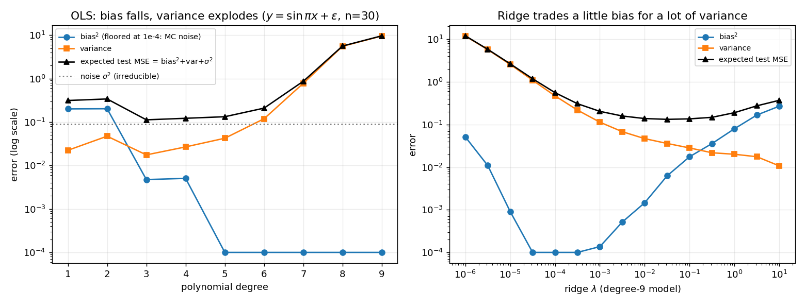
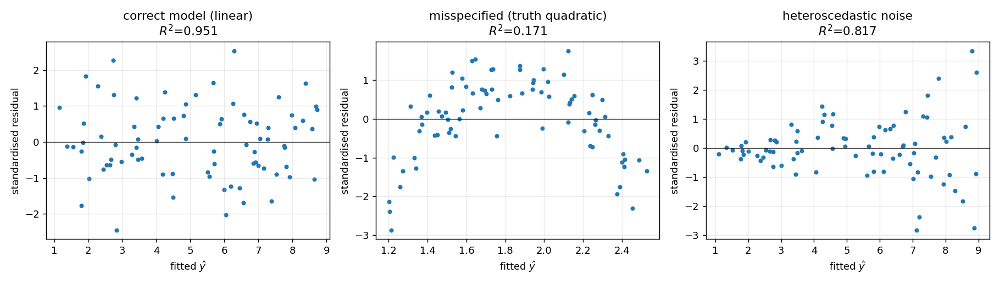
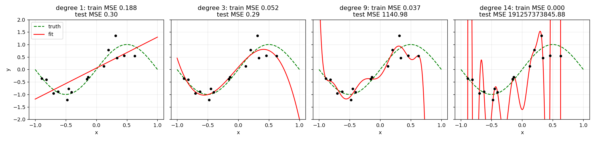

# Linear regression from zero

> **The one-sentence idea.** Fit a straight (hyper)plane to data by choosing the coefficients that make the squared
> prediction errors smallest; geometrically this is *dropping a perpendicular* from the target vector onto the space
> spanned by the features, and every other topic here (gradient descent, QR/SVD, ridge, bias-variance) is a different
> way of computing, stabilising or interpreting that one perpendicular.

Everything is implemented in NumPy in [`src/linear_regression.py`](src/linear_regression.py); every number quoted below is
printed by [`demo.py`](demo.py) or asserted by [`tests/`](tests). Regenerate figures with `python make_figures.py`, run
`python -m pytest tests`, and `python demo.py` (about 2 s).

**Contents.** 0 Motivation - 1 Notation - 2 Model and loss - 3 Normal equations (calculus) - 4 Normal equations (geometry, hat
matrix) - 5 Maximum likelihood - 6 Worked example - 7 Gradient descent - 8 QR, SVD and the squared condition number -
9 Ridge - 10 Bias-variance - 11 R-squared and residual diagnostics - 12 Multicollinearity - 13 Polynomial overfitting -
14 Algorithms - 15 Complexity - 16 Failure modes - 17 Exercises with solutions - 18 Equation-to-code map.

---

## 0. Motivation

We observe $n$ examples, each with $p$ features, and a number $y_i$ to predict. The simplest nontrivial predictor is a
weighted sum of the features. It is (i) the baseline every fancier model must beat, (ii) the local approximation inside
most of machine learning (a Taylor expansion is linear; the last layer of a neural network is linear regression; Gaussian
processes and kernel methods are linear regression in a feature space), and (iii) the one place where the optimum, the
geometry, the statistics and the numerics can all be done completely by hand. Master this and the rest is variations.

## 1. Notation

| Symbol | Meaning | Shape |
|---|---|---|
| $n,\ p$ | number of observations, number of columns of $X$ (intercept column included) | scalars |
| $X$ | design matrix; row $i$ is $x_i^\top$; first column is all ones when there is an intercept | $n\times p$ |
| $y$ | target vector | $n$ |
| $w$, $\hat w$ | coefficient vector, its least-squares estimate; $w_0$ is the intercept | $p$ |
| $\varepsilon$ | noise vector | $n$ |
| $\hat y = X\hat w$ | fitted values | $n$ |
| $r = y-\hat y$ | residual vector | $n$ |
| $L(w)$ | mean-squared-error loss | scalar |
| $H=X(X^\top X)^{-1}X^\top$ | hat (projection) matrix; $h_{ii}$ = leverage | $n\times n$ |
| $\mathrm{col}(X)$ | column space of $X$, a $p$-dimensional subspace of $\mathbb{R}^n$ | |
| $X=U\Sigma V^\top$ | thin SVD, singular values $s_1\ge\dots\ge s_p>0$ | $U:n\times p$ |
| $A=\frac1n X^\top X$ | Hessian of the loss, eigenvalues $\lambda_1\ge\dots\ge\lambda_p>0$ | $p\times p$ |
| $\kappa(\cdot)$ | 2-norm condition number $=$ largest / smallest singular value | |
| $\eta$ | gradient-descent step size (learning rate) | scalar |
| $\lambda$ (ridge) | regularisation strength; do not confuse with eigenvalues $\lambda_i$ of $A$ -- we write $\lambda_i(A)$ for those in Section 7 | scalar |
| $\sigma^2,\ \tau^2$ | noise variance, prior variance | scalars |

Standing assumption unless stated otherwise: $\mathrm{rank}(X)=p\le n$ (full column rank). Section 8 and 12 say what
happens when it fails.

## 2. Model and loss

$$y = Xw+\varepsilon, \qquad \text{i.e. } y_i = w_0 + w_1 x_{i1}+\dots+w_{p-1}x_{i,p-1}+\varepsilon_i \tag{E1}$$

When the noise model matters (Sections 5, 9, 10, 11) we assume

$$\varepsilon \sim \mathcal N(0,\sigma^2 I_n). \tag{E2}$$

Linear means linear in $w$, not in the raw input: a column may be $x^2$, $\sin x$, etc. (Section 13). The intercept is
just a column of ones ([`add_intercept`](src/linear_regression.py#L10)).

We judge a candidate $w$ by the mean squared error (the $\tfrac12$ is a convenience that cancels a 2 in the derivative):

$$L(w)=\frac1{2n}\lVert y-Xw\rVert_2^2=\frac1{2n}\sum_{i=1}^n\bigl(y_i-x_i^\top w\bigr)^2 \tag{E3}$$

([`mse`](src/linear_regression.py#L23)). Why squares? They are differentiable, make the problem a convex quadratic with
a closed form, correspond to Gaussian noise (Section 5), and equal squared Euclidean distance (Section 4).

## 3. The normal equations by calculus, every step

**Step 1: expand the loss.** Using $(a-b)^\top(a-b)=a^\top a-2a^\top b+b^\top b$ and $(Xw)^\top y=w^\top X^\top y$ (a scalar equals its transpose):

$$L(w)=\frac1{2n}\bigl(y^\top y-2\,w^\top X^\top y+w^\top X^\top X\,w\bigr) \tag{E4}$$

**Step 2: two matrix-derivative rules, proved in index notation.** The gradient $\nabla_w f$ is the vector with entries $\partial f/\partial w_k$.

* *Linear form.* $f(w)=a^\top w=\sum_j a_jw_j$. Then $\partial f/\partial w_k=a_k$, so
$$\nabla_w(a^\top w)=a. \tag{E5}$$
* *Quadratic form.* $f(w)=w^\top Bw=\sum_{i,j}w_iB_{ij}w_j$ for any square $B$. The variable $w_k$ appears in the sum when $i=k$ and when $j=k$ (once in both when $i=j=k$, which the product rule handles automatically):
$$\frac{\partial f}{\partial w_k}=\sum_j B_{kj}w_j+\sum_i w_iB_{ik}=\bigl[(B+B^\top)w\bigr]_k,\quad\text{so}\quad \nabla_w(w^\top Bw)=(B+B^\top)w. \tag{E6}$$
For symmetric $B$ (and $X^\top X$ is symmetric) this is $2Bw$.

**Step 3: differentiate (E4) term by term.** $y^\top y$ does not depend on $w$ (derivative $0$). By (E5) with $a=X^\top y$ the middle term gives $-2X^\top y$. By (E6) with $B=X^\top X$ the last term gives $2X^\top Xw$:

$$\nabla L(w)=\frac1{2n}\bigl(-2X^\top y+2X^\top Xw\bigr) \tag{E7}$$
$$\;\;=\frac1n X^\top(Xw-y). \tag{E8}$$

([`mse_grad`](src/linear_regression.py#L29); verified against central finite differences in
`test_gradient_check`.)

**Step 4: second derivative.** Differentiating (E8) once more with respect to $w$ gives the constant matrix

$$\nabla^2L(w)=\frac1nX^\top X=:A. \tag{E9}$$

([`mse_hessian`](src/linear_regression.py#L34).) For any vector $v$, $v^\top Av=\frac1n\lVert Xv\rVert^2\ge0$, so
$A$ is positive semi-definite and $L$ is convex. If $\mathrm{rank}X=p$ then $Xv=0\Rightarrow v=0$, so $v^\top Av>0$ for $v\ne0$: $A$ is positive definite and $L$ is *strictly* convex with at most one stationary point.

**Step 5: set the gradient to zero.** $\nabla L(\hat w)=0$ in (E8) gives the **normal equations**

$$X^\top X\,\hat w=X^\top y \tag{E10}$$

and, since $X^\top X$ is invertible under full rank,

$$\hat w=(X^\top X)^{-1}X^\top y. \tag{E11}$$

([`ols_normal`](src/linear_regression.py#L40); we call `solve`, never an explicit inverse.)

**Step 6: it really is the global minimum (no appeal to "second-derivative test").** For any $w$, write $w=\hat w+\delta$ and expand (E3):
$\lVert y-X\hat w-X\delta\rVert^2=\lVert y-X\hat w\rVert^2-2\delta^\top X^\top(y-X\hat w)+\lVert X\delta\rVert^2$. The middle term is $0$ by (E10), so

$$L(w)=L(\hat w)+\frac1{2n}\lVert X(w-\hat w)\rVert^2\ \ge\ L(\hat w), \tag{E11a}$$

with equality iff $X(w-\hat w)=0$, i.e. $w=\hat w$ under full rank. (E11a) is also the exact loss surface: ellipses centred at $\hat w$ whose shape is $A$ -- which is the picture used in Section 7.

## 4. The normal equations by geometry: orthogonal projection and the hat matrix

Look at the problem in $\mathbb{R}^n$, where $y$ is a single point/vector and the columns $x_{(1)},\dots,x_{(p)}$ of $X$ span a
$p$-dimensional subspace $\mathrm{col}(X)=\{Xw\}$. Choosing $w$ means choosing a point $Xw$ in this subspace; $\lVert y-Xw\rVert$ is the distance from $y$ to that point. So **least squares = find the point of $\mathrm{col}(X)$ closest to $y$.**



*Figure 1. $y$ (black) is split into $\hat y=Hy$ in the plane $\mathrm{col}(X)$ (green) and the residual $r$ (red) perpendicular to the plane. The title prints $\lVert X^\top r\rVert_\infty\approx10^{-16}$: orthogonality holds to machine precision.*

**Claim.** $\hat y$ is the closest point iff $r=y-\hat y$ is orthogonal to every column of $X$, i.e. $X^\top r=0$.

*Proof.* ($\Leftarrow$) Suppose $\hat y\in\mathrm{col}(X)$ and $X^\top(y-\hat y)=0$. For any other $u=Xw\in\mathrm{col}(X)$, $\hat y-u\in\mathrm{col}(X)$ so $(y-\hat y)^\top(\hat y-u)=0$ and by Pythagoras
$$\lVert y-u\rVert^2=\lVert (y-\hat y)+(\hat y-u)\rVert^2=\lVert y-\hat y\rVert^2+\lVert\hat y-u\rVert^2\ \ge\ \lVert y-\hat y\rVert^2 ,$$
equality only if $u=\hat y$. ($\Rightarrow$) If $X^\top r\neq0$ move from $\hat y$ a small step $t$ along the direction $d=Xg$, $g=X^\top r$: $\lVert r-td\rVert^2=\lVert r\rVert^2-2t\,r^\top Xg+t^2\lVert d\rVert^2=\lVert r\rVert^2-2t\lVert g\rVert^2+t^2\lVert d\rVert^2$, which is smaller than $\lVert r\rVert^2$ for small $t>0$; so $\hat y$ was not optimal. $\square$

Writing $X^\top(y-X\hat w)=0$ gives $X^\top X\hat w=X^\top y$: exactly (E10), obtained with no derivatives. The two derivations agree because the gradient (E8) *is* $-\frac1nX^\top r$.

**The hat matrix.** Substituting (E11), $\hat y=X(X^\top X)^{-1}X^\top y=Hy$ with

$$H=X(X^\top X)^{-1}X^\top ,\qquad r=(I-H)y . \tag{E14}$$

([`hat_matrix`](src/linear_regression.py#L68), stable QR version [`hat_matrix_qr`](src/linear_regression.py#L73). The numbering skips E12/E13 on purpose: they belong to gradient descent in Section 7.)
It is called the hat matrix because it puts the hat on $y$. Its properties, each proved:

1. **Symmetric.** $H^\top=X\bigl((X^\top X)^{-1}\bigr)^\top X^\top=X(X^\top X)^{-1}X^\top=H$ since $X^\top X$ is symmetric.
2. **Idempotent** ($H^2=H$). $H^2=X(X^\top X)^{-1}\underbrace{X^\top X(X^\top X)^{-1}}_{=I}X^\top=H$. Meaning: projecting twice changes nothing.
3. **$HX=X$ and $(I-H)X=0$.** $HX=X(X^\top X)^{-1}X^\top X=X$. Vectors already in $\mathrm{col}(X)$ are fixed; hence $X^\top r=X^\top(I-H)y=((I-H)X)^\top y=0$: residual orthogonality again.
4. **Eigenvalues are $0$ or $1$.** If $Hv=\mu v$ then $H^2v=\mu^2v=Hv=\mu v$, so $\mu\in\{0,1\}$. The eigenvalue-1 eigenspace is $\mathrm{col}(X)$ (dimension $p$), the eigenvalue-0 eigenspace is its orthogonal complement (dimension $n-p$).
5. **$\mathrm{tr}H=p$.** Trace = sum of eigenvalues = number of ones = $p$. (Also directly: $\mathrm{tr}[X(X^\top X)^{-1}X^\top]=\mathrm{tr}[(X^\top X)^{-1}X^\top X]=\mathrm{tr}I_p=p$ by cyclicity.)
6. **$I-H$ is the complementary projector** (symmetric, idempotent, trace $n-p$) onto $\mathrm{col}(X)^\perp$, and $H(I-H)=H-H^2=0$: fitted values and residuals are orthogonal, $\hat y^\top r=0$.
7. **Leverages lie in $[0,1]$.** Write $h_{ii}=\sum_jH_{ij}H_{ji}=\sum_jH_{ij}^2$ (symmetry and idempotence) $=h_{ii}^2+\sum_{j\ne i}h_{ij}^2\ge h_{ii}^2$. Since $h_{ii}=e_i^\top He_i=\lVert He_i\rVert^2\ge0$ we get $h_{ii}\ge h_{ii}^2\Rightarrow0\le h_{ii}\le1$.
8. **Invariance.** $H$ depends on $X$ only through $\mathrm{col}(X)$: replacing $X$ by $XM$ for invertible $M$ gives the same $H$ (`test_ols_is_invariant_to_column_rescale`). So rescaling or mixing features changes $\hat w$ but never $\hat y$.
9. **Pythagoras / sum-of-squares split.** From 6, $\lVert y\rVert^2=\lVert\hat y\rVert^2+\lVert r\rVert^2$ (`test_pythagoras`).

**Statistical consequences.** (a) *Unbiasedness*: $\hat w=(X^\top X)^{-1}X^\top(Xw+\varepsilon)=w+(X^\top X)^{-1}X^\top\varepsilon$, so $\mathbb E\hat w=w$. (b) *Covariance*: with $\mathrm{Cov}\,\varepsilon=\sigma^2I$,

$$\mathrm{Cov}(\hat w)=(X^\top X)^{-1}X^\top(\sigma^2I)X(X^\top X)^{-1}=\sigma^2(X^\top X)^{-1} . \tag{E27}$$

([`coef_covariance`](src/linear_regression.py#L181); checked by Monte Carlo in `test_coef_covariance_monte_carlo`.) (c) *Variance estimate*: $r=(I-H)y=(I-H)\varepsilon$ because $(I-H)X=0$, so $\mathbb E\lVert r\rVert^2=\mathbb E[\varepsilon^\top(I-H)\varepsilon]=\sigma^2\mathrm{tr}(I-H)=\sigma^2(n-p)$ and $\hat\sigma^2=\lVert r\rVert^2/(n-p)$ is unbiased. (d) *Gauss-Markov*: any other linear unbiased estimator is $\tilde w=Cy$ with $C=(X^\top X)^{-1}X^\top+D$ and $DX=0$ (unbiasedness); then $\mathrm{Cov}\,\tilde w=\sigma^2(CC^\top)=\sigma^2\bigl[(X^\top X)^{-1}+DD^\top\bigr]$ (the cross terms vanish because $DX=0$), which exceeds (E27) by the PSD matrix $\sigma^2DD^\top$: OLS has the smallest variance among linear unbiased estimators.

## 5. The maximum-likelihood view

Under (E1)-(E2), $y\mid X,w\sim\mathcal N(Xw,\sigma^2I)$, so the log-likelihood is

$$\ell(w,\sigma^2)=-\frac n2\log(2\pi\sigma^2)-\frac1{2\sigma^2}\lVert y-Xw\rVert^2 . \tag{E23}$$

For fixed $\sigma^2$ only the last term depends on $w$ and it is $-\frac{n}{\sigma^2}L(w)$. **Maximising the likelihood in $w$ is exactly minimising the MSE** -- so least squares *is* the MLE under Gaussian noise, and $\hat w_{\rm MLE}=\hat w_{\rm OLS}$. For the variance, differentiate with respect to $\sigma^2$: $-\frac{n}{2\sigma^2}+\frac{\mathrm{SSE}}{2\sigma^4}=0\Rightarrow\hat\sigma^2_{\rm MLE}=\mathrm{SSE}/n$. This is *biased low* by the factor $(n-p)/n$ (Section 4(c)): the fit "uses up" $p$ degrees of freedom of the noise. Because $\hat w$ is a linear function of Gaussian $\varepsilon$, $\hat w\sim\mathcal N\bigl(w,\sigma^2(X^\top X)^{-1}\bigr)$ exactly, which is what t-tests and confidence intervals use. If the noise is *not* Gaussian OLS is still the best linear unbiased estimator (Gauss-Markov) but no longer the MLE (e.g. Laplace noise $\Rightarrow$ least absolute deviations).

## 6. A tiny worked example (all numbers asserted by tests)

Three points $(x,y)=(1,1),(2,2),(3,2)$ with an intercept:
$X=\begin{pmatrix}1&1\\1&2\\1&3\end{pmatrix}$, $y=(1,2,2)^\top$.

* $X^\top X=\begin{pmatrix}3&6\\6&14\end{pmatrix}$, $X^\top y=\begin{pmatrix}5\\11\end{pmatrix}$, $\det X^\top X=42-36=6$.
* $(X^\top X)^{-1}=\frac16\begin{pmatrix}14&-6\\-6&3\end{pmatrix}$, so $\hat w=\frac16\begin{pmatrix}14\cdot5-6\cdot11\\-6\cdot5+3\cdot11\end{pmatrix}=\frac16\begin{pmatrix}4\\3\end{pmatrix}=\begin{pmatrix}2/3\\1/2\end{pmatrix}$.
* $\hat y=(7/6,\ 5/3,\ 13/6)=(1.1667,1.6667,2.1667)$, $r=(-1/6,\ 1/3,\ -1/6)$. Check orthogonality: $\sum r_i=0$ and $\sum x_ir_i=-\frac16+\frac23-\frac12=0$. ✓
* $\mathrm{SSE}=\frac1{36}+\frac4{36}+\frac1{36}=\frac16$, $\mathrm{SST}=\sum(y_i-\tfrac53)^2=\frac49+\frac19+\frac19=\frac23$, so $R^2=1-\frac{1/6}{2/3}=\frac34$.
* Hat diagonal $(5/6,\ 1/3,\ 5/6)$, trace $=2=p$ (Exercise 2 derives it).
* $\hat\sigma^2=\mathrm{SSE}/(n-p)=1/6$ whereas the MLE is $\mathrm{SSE}/n=1/18$.
* Gradient at $w=0$: $L(0)=\frac1{6}(1+4+4)=1.5$ and $\nabla L(0)=-\frac13(5,11)^\top$; one GD step with $\eta=0.1$ gives $w_1=(1/6,\ 11/30)$.

`demo.py` section 1 prints all of these; `tests/test_linear_regression.py::test_worked_example_exact` and `tests/test_readme_claims.py` assert them.

## 7. Gradient descent: derivation, convergence rate, and the $2/\lambda_{\max}$ bound

For huge $n,p$ we avoid forming/factoring $X^\top X$ and instead step downhill: $w_{k+1}=w_k-\eta\nabla L(w_k)$, i.e. by (E8)

$$w_{k+1}=w_k-\frac{\eta}{n}X^\top(Xw_k-y). \tag{E12}$$

([`gradient_descent`](src/linear_regression.py#L84).) **Error recursion.** Because $X^\top y=X^\top X\hat w$ by (E10), the gradient can be rewritten as $\nabla L(w)=\frac1nX^\top X(w-\hat w)=A(w-\hat w)$. Let $e_k=w_k-\hat w$. Subtracting $\hat w$ from (E12):

$$e_{k+1}=(I-\eta A)\,e_k\quad\Longrightarrow\quad e_k=(I-\eta A)^ke_0. \tag{E13}$$

**Diagonalise.** $A$ is symmetric, so $A=Q\Lambda Q^\top$ with orthonormal $Q$ and eigenvalues $\lambda_1(A)\ge\dots\ge\lambda_p(A)>0$. Put $c_k=Q^\top e_k$; then $(c_k)_i=(1-\eta\lambda_i)^k(c_0)_i$: **each eigen-direction decays (or grows) geometrically and independently with ratio $1-\eta\lambda_i$.**

**Learning-rate bound.** Every component shrinks iff $|1-\eta\lambda_i|<1$ for all $i$, i.e. $0<\eta\lambda_i<2$ for all $i$; the binding one is the largest eigenvalue:

$$0<\eta<\frac{2}{\lambda_{\max}(A)} . \tag{E15}$$

If $\eta>2/\lambda_{\max}$ the top component has ratio $<-1$ and oscillates with growing amplitude. Experiment (`demo.py` section 4, `test_gd_learning_rate_bound`): with $\eta=0.99\cdot2/\lambda_{\max}$ the final error is $4\times10^{-15}$, with $\eta=1.01\cdot2/\lambda_{\max}$ it is $1.6\times10^{17}$ after 2000 steps. (Notice that $\lambda_{\max}(A)$ is $\lambda_{\max}(X^\top X)/n$, so the safe rate shrinks if you don't divide by $n$ or if features have large scale.)

**Rate.** The slowest component sets the overall speed. Per step the error norm is multiplied by at most

$$\rho(\eta)=\max_i|1-\eta\lambda_i|=\max\bigl(|1-\eta\lambda_{\min}|,\ |1-\eta\lambda_{\max}|\bigr). \tag{E16}$$

($\rho$ is attained: take $e_0$ along the extreme eigenvector; [`gd_contraction_rate`](src/linear_regression.py#L104).) $\rho$ is the maximum of a decreasing function ($1-\eta\lambda_{\min}$, falling in $\eta$) and an increasing one for $\eta>1/\lambda_{\max}$, so it is minimised where they cross: $1-\eta\lambda_{\min}=\eta\lambda_{\max}-1\Rightarrow$

$$\eta^\star=\frac2{\lambda_{\max}+\lambda_{\min}},\qquad \rho^\star=\frac{\lambda_{\max}-\lambda_{\min}}{\lambda_{\max}+\lambda_{\min}}=\frac{\kappa-1}{\kappa+1},\quad \kappa=\frac{\lambda_{\max}}{\lambda_{\min}}=\kappa(X)^2 . \tag{E17}$$

([`gd_lr_bounds`](src/linear_regression.py#L96).) Note the last equality: the eigenvalues of $A=X^\top X/n$ are $s_i^2/n$, so the Hessian's condition number is the **square** of that of $X$ -- the same squaring as in Section 8.

**Iteration count.** To shrink the error by a factor $\epsilon$ we need $\rho^{\star k}\le\epsilon$, i.e. $k\ge\ln(1/\epsilon)/\ln\frac{\kappa+1}{\kappa-1}\approx\frac\kappa2\ln\frac1\epsilon$ for large $\kappa$ (using $\ln\frac{\kappa+1}{\kappa-1}\approx2/\kappa$). **Iterations scale linearly with $\kappa=\kappa(X)^2$.** Measured (`demo.py` section 4; 200 points, two standardised features, the second scaled by `scale`):

| second-feature scale | $\kappa$ | $\eta^\star$ | $\rho^\star$ | iterations to $10^{-6}$: measured / predicted |
|---|---|---|---|---|
| 0.8 | 1.6 | 1.220 | 0.2256 | 10 / 10 |
| 0.3 | 11.1 | 1.835 | 0.8354 | 77 / 77 |
| 0.1 | 100.3 | 1.980 | 0.9803 | 693 / 693 |

Prediction and measurement coincide exactly because (E16) is an equality for the worst direction. Dashed lines in Figure 3 are $\rho^{\star k}$ and sit on the measured curves.



*Figure 2. Contours of the loss (E11a) and the GD path from the same relative starting point. Left: nearly round bowl ($\kappa\approx2$), converges in about 5 steps. Right: long narrow valley ($\kappa=100$): the step is capped by the steep direction (E15), so GD zig-zags across the valley and crawls along it (rate 0.980 per step; more than 200 steps for a 1000x error reduction).*



*Figure 3. Error versus iteration for three condition numbers; dashed = theory (E17).*

**Practical remarks.** Standardising columns (zero mean, unit variance) lowers $\kappa$ drastically; centring the features removes the huge eigenvalue contributed by the intercept column when feature means are far from zero. With rank-deficient $X$ ($\lambda_{\min}=0$) the zero-eigenvalue components never move, so starting at $w_0=0$ GD converges to the minimum-norm solution. Momentum or conjugate gradients improve $\kappa$ to $\sqrt\kappa$ (not derived here).

## 8. QR and SVD solvers, and why the normal equations square the condition number

**Condition number.** $\kappa(X)=s_1/s_p$ measures how much a relative perturbation of the data can be amplified in the solution. **Squaring.** $X^\top X=V\Sigma U^\top U\Sigma V^\top=V\Sigma^2V^\top$, so its singular values are $s_i^2$ and

$$\kappa(X^\top X)=\frac{s_1^2}{s_p^2}=\kappa(X)^2 . \tag{E25}$$

Forming $X^\top X$ also *rounds* it: entries are stored to relative precision $\varepsilon_{\rm mach}\approx1.1\times10^{-16}$, and a perturbation of that size in a matrix with condition number $\kappa^2$ destroys about $2\log_{10}\kappa$ digits; once $\kappa(X)\gtrsim10^{8}$ the Gram matrix is numerically singular. The classic example (Exercise 7): $X=\begin{pmatrix}1&1\\ \delta&0\\0&\delta\end{pmatrix}$ with $\delta=10^{-8}$; $1+\delta^2$ rounds to $1$ so $X^\top X$ computed in floating point is rank 1 even though $X$ is fine.

**QR.** Factor $X=QR$ with $Q$ ($n\times p$) having orthonormal columns and $R$ ($p\times p$) upper triangular (Householder reflections). Complete $Q$ to an orthogonal $n\times n$ matrix $[Q\ Q_\perp]$; orthogonal matrices preserve norms, so

$$\lVert y-Xw\rVert^2=\lVert Q^\top y-Rw\rVert^2+\lVert Q_\perp^\top y\rVert^2 .$$

The second term does not involve $w$ (it is the SSE); the first is zero iff

$$R\hat w=Q^\top y , \tag{E24}$$

solved by back-substitution ([`ols_qr`](src/linear_regression.py#L45), with our own [`_back_substitute`](src/linear_regression.py#L58)). Consistency with (E10): $X^\top X=R^\top Q^\top QR=R^\top R$ (so $R$ is the Cholesky factor of the Gram matrix) and $X^\top y=R^\top Q^\top y$; cancel $R^\top$. Because $\kappa(R)=\kappa(X)$, QR only sees $\kappa$, not $\kappa^2$. Also $H=QQ^\top$.

**SVD.** With $X=U\Sigma V^\top$ and $z=V^\top w$: $\lVert y-Xw\rVert^2=\lVert U^\top y-\Sigma z\rVert^2+\lVert(I-UU^\top)y\rVert^2$, minimised coordinate-wise at $z_i=u_i^\top y/s_i$, so

$$\hat w=V\Sigma^{-1}U^\top y=\sum_{i=1}^p\frac{u_i^\top y}{s_i}v_i . \tag{E26}$$

([`ols_svd`](src/linear_regression.py#L51).) If some $s_i$ are (numerically) zero, dropping those terms returns the minimum-norm least-squares solution $X^+y$, which is what `np.linalg.lstsq` does. The SVD exposes the danger directly: each term is amplified by $1/s_i$, so noise in $y$ along $u_i$ with tiny $s_i$ becomes huge in $\hat w$ -- this is also the key to ridge (Section 9).

**Measured** (`demo.py` section 3; polynomial columns on 50 points of $[0,1]$, noise-free $y$ with exact $w=\mathbf 1$, relative error in $w$):

| degree | $\kappa(X)$ | $\kappa(X)^2$ | normal eq. | QR | SVD |
|---|---|---|---|---|---|
| 3 | 1.18e2 | 1.39e4 | 9.0e-13 | 5.2e-15 | 6.1e-15 |
| 6 | 1.98e4 | 3.90e8 | 6.5e-9 | 5.0e-13 | 1.3e-13 |
| 9 | 3.56e6 | 1.27e13 | 1.2e-4 | 3.4e-11 | 2.0e-11 |
| 12 | 6.79e8 | 4.61e17 | **8.1** (garbage) | 2.8e-8 | 1.6e-8 |

The normal-equation error grows like $\varepsilon_{\rm mach}\kappa^2$; QR/SVD like $\varepsilon_{\rm mach}\kappa$. At degree 12, $\kappa(X)^2\approx5\times10^{17}$ exceeds $1/\varepsilon_{\rm mach}$ and the Gram-matrix route returns nonsense while QR still has 7 correct digits. (The computed $\kappa(X^\top X)=2.1\times10^{18}$ differs from $\kappa(X)^2$ at that point because the rounded Gram matrix is no longer the true one; the left panel of Figure 4 shows it flattening.)



*Figure 4. Left: forming $X^\top X$ squares $\kappa$. Right: accuracy of the three solvers as the Vandermonde columns become collinear.*

Rule of thumb: QR is the default (about as cheap as normal equations, much safer), SVD when rank deficiency or diagnostics are needed, normal equations (Cholesky) only for well-conditioned, large $n\gg p$ problems or when $X^\top X$ is accumulated in a streaming fashion.

## 9. Ridge regression

**Objective and closed form.** Add a penalty on the size of $w$ (typically not on the intercept; our function has a flag):

$$L_\lambda(w)=\lVert y-Xw\rVert^2+\lambda\lVert w\rVert^2,\qquad\lambda>0. \tag{E29}$$

Gradient: $-2X^\top(y-Xw)+2\lambda w$ (using (E5), (E6) and $\nabla\lVert w\rVert^2=2w$). Setting it to zero: $(X^\top X+\lambda I)w=X^\top y$, hence

$$\hat w_\lambda=(X^\top X+\lambda I)^{-1}X^\top y . \tag{E30}$$

The matrix is *always* invertible for $\lambda>0$: $v^\top(X^\top X+\lambda I)v=\lVert Xv\rVert^2+\lambda\lVert v\rVert^2\ge\lambda\lVert v\rVert^2>0$ -- even when $X$ is rank deficient or $p>n$. ([`ridge_closed_form`](src/linear_regression.py#L111).) The Hessian is $X^\top X+\lambda I$ with eigenvalues $s_i^2+\lambda$, so the condition number improves from $s_1^2/s_p^2$ to $(s_1^2+\lambda)/(s_p^2+\lambda)$: ridge also speeds up gradient descent.

**Bayesian MAP view.** Put a Gaussian prior $w\sim\mathcal N(0,\tau^2I)$ on the coefficients and keep the likelihood (E23). By Bayes' rule the posterior is proportional to likelihood $\times$ prior, so

$$-\log p(w\mid y)=\frac1{2\sigma^2}\lVert y-Xw\rVert^2+\frac1{2\tau^2}\lVert w\rVert^2+\text{const}=\frac1{2\sigma^2}\Bigl[\lVert y-Xw\rVert^2+\frac{\sigma^2}{\tau^2}\lVert w\rVert^2\Bigr]+\text{const}.$$

This is $\frac1{2\sigma^2}L_\lambda(w)$ with

$$\lambda=\sigma^2/\tau^2 . \tag{E31/E32}$$

So the ridge solution is the **maximum a posteriori (MAP)** estimate: more regularisation = a tighter prior (small $\tau^2$) or noisier data (large $\sigma^2$). Completing the square shows the posterior is exactly Gaussian, $w\mid y\sim\mathcal N\bigl(\hat w_\lambda,\ \sigma^2(X^\top X+\lambda I)^{-1}\bigr)$, so the ridge estimate is also the posterior *mean*. A second equivalent view (tested in `test_ridge_as_augmented_ols`): ridge is OLS on data augmented with $p$ pseudo-observations $\sqrt\lambda\,e_j\mapsto0$, i.e. "the prior is $p$ extra data points saying $w_j\approx0$".

**SVD view: shrinkage factors.** With $X=U\Sigma V^\top$: $X^\top X+\lambda I=V(\Sigma^2+\lambda I)V^\top$ and $X^\top y=V\Sigma U^\top y$, so

$$\hat w_\lambda=V\,\mathrm{diag}\!\Bigl(\frac{s_i}{s_i^2+\lambda}\Bigr)U^\top y=\sum_i\underbrace{\frac{s_i^2}{s_i^2+\lambda}}_{f_i}\;\frac{u_i^\top y}{s_i}\,v_i . \tag{E33}$$

Compare with (E26): ridge multiplies the $i$-th OLS component by the **filter factor**

$$f_i=\frac{s_i^2}{s_i^2+\lambda}\in(0,1) . \tag{E34}$$

Directions with $s_i^2\gg\lambda$ are untouched ($f_i\approx1$); directions with $s_i^2\ll\lambda$ -- exactly the ones where OLS divides noise by a tiny $s_i$ -- are killed ($f_i\approx0$). The smoothly-shrunk fit has effective degrees of freedom (trace of the ridge hat matrix $X(X^\top X+\lambda I)^{-1}X^\top=U\,\mathrm{diag}(f_i)U^\top$)

$$\mathrm{df}(\lambda)=\sum_{i=1}^pf_i,\qquad \mathrm{df}(0)=p,\ \ \mathrm{df}(\infty)=0 . \tag{E35}$$

([`ridge_svd`](src/linear_regression.py#L121), [`ridge_shrinkage_factors`](src/linear_regression.py#L127), [`ridge_effective_dof`](src/linear_regression.py#L133).) Immediate corollaries (all tested): $\hat w_\lambda\to\hat w_{\rm OLS}$ as $\lambda\to0$ (`test_ridge_to_ols_as_lambda_to_zero`: $\lVert\hat w_{\lambda}-\hat w_{\rm OLS}\rVert=3.5\times10^{-10}$ at $\lambda=10^{-8}$ in `demo.py`); $\hat w_\lambda\to0$ as $\lambda\to\infty$; $\lVert\hat w_\lambda\rVert^2=\sum_i\bigl(s_ic_i/(s_i^2+\lambda)\bigr)^2$ ($c_i=u_i^\top y$) is a sum of strictly decreasing terms, hence strictly decreasing in $\lambda$.



*Figure 5. Left: coefficient paths. $w_1,w_2$ are almost collinear so OLS splits their joint effect arbitrarily; ridge pulls them together. Middle: $\mathrm{df}(\lambda)$ from 5 to 0. Right: filters $f_i$ per singular value -- the smallest singular value ($s_5=0.5$) is shrunk first.*

**Ridge trades bias for variance.** Per SVD direction with true coordinate $\alpha_i=v_i^\top w$: $\mathbb E[\hat\alpha_i]=f_i\alpha_i$, so

$$\mathrm{bias}_i=-\frac{\lambda}{s_i^2+\lambda}\alpha_i,\qquad \mathrm{Var}_i=\sigma^2\frac{s_i^2}{(s_i^2+\lambda)^2}=\sigma^2\frac{f_i^2}{s_i^2}. \tag{E36}$$

At $\lambda=0$ the variance is $\sigma^2/s_i^2$ (huge for small $s_i$) and the bias is $0$. The bias is quadratic in $\lambda$ (so its derivative at 0 is 0), whereas $\frac{d}{d\lambda}\mathrm{Var}_i|_{0}=-2\sigma^2/s_i^4<0$. Hence **for small enough $\lambda>0$ the total MSE of $\hat w_\lambda$ is strictly lower than OLS's** (Hoerl-Kennard); in one dimension the optimum is $\lambda^\star=\sigma^2/\alpha^2$ (Exercise 8). Demonstration (`demo.py` section 5; $m=60$ points, two features with correlation $0.99995$, VIF $=10986$, true combined effect $w_1+w_2=1$, 2000 re-drawn datasets): the OLS estimate of $w_1$ has standard deviation $4.02$, ridge ($\lambda=1$) $0.023$, while the well-determined sum $w_1+w_2$ averages $1.001$ (OLS) and $0.993$ (ridge): ridge pays 0.7 percent bias on the sum to remove a roughly 175-fold standard deviation on the individual coefficients.

## 10. Bias-variance

Take a fixed test input $x_0$ with $y_0=f(x_0)+\varepsilon_0$, $\mathbb E\varepsilon_0=0$, $\mathrm{Var}\,\varepsilon_0=\sigma^2$ independent of the training set $\mathcal D$, and let $\hat h=\hat h_{\mathcal D}(x_0)$ be the fitted prediction (random through $\mathcal D$). Let $\bar h=\mathbb E_{\mathcal D}\hat h$. Add and subtract: $y_0-\hat h=\varepsilon_0+(f-\bar h)+(\bar h-\hat h)$. Square and take expectations; the cross terms vanish because $\varepsilon_0$ is independent of $\hat h$ with mean 0, and $\mathbb E(\bar h-\hat h)=0$ with $f-\bar h$ non-random:

$$\mathbb E\bigl[(y_0-\hat h)^2\bigr]=\underbrace{\sigma^2}_{\text{noise}}+\underbrace{(f(x_0)-\bar h)^2}_{\text{bias}^2}+\underbrace{\mathbb E(\hat h-\bar h)^2}_{\text{variance}} . \tag{E37}$$

([`bias_variance_poly`](src/linear_regression.py#L187) estimates the last two by Monte Carlo over many datasets, correcting the bias estimate for the Monte-Carlo variance of the mean.) For OLS with a *correct* model and fixed design the average variance over the training inputs is exactly $\sigma^2\,\mathrm{tr}(H)/n=\sigma^2p/n$: **variance grows linearly with the number of parameters**, bias is 0; for a too-small model the bias is positive and does not shrink with more data.



*Figure 6. Left: OLS polynomials fitted to $y=\sin\pi x+\varepsilon$, $\sigma=0.3$, $n=30$ (400 datasets). Right: the degree-9 model with ridge penalty $\lambda$.*

Left panel numbers (`demo.py` section 6, noise $\sigma^2=0.09$):

| degree | bias$^2$ | variance | expected test MSE |
|---|---|---|---|
| 1 | 0.2002 | 0.0223 | 0.3126 |
| 2 | 0.2019 | 0.0472 | 0.3391 |
| 3 | 0.0047 | 0.0175 | **0.1123** |
| 4 | 0.0050 | 0.0267 | 0.1218 |
| 6 | -0.0001 | 0.1188 | 0.2087 |
| 8 | -0.0099 | 5.52 | 5.60 |
| 9 | -0.0106 | 9.54 | 9.62 |

Odd target function $\Rightarrow$ even degrees add nothing (degree 2 has the bias of degree 1, degree 4 of degree 3); degree 3 is the sweet spot. Tiny negative "bias$^2$" values are Monte-Carlo noise in the unbiased estimator (the true value is $\ge0$); the variance at high degree is huge because random $x$ leaves gaps and the Vandermonde matrix is ill-conditioned (Section 8) -- this also shows that variance is $\sigma^2\,\mathrm{tr}(H)/n$ *on the training inputs* but can be far larger *between* them (Runge's phenomenon).

## 11. $R^2$ and residual diagnostics

**Decomposition.** If the model contains an intercept then $\mathbf 1\in\mathrm{col}(X)$, so $r\perp\mathbf 1$: $\sum r_i=0$ and $\bar{\hat y}=\bar y$. Then $y-\bar y\mathbf1=(\hat y-\bar y\mathbf1)+r$ with the two parts orthogonal (the second is orthogonal to $\mathrm{col}(X)\ni\hat y-\bar y\mathbf 1$), and Pythagoras gives

$$\underbrace{\sum(y_i-\bar y)^2}_{\mathrm{SST}}=\underbrace{\sum(\hat y_i-\bar y)^2}_{\mathrm{SSR}}+\underbrace{\sum r_i^2}_{\mathrm{SSE}},\qquad R^2=1-\frac{\mathrm{SSE}}{\mathrm{SST}}=\frac{\mathrm{SSR}}{\mathrm{SST}}\in[0,1] . \tag{E18/E19}$$

([`r_squared`](src/linear_regression.py#L139).) $R^2$ is the squared cosine of the angle between the centred $y$ and the centred $\hat y$, and the squared sample correlation of $y$ with $\hat y$. **It never decreases when a column is added** (minimising over a larger set cannot raise the SSE; `test_r2_nondecreasing_when_adding_columns`), so it cannot be used to choose model size. The adjusted version penalises $p$:

$$R^2_{\rm adj}=1-(1-R^2)\frac{n-1}{n-p} \tag{E20}$$

([`adjusted_r_squared`](src/linear_regression.py#L146)), i.e. one minus the ratio of the unbiased variance estimates $\hat\sigma^2/\widehat{\mathrm{Var}}(y)$. Example (`demo.py` section 2, $n=100$, $p=4$): $R^2=0.99442$, $R^2_{\rm adj}=0.99425$. High $R^2$ does not imply a correct model, and low $R^2$ does not imply a useless one (noise may simply be large).

**Residuals.** Since $r=(I-H)\varepsilon$, $\mathrm{Cov}(r)=\sigma^2(I-H)$, so $\mathrm{Var}(r_i)=\sigma^2(1-h_{ii})$: raw residuals have *unequal* variance; high-leverage points ($h_{ii}$ near 1) pull the fit towards themselves and have small residuals. Leverage is the diagonal of the hat matrix

$$h_{ii}=\lVert Q_{i,\cdot}\rVert^2,\qquad t_i=\frac{r_i}{\hat\sigma\sqrt{1-h_{ii}}} \tag{E21/E22}$$

(computed from QR without forming the $n\times n$ matrix: [`leverages`](src/linear_regression.py#L153), [`standardized_residuals`](src/linear_regression.py#L159)). The $t_i$ have variance about 1 and are the thing to plot. Average leverage is $p/n$ (trace), a common flag is $h_{ii}>2p/n$.



*Figure 7. Standardised residuals versus fitted values. Left: a healthy cloud around 0. Middle: curvature (a quadratic truth fitted with a line) -- systematic, the model is misspecified even though $R^2$ is high. Right: funnel shape -- noise variance grows with the fitted value (heteroscedasticity); OLS is still unbiased but its standard errors (E27) are wrong; use weighted least squares or robust errors.*

Checklist: residual-vs-fitted (shape, spread), residual-vs-each-feature, normal Q-Q plot (only matters for small-sample inference), leverage versus residual (influential points), residuals in time/space order (autocorrelation violates $\mathrm{Cov}\,\varepsilon=\sigma^2I$).

## 12. Multicollinearity

If a column of $X$ is (almost) a combination of the others, $X^\top X$ is (nearly) singular: $s_p\approx0$. Consequences: the fit $\hat y$ is fine (it depends only on $\mathrm{col}(X)$), but individual coefficients are unidentifiable (rank deficiency: infinitely many $\hat w$) or hugely variable (near deficiency), by (E27) $\mathrm{Var}(\hat w)=\sigma^2V\Sigma^{-2}V^\top$ whose largest eigenvalue is $\sigma^2/s_p^2$.

**Variance of one coefficient.** *Frisch-Waugh-Lovell*: let $\tilde x_j$ be the residual of regressing column $j$ on all other columns. Then $\hat w_j$ equals the simple-regression coefficient of $y$ on $\tilde x_j$. (Proof: partition $X=[x_j\ X_{-j}]$; the normal equations for $(w_j,w_{-j})$ read $x_j^\top x_jw_j+x_j^\top X_{-j}w_{-j}=x_j^\top y$ and $X_{-j}^\top x_jw_j+X_{-j}^\top X_{-j}w_{-j}=X_{-j}^\top y$; eliminating $w_{-j}$ from the second equation, $w_{-j}=(X_{-j}^\top X_{-j})^{-1}X_{-j}^\top(y-x_jw_j)$, and substituting in the first gives $x_j^\top(I-H_{-j})x_jw_j=x_j^\top(I-H_{-j})y$, i.e. $\tilde x_j^\top\tilde x_jw_j=\tilde x_j^\top y$ since $I-H_{-j}$ is a symmetric idempotent.) Hence

$$\mathrm{Var}(\hat w_j)=\frac{\sigma^2}{\lVert\tilde x_j\rVert^2}=\frac{\sigma^2}{(1-R_j^2)\sum_i(x_{ij}-\bar x_j)^2}=\sigma^2\frac{\mathrm{VIF}_j}{\sum_i(x_{ij}-\bar x_j)^2},\qquad \mathrm{VIF}_j=\frac1{1-R_j^2} \tag{E28}$$

where $R_j^2$ is the $R^2$ of regressing $x_j$ on the other (centred) features, and $\mathrm{VIF}_j=[R_{\rm corr}^{-1}]_{jj}$ equals the $j$-th diagonal of the inverse correlation matrix ([`vif`](src/linear_regression.py#L173)). Two features with correlation $0.99995$ have VIF $=10986$ (`demo.py` section 5), i.e. a standard error 105 times larger than if they were uncorrelated. Rules of thumb: VIF above 5-10, or $\kappa(X)$ (after column scaling) above 30-100, deserves attention.

**Remedies.** Drop/merge features; standardise (reduces numerical conditioning, but not true collinearity); ridge (Section 9) or PCA regression (zero out $f_i$ for small $s_i$ instead of shrinking smoothly); collect data that breaks the collinearity. Inference on a *combination* such as $w_1+w_2$ remains well-posed, as in Section 9.

## 13. Polynomial overfitting

Polynomial regression is linear regression with the columns $1,x,\dots,x^d$ ([`poly_features`](src/linear_regression.py#L16)). With $d+1=n$ the Vandermonde matrix is square and invertible: $\hat y=y$ exactly, train error $0$. Training error is non-increasing in $d$ (nested column spaces); test error is U-shaped.



*Figure 8. 15 noisy points from $\sin\pi x$, degrees 1, 3, 9, 14.*

`demo.py` section 7: degree 1 train/test MSE 0.188 / 0.298; degree 3: 0.052 / 0.294; degree 9: 0.037 / 1141; degree 14 (interpolation): 0.0000 / $1.9\times10^{11}$. The fitted curve oscillates wildly between and beyond the training points (Runge). Remedies: fewer parameters, more data, ridge, an orthogonal polynomial basis (Chebyshev -- much better conditioned), or validation-based model selection.

## 14. Algorithms

```
OLS-NORMAL(X, y):   A <- X^T X;  b <- X^T y;  return SOLVE(A, b)  (Cholesky)
OLS-QR(X, y):       (Q, R) <- HOUSEHOLDER-QR(X);  c <- Q^T y;  return BACK-SUBSTITUTE(R, c)
OLS-SVD(X, y):      (U, S, V) <- SVD(X);  keep i with s_i > tol * s_1
                    return sum_i (u_i^T y / s_i) v_i
GD(X, y, eta, K):   w <- 0
                    repeat K times:  g <- X^T (X w - y) / n;  w <- w - eta * g
                    # choose eta in (0, 2/lambda_max); optimum 2/(lambda_max+lambda_min)
RIDGE(X, y, lam):   (U, S, V) <- SVD(X)                      # once
                    return V diag(s_i / (s_i^2 + lam)) U^T y # O(np) per extra lam
```

## 15. Complexity

| Method | Time | Memory | Notes |
|---|---|---|---|
| Normal equations + Cholesky | $O(np^2+p^3)$ (form Gram: $np^2$) | $O(p^2)$ | fastest, error $\sim\varepsilon\kappa^2$ |
| Householder QR | $\approx 2np^2-\tfrac23p^3$ | $O(np)$ | error $\sim\varepsilon\kappa$; default |
| Thin SVD | $O(np^2)$ with a constant several times that of QR | $O(np)$ | rank-revealing, many $\lambda$ at no extra cost |
| Gradient descent | $O(np)$ per iteration, $\approx\frac\kappa2\ln\frac1\epsilon$ iterations | $O(p)$ extra | wins when $p$ huge or data streamed |
| Ridge via SVD | one SVD, then $O(np)$ per new $\lambda$ | | cheap regularisation-path search |

## 16. Failure modes and pitfalls

* **Rank deficiency / $p>n$**: $X^\top X$ singular; `ols_normal` raises or returns garbage; use SVD (min-norm) or ridge.
* **Ill conditioning**: normal equations lose $2\log_{10}\kappa$ digits (Section 8, degree-12 row).
* **Unscaled features**: GD step bound is set by the largest-scale feature; ridge penalises features unequally. Standardise first (but never penalise the intercept: pass `penalize_intercept=False`).
* **Step size too large**: divergence beyond $2/\lambda_{\max}$ (Section 7); normalising the loss by $n$ makes $\eta$ transferable between data sizes.
* **Extrapolation**: the fit is only trusted inside the data cloud; leverage grows rapidly outside it.
* **Outliers/leverage**: squared loss is not robust; one far point with high leverage can rotate the whole fit.
* **Non-constant or correlated noise**: coefficients unbiased but reported standard errors wrong.
* **$R^2$ misuse**: never compare $R^2$ across different $p$ or across models without intercept (its definition changes); never use training $R^2$ to pick complexity.
* **Fitting on test data / leakage**: all tuning ($\lambda$, degree) must be done on validation folds.
* **Variance estimate**: use $n-p$, not $n$, for $\hat\sigma^2$.
* **Explicit inverses**: `inv(X.T @ X) @ X.T @ y` is both slower and less accurate than a solver.

## 17. Exercises with full solutions

**Exercise 1 (simple regression).** For one feature plus intercept show $\hat w_1=S_{xy}/S_{xx}$, $\hat w_0=\bar y-\hat w_1\bar x$ with $S_{xy}=\sum(x_i-\bar x)(y_i-\bar y)$, and check on Section 6.

*Solution.* The normal equations $X^\top r=0$ say $\sum r_i=0$ and $\sum x_ir_i=0$ with $r_i=y_i-w_0-w_1x_i$. The first gives $w_0=\bar y-w_1\bar x$. Substituting into the second: $\sum x_i\bigl[(y_i-\bar y)-w_1(x_i-\bar x)\bigr]=0$. Subtract $\bar x\sum[(y_i-\bar y)-w_1(x_i-\bar x)]=0$ (which is $0$ identically) to replace $x_i$ by $x_i-\bar x$: $S_{xy}-w_1S_{xx}=0$. Example: $\bar x=2,\bar y=5/3$, $S_{xx}=2$, $S_{xy}=(-1)(-\tfrac23)+0+(1)(\tfrac13)=1$, so $\hat w_1=1/2$, $\hat w_0=5/3-1=2/3$. ✓ matches Section 6.

**Exercise 2 (leverage).** Show $h_{ii}=\frac1n+\frac{(x_i-\bar x)^2}{S_{xx}}$ for simple regression and evaluate on Section 6.

*Solution.* Centre the feature: $X=[\mathbf1\ \ \tilde x]$ with $\tilde x=x-\bar x\mathbf 1$ spans the same $\mathrm{col}(X)$ and $\mathbf1\perp\tilde x$. For orthogonal columns $H=\frac{\mathbf1\mathbf1^\top}{n}+\frac{\tilde x\tilde x^\top}{\tilde x^\top\tilde x}$ (sum of projectors onto each), giving the diagonal. With $n=3$, $\bar x=2$, $S_{xx}=2$: $h=\tfrac13+\tfrac12=\tfrac56,\ \tfrac13+0=\tfrac13,\ \tfrac56$; trace $=2=p$. ✓

**Exercise 3 (GD on the worked example).** Compute the safe step range, the optimal $\eta$, the rate and the iteration count for the data of Section 6 with $A=X^\top X/n$.

*Solution.* $A=\begin{pmatrix}1&2\\2&14/3\end{pmatrix}$, trace $17/3$, determinant $14/3-4=2/3$, so $\lambda=\frac{17/3\pm\sqrt{289/9-8/3}}{2}=\frac{17\pm\sqrt{265}}{6}=5.5465,\ 0.1202$. Safe: $\eta<2/5.5465=0.3606$ (so $\eta=0.4$ diverges -- tested). $\kappa=46.14$, $\eta^\star=2/(5.5465+0.1202)=0.3529$, $\rho^\star=45.14/47.14=0.9576$; for error $10^{-6}$ you need $\ln10^{-6}/\ln0.9576\approx 319$ iterations -- 'a three-point regression needs 300 GD steps' because intercept and slope columns are strongly correlated (feature mean 2 far from 0); centring $x$ gives $A=\mathrm{diag}(1,2/3)$, $\kappa=1.5$, and $\rho^\star=0.2$ (about 9 iterations).

**Exercise 4 (ridge by hand).** Section 6 data, $\lambda=1$. Solve (a) penalising both coefficients, (b) penalising only the slope.

*Solution.* (a) $X^\top X+I=\begin{pmatrix}4&6\\6&15\end{pmatrix}$, det $=24$, inverse $\frac1{24}\begin{pmatrix}15&-6\\-6&4\end{pmatrix}$; $\hat w=\frac1{24}(75-66,\ -30+44)=(9/24,\ 14/24)=(0.375,\ 0.5833)$. (b) With the intercept free, centre: slope $=S_{xy}/(S_{xx}+\lambda)=1/3$, intercept $=\bar y-\tfrac13\bar x=5/3-2/3=1$. The slope is shrunk from $1/2$ to $1/3$ (filter $f=S_{xx}/(S_{xx}+\lambda)=2/3$ -- an instance of E34). In (a) the intercept is also shrunk, which is why we normally don't. Both asserted in `test_worked_example_ridge`.

**Exercise 5 (ridge shrinks).** Prove $\lVert\hat w_\lambda\rVert$ strictly decreases in $\lambda$ when $X^\top y\neq0$ and has limit 0.

*Solution.* By (E33), $\lVert\hat w_\lambda\rVert^2=\sum_i\frac{s_i^2c_i^2}{(s_i^2+\lambda)^2}$ with $c_i=u_i^\top y$. Each term with $c_i\ne0$ is strictly decreasing and tends to $0$; at least one is nonzero iff $X^\top y=V\Sigma U^\top y\ne0$. ✓ (`test_ridge_norm_decreasing_via_svd`.)

**Exercise 6 (MLE variance).** For Section 6 compute the MLE and unbiased variance estimates; show $\mathbb E[\mathrm{SSE}/n]=\sigma^2(n-p)/n$.

*Solution.* $\mathbb E[\mathrm{SSE}]=\sigma^2(n-p)$ from Section 4(c). With $\mathrm{SSE}=1/6$: unbiased $\hat\sigma^2=\frac{1/6}{1}=1/6$; MLE $=\frac{1/6}{3}=1/18$ -- smaller by the factor $(n-p)/n=1/3$. ✓

**Exercise 7 (squaring $\kappa$ in floating point).** Let $X=\begin{pmatrix}1&1\\\delta&0\\0&\delta\end{pmatrix}$, $y=X(1,1)^\top$, $\delta=10^{-8}$. What goes wrong with the normal equations?

*Solution.* Exactly, $X^\top X=\begin{pmatrix}1+\delta^2&1\\1&1+\delta^2\end{pmatrix}$ with eigenvalues $2+\delta^2$ and $\delta^2$, so $\kappa(X^\top X)\approx2\times10^{16}$ and $\kappa(X)\approx\sqrt2\times10^8$. In double precision $1+\delta^2=1+10^{-16}$ rounds to $1$ (`1.0 + 1e-16 == 1.0` is true), so the computed Gram matrix is $\begin{pmatrix}1&1\\1&1\end{pmatrix}$, rank 1, and the solve fails or returns garbage. QR and SVD work on $X$ directly and return $(1,1)$ to within $10^{-6}$. Asserted in `test_lauchli_matrix_normal_equations_fail_but_qr_works`.

**Exercise 8 (optimal ridge in one dimension).** One feature with $\sum x_i^2=s^2$, true coefficient $\alpha$, noise $\sigma^2$. Find $\lambda$ minimising $\mathbb E(\hat w_\lambda-\alpha)^2$.

*Solution.* By (E36): $\mathrm{MSE}(\lambda)=\frac{\lambda^2\alpha^2}{(s^2+\lambda)^2}+\frac{\sigma^2s^2}{(s^2+\lambda)^2}=\frac{\lambda^2\alpha^2+\sigma^2s^2}{(s^2+\lambda)^2}$. Setting the derivative to zero: $2\lambda\alpha^2(s^2+\lambda)-2(\lambda^2\alpha^2+\sigma^2s^2)=0\Rightarrow\lambda\alpha^2s^2=\sigma^2s^2\Rightarrow\lambda^\star=\sigma^2/\alpha^2$, exactly the Bayesian value $\sigma^2/\tau^2$ with $\tau^2=\alpha^2$ (E32). Minimum MSE $=\sigma^2/(s^2+\sigma^2/\alpha^2)<\sigma^2/s^2$ (OLS). (`test_ridge_1d_optimal_lambda`.) Unfortunately $\alpha$ is unknown, so in practice $\lambda$ is found by cross-validation.

**Exercise 9 ($R^2$ is monotone in features).** Prove adding a column cannot lower $R^2$ (and can raise it for pure noise).

*Solution.* $\mathrm{SSE}(X')=\min_{w'}\lVert y-X'w'\rVert^2\le\mathrm{SSE}(X)$ because setting the coefficient of the new column to 0 reproduces any $w$ for $X$. SST unchanged, so $R^2$ cannot fall; it strictly rises unless the new column is orthogonal to the current residual. Adjusted $R^2$ (E20) can fall: the factor $(n-1)/(n-p)$ grows. ✓ (`test_r2_nondecreasing_when_adding_columns`.)

**Exercise 10 (invariance).** Show that rescaling a feature leaves $\hat y$ and $R^2$ unchanged, scales $\hat w_j$ inversely, but changes ridge predictions.

*Solution.* $X\to XD$ with $D$ diagonal invertible keeps $\mathrm{col}(X)$, hence $H$ and $\hat y$ (property 8); $\hat w\to D^{-1}\hat w$ since $XD\cdot D^{-1}\hat w=X\hat w$. Ridge penalises $\lVert w\rVert^2$, which is *not* invariant to $D$ (a feature in millimetres has a tiny coefficient and is barely penalised) -- hence standardise before ridge.

## 18. Equation-to-code map

| Equation | Meaning | Code |
|---|---|---|
| E1 | model, intercept column | [`add_intercept`](src/linear_regression.py#L10) |
| E3 | MSE loss | [`mse`](src/linear_regression.py#L23) |
| E8 | gradient | [`mse_grad`](src/linear_regression.py#L29) |
| E9 | Hessian | [`mse_hessian`](src/linear_regression.py#L34) |
| E10/E11 | normal equations | [`ols_normal`](src/linear_regression.py#L40) |
| E12 | gradient descent | [`gradient_descent`](src/linear_regression.py#L84) |
| E14 | hat matrix | [`hat_matrix`](src/linear_regression.py#L68), [`hat_matrix_qr`](src/linear_regression.py#L73) |
| E15, E17 | step-size bound, optimal step | [`gd_lr_bounds`](src/linear_regression.py#L96) |
| E16 | contraction rate | [`gd_contraction_rate`](src/linear_regression.py#L104) |
| E19 / E20 | $R^2$ / adjusted | [`r_squared`](src/linear_regression.py#L139), [`adjusted_r_squared`](src/linear_regression.py#L146) |
| E21 / E22 | leverage / standardised residual | [`leverages`](src/linear_regression.py#L153), [`standardized_residuals`](src/linear_regression.py#L159) |
| E24 | QR solver | [`ols_qr`](src/linear_regression.py#L45) |
| E25 | $\kappa(X^\top X)=\kappa(X)^2$ | [`condition_number`](src/linear_regression.py#L167) |
| E26 | SVD solver | [`ols_svd`](src/linear_regression.py#L51) |
| E27 | coefficient covariance | [`coef_covariance`](src/linear_regression.py#L181) |
| E28 | VIF | [`vif`](src/linear_regression.py#L173) |
| E30 | ridge closed form | [`ridge_closed_form`](src/linear_regression.py#L111) |
| E33 | ridge via SVD | [`ridge_svd`](src/linear_regression.py#L121) |
| E34 / E35 | filter factors / df | [`ridge_shrinkage_factors`](src/linear_regression.py#L127), [`ridge_effective_dof`](src/linear_regression.py#L133) |
| E37 | bias-variance simulation | [`bias_variance_poly`](src/linear_regression.py#L187) |

**Tests** (`python -m pytest tests`, 32 tests): agreement of the three solvers with `np.linalg.lstsq` and (if installed) scikit-learn `LinearRegression`/`Ridge`; finite-difference gradient check; gradient vanishes at $\hat w$; residual orthogonality and zero residual sum; hat matrix symmetric, idempotent, trace $p$, eigenvalues in $\{0,1\}$, $HX=X$, leverages in $[0,1]$; Pythagoras; GD converges monotonically to OLS; GD diverges just above $2/\lambda_{\max}$ and the contraction rate equals $(\kappa-1)/(\kappa+1)$; $\kappa(X^\top X)=\kappa(X)^2$; QR/SVD more accurate than normal equations on Vandermonde; ridge $\to$ OLS as $\lambda\to0$, ridge via SVD equals closed form, ridge as augmented OLS, ridge norm monotone, df limits; covariance of $\hat w$ by Monte Carlo; bias-variance trends; plus the README claims in `tests/test_readme_claims.py`.
