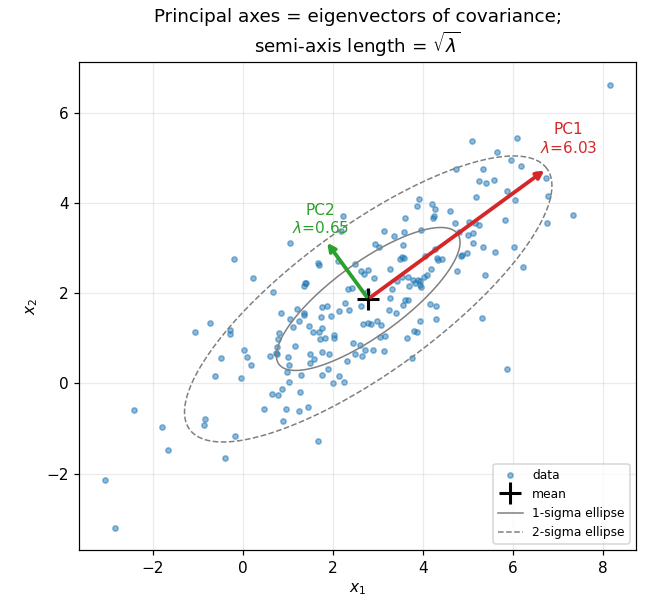
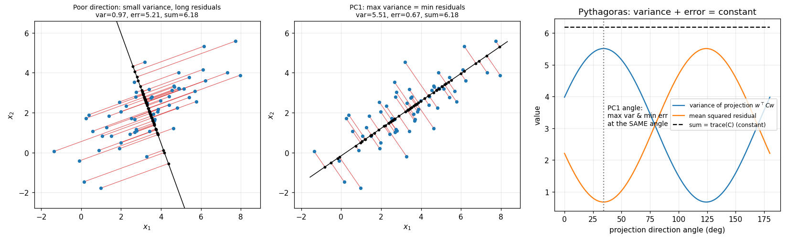
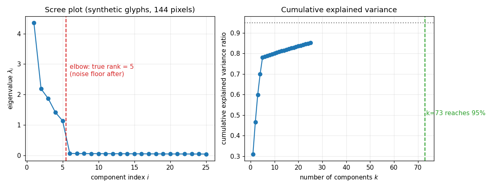
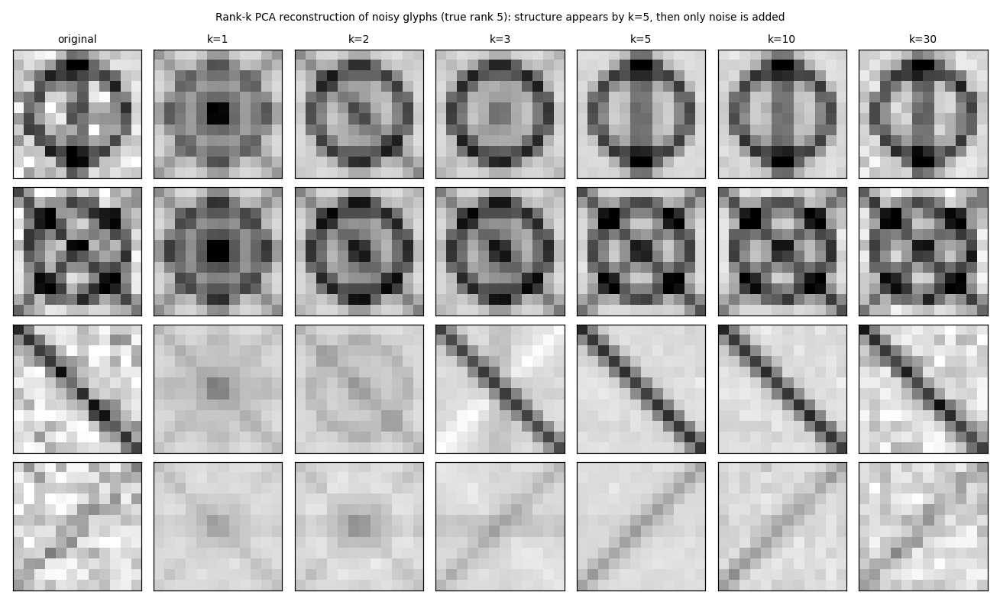
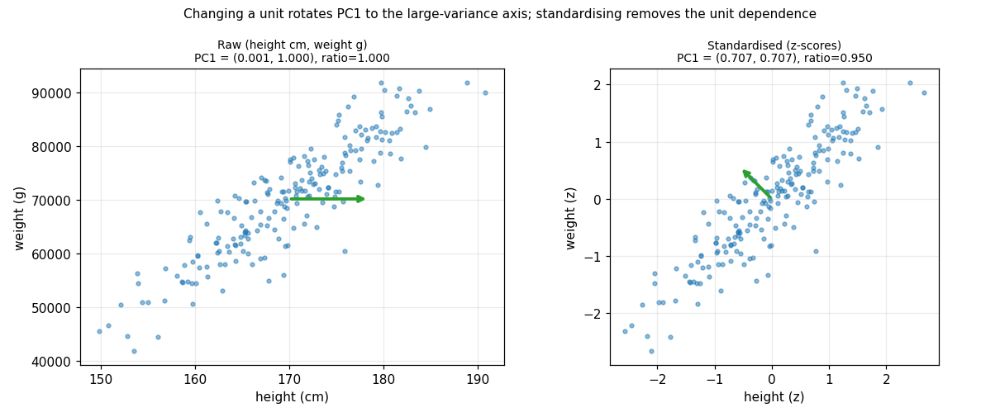
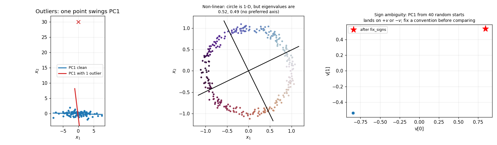

# Principal Component Analysis (PCA)

Everything here is reproducible: `python3 -m pytest tests`, `python3 make_figures.py`, `python3 demo.py`.
Every number quoted below is printed by `demo.py` (section numbers in brackets) or asserted in `tests/test_pca.py`.

## 1. Motivation and the one-sentence idea

High-dimensional data (pixels, sensor channels, CPT readings at many depths) usually lives close to a low-dimensional
subspace. **PCA finds the $k$-dimensional linear subspace that keeps as much of the data's variance as possible, which
(Section 4.3) is the very same subspace that minimises the squared reconstruction error, and it is found by
the top-$k$ eigenvectors of the covariance matrix (equivalently, the top-$k$ right singular vectors of the centred data).**

## 2. Notation

| Symbol | Meaning |
|---|---|
| $X \in \mathbb R^{n\times d}$ | data matrix, rows $x_i^\top$ are samples |
| $\mu \in \mathbb R^d$ | sample mean |
| $X_c = X - \mathbf 1\mu^\top$ | centred data |
| $C \in \mathbb R^{d\times d}$ | sample covariance (divisor $n-1$) |
| $\lambda_1\ge\dots\ge\lambda_d\ge 0$, $v_i$ | eigenvalues / orthonormal eigenvectors of $C$ |
| $V=[v_1\dots v_d]$, $\Lambda=\mathrm{diag}(\lambda)$ | eigen-matrices |
| $W_k\in\mathbb R^{k\times d}$ | rows $v_1^\top..v_k^\top$ (`components_` in code) |
| $z_i = W_k(x_i-\mu)$ | scores (coordinates in the PCA basis) |
| $\hat x_i = \mu + W_k^\top z_i$ | rank-$k$ reconstruction |
| $X_c = USV^\top$ | thin SVD, $s_1\ge s_2\ge\dots$ singular values |
| $P = W_k^\top W_k$ | orthogonal projector onto the span of the first $k$ components |

## 3. Centering and the covariance matrix

PCA is about *spread around the mean*, so we first remove the mean:

$$\mu=\frac1n\sum_{i}x_i,\qquad X_c = X-\mathbf 1\mu^\top \tag{E1}$$

(code: `center`, [`src/pca.py:14`](src/pca.py#L14)). The sample covariance is

$$C=\frac{1}{n-1}X_c^\top X_c,\qquad C_{ab}=\frac{1}{n-1}\sum_i (x_{ia}-\mu_a)(x_{ib}-\mu_b) \tag{E2}$$

([`src/pca.py:21`](src/pca.py#L21)). Diagonal entries are variances, off-diagonals covariances. $C$ is symmetric, and
positive semi-definite because for every $w$:
$w^\top C w=\frac{1}{n-1}\|X_cw\|^2\ge0$.

**Variance along a direction.** The projection of sample $i$ onto a unit vector $w$ is the scalar $w^\top (x_i-\mu)$. Their mean is
$w^\top\cdot 0=0$, so their variance is

$$\mathrm{Var}(w)=\frac1{n-1}\sum_i \big(w^\top(x_i-\mu)\big)^2=\frac{1}{n-1}\|X_cw\|^2=w^\top C w. \tag{E3}$$

**Total variance** is $\operatorname{tr}C=\sum_a C_{aa}$. Section 5 shows $\operatorname{tr}C=\sum_i\lambda_i$ (E8).

## 4. Derivation

### 4.0 Spectral theorem refresher

**Theorem.** A real symmetric $A$ has real eigenvalues and an orthonormal basis of eigenvectors: $A=V\Lambda V^\top$ with $V^\top V=I$.

*Proof.*
(i) Real eigenvalues: if $Av=\lambda v$ with $v\in\mathbb C^d$, $v\ne0$, then $\bar v^\top A v=\lambda\,\bar v^\top v$. Also
$\bar v^\top A v=\overline{(A v)}^{\top}v$ (since $A$ is real symmetric, $\bar v^\top A=\overline{(Av)}^\top$) $=\bar\lambda\,\bar v^\top v$. So $\lambda=\bar\lambda$.
(ii) Distinct eigenvalues give orthogonal eigenvectors: $\lambda_1 v_1^\top v_2=(Av_1)^\top v_2=v_1^\top Av_2=\lambda_2v_1^\top v_2$, so $(\lambda_1-\lambda_2)v_1^\top v_2=0$.
(iii) Full basis, by induction on $d$: pick any eigenpair $(\lambda,v)$, $\|v\|=1$ (exists by (i) and the fundamental theorem of algebra). The subspace $v^\perp$ is invariant: if $v^\top u=0$ then $v^\top Au=(Av)^\top u=\lambda v^\top u=0$. Restricting $A$ to $v^\perp$ gives a symmetric operator in dimension $d-1$; apply the induction hypothesis. Within a repeated eigenvalue, orthonormalise by Gram-Schmidt. $\square$

Consequently, for any $w$, with coordinates $c_i=v_i^\top w$ and $\sum c_i^2=\|w\|^2$:

$$w^\top Cw=\sum_{i=1}^d \lambda_i c_i^2 ,\qquad \operatorname{tr}C=\sum_i \lambda_i \tag{E13}$$

(the trace identity: $\operatorname{tr}(V\Lambda V^\top)=\operatorname{tr}(\Lambda V^\top V)=\operatorname{tr}\Lambda$ by cyclicity). We call (E13) the *spectral expansion*; with $C\succeq0$ all $\lambda_i\ge0$.
Numerically this is `np.linalg.eigh` ([`src/pca.py:45`](src/pca.py#L45)), which exploits symmetry and returns ascending eigenvalues, so we reverse.

### 4.1 PCA as variance maximisation

**First component.** Find the unit direction with the largest projected variance:

$$\max_{w}\; w^\top C w\quad\text{s.t.}\quad w^\top w=1. \tag{E4}$$

Lagrangian $\mathcal L(w,\lambda)=w^\top Cw-\lambda(w^\top w-1)$. Using $\nabla_w w^\top Cw=2Cw$ (C symmetric) and $\nabla_w w^\top w=2w$:

$$\nabla_w\mathcal L=2Cw-2\lambda w=0\;\Longrightarrow\; Cw=\lambda w. \tag{E6}$$

So every stationary point is an eigenvector, with multiplier equal to its eigenvalue. Plug back, using $w^\top w=1$:

$$w^\top C w=\lambda\, w^\top w=\lambda. \tag{E5, E7}$$

The objective at a stationary point is its eigenvalue, so the maximiser is the eigenvector with the **largest** eigenvalue, $w_1=v_1$.
(Independent confirmation without calculus: by E13, $w^\top Cw=\sum\lambda_ic_i^2\le\lambda_1\sum c_i^2=\lambda_1$, with equality iff $w\in$ the $\lambda_1$-eigenspace.)
The quantity $w^\top Cw/w^\top w$ is the *Rayleigh quotient*; the code uses it to read off eigenvalues in the power method ([`src/pca.py:87`](src/pca.py#L87)).

**The $k$-th component, by induction.** Claim: for each $k$, the maximiser of $w^\top C w$ over unit vectors orthogonal to $w_1,\dots,w_{k-1}$ is $v_k$, with value $\lambda_k$.

*Base case* $k=1$: done above.

*Inductive step.* Assume $w_j=v_j$ for $j<k$. Solve

$$\max_w\; w^\top Cw\quad\text{s.t. } w^\top w=1,\; w_j^\top w=0\;(j<k).$$

$$\mathcal L=w^\top Cw-\lambda(w^\top w-1)-\sum_{j<k}\mu_j\,w_j^\top w,\qquad \nabla_w\mathcal L=2Cw-2\lambda w-\sum_{j<k}\mu_jw_j=0 .$$

Left-multiply by $w_m^\top$ ($m<k$). Because $C$ is symmetric and $Cw_m=\lambda_mw_m$, $w_m^\top Cw=(Cw_m)^\top w=\lambda_m w_m^\top w=0$ by the constraint; also $w_m^\top w=0$ and $w_m^\top w_j=\delta_{mj}$. We get $0-0-\mu_m=0$, i.e. **all $\mu_m=0$**. The condition reduces again to $Cw=\lambda w$: $w$ is an eigenvector orthogonal to $v_1..v_{k-1}$, so it lies in the span of $v_k..v_d$, and the objective equals its eigenvalue. The largest available is $\lambda_k$, attained by $v_k$. $\square$

The orthogonality constraints cost nothing: the eigenvectors of a symmetric matrix are automatically orthogonal, and the constraint multipliers vanish. Consequence: the scores are uncorrelated,
$\frac1{n-1}\sum_i z_{ia}z_{ib}=v_a^\top Cv_b=\lambda_b\delta_{ab}$, and $\mathrm{Var}(z_a)=\lambda_a$ (tested in `test_variance_preserved`).

With scores and reconstruction

$$z=W_k(x-\mu),\qquad \hat x=\mu+W_k^\top z \tag{E9, E10}$$

([`src/pca.py:124`](src/pca.py#L124), [`src/pca.py:136`](src/pca.py#L136)), and the sum rule E8 (code: `total_variance_`, [`src/pca.py:118`](src/pca.py#L118)):

$$\sum_{a}\mathrm{Var}(z_a)=\sum_a\lambda_a=\operatorname{tr}C \tag{E8}$$

PCA is a rotation of the coordinate axes into the eigenbasis: total variance is conserved, but redistributed so that the first axes carry as much as possible.

### 4.2 The eigendecomposition solution

$$C=V\Lambda V^\top,\qquad W_k=[v_1\dots v_k]^\top \tag{E12}$$

### 4.3 PCA as minimum reconstruction error, and why it is the same problem

Seek an orthonormal set of $k$ directions, rows of $W$ ($WW^\top=I_k$), minimising the mean squared error of the orthogonal-projection reconstruction $\hat x_i-\mu=W^\top W(x_i-\mu)=P(x_i-\mu)$:

$$\mathrm{Err}(W)=\frac{1}{n-1}\sum_i\|(x_i-\mu)-P(x_i-\mu)\|^2 . \tag{E15}$$

**Pythagoras.** $P=W^\top W$ is an orthogonal projector: $P^\top=P$ and $P^2=W^\top(WW^\top)W=P$. For any vector $y$ (here $y=x_i-\mu$),

$$(Py)^\top(y-Py)=y^\top Py-y^\top P^2y=0,$$

so $Py\perp(y-Py)$ and

$$\|y\|^2=\|Py\|^2+\|y-Py\|^2 .$$

Average over samples with weight $1/(n-1)$. The left side averages to $\operatorname{tr}C$; $\frac1{n-1}\sum\|Py_i\|^2$ is the variance captured by the subspace, $\mathrm{Var}(W)=\sum_{j=1}^k w_j^\top Cw_j=\operatorname{tr}(WCW^\top)$ (rows $w_j$ of $W$). Hence

$$\boxed{\ \operatorname{tr}C=\mathrm{Var}(W)+\mathrm{Err}(W)\ } \tag{E16}$$

for **every** orthonormal $W$ (tested with random subspaces in `test_pythagoras_variance_plus_error_is_total`). The left side does not depend on $W$, so *maximising captured variance and minimising error are the same optimisation*; the two curves in `figures/variance_vs_error.png` are mirror images that sum to a constant.

**Solving it jointly (the subspace, not just greedy).** We maximise $\operatorname{tr}(WCW^\top)=\sum_i\lambda_i\,\|Wv_i\|^2$ (E13 applied to each row and summed). Put $c_i=\|Wv_i\|^2$. Then (a) $0\le c_i\le 1$, since $\|Wv\|^2=v^\top Pv\le\|v\|^2$ for a projector, and (b) $\sum_ic_i=\|WV\|_F^2=\|W\|_F^2=k$ because $V$ is orthogonal. Maximising $\sum\lambda_ic_i$ over $0\le c_i\le1$, $\sum c_i=k$ with $\lambda_1\ge\lambda_2\ge\dots$: moving weight from a smaller to a larger $\lambda$ never hurts, so the optimum is $c_1=\dots=c_k=1$, the rest $0$, i.e. $W$ spans $v_1..v_k$, and

$$\max\mathrm{Var}=\sum_{i\le k}\lambda_i,\qquad \min \mathrm{Err}=\operatorname{tr}C-\sum_{i\le k}\lambda_i=\sum_{i>k}\lambda_i \tag{E17}$$

The error equals the sum of the **discarded** eigenvalues (tested for all three solvers in `test_reconstruction_error_is_discarded_eigenvalues`). This is what `reconstruction_error` computes ([`src/pca.py:140`](src/pca.py#L140)). Two derivations, one answer: the greedy variance argument of 4.1 and the subspace error argument here agree, as E16 requires.

(Ties: if $\lambda_k=\lambda_{k+1}$ the optimal subspace is not unique, but the optimal value still is.)

## 5. Geometry

For Gaussian-like data the level sets of the density are ellipsoids $\{x:(x-\mu)^\top C^{-1}(x-\mu)=r^2\}$. Writing $x-\mu=V\Lambda^{1/2}u$ with $\|u\|=r$ shows that the axes are $v_i$ with semi-lengths $r\sqrt{\lambda_i}$. PCA aligns the coordinate system with this ellipsoid: PC1 is the long axis.



`figures/ellipse_axes.png`: principal axes drawn with length $2\sqrt{\lambda_i}$.



`figures/variance_vs_error.png`: left, a poor direction has short projected spread and long red residuals; middle, PC1 has the opposite; right, variance and error as functions of the angle always sum to $\operatorname{tr}C$, and the optimum of one is the optimum of the other.

## 6. SVD connection

Let $X_c=USV^\top$ be the thin SVD ($U^\top U=I$, $V^\top V=I$, $S=\mathrm{diag}(s_1\ge s_2\ge\dots\ge0)$). Then

$$X_c^\top X_c=(USV^\top)^\top(USV^\top)=VS U^\top U SV^\top=VS^2V^\top, $$

$$C=V\,\frac{S^2}{n-1}\,V^\top . \tag{E22}$$

E22 has the form $V\Lambda V^\top$ with $V$ orthogonal and diagonal $\Lambda$. By uniqueness of the eigendecomposition (eigenvalues are unique, eigenvectors unique up to sign, or up to rotation inside a repeated eigenvalue), the columns of $V$ are the principal directions and

$$\lambda_i=\frac{s_i^2}{n-1},\qquad X_cV=US \;(\text{scores}) \tag{E21, E23}$$

([`src/pca.py:58`](src/pca.py#L58)). The scores follow from $X_cV=USV^\top V=US$. Then $U$ holds the scores normalised to unit length, which is exactly whitening up to the factor $\sqrt{n-1}$ (Section 8).

The reconstruction error has the SVD form $\sum_{i>k}s_i^2/(n-1)$, the Eckart-Young theorem: truncated SVD is the best rank-$k$ approximation in Frobenius norm (the same fact as E17).

**Why SVD is the numerically preferred solver.** Forming $X_c^\top X_c$ squares the condition number, $\kappa(C)=\kappa(X_c)^2$, so eigenvalues below $\epsilon\lambda_1$ are lost to round-off. The SVD works on $X_c$ directly. It also never builds the $d\times d$ matrix, which matters when $d\gg n$. Also, with centred data the rank is at most $n-1$: only $n-1$ non-zero eigenvalues exist when $d\ge n$ (the demo's $n=4$, $d=100$ check, Exercise 4).

`demo.py` section 2 shows `eigh`, SVD and the power method agreeing to $\sim10^{-14}$ on a random 200x6 problem.

## 7. Explained variance, choosing $k$, scree

$$\mathrm{EVR}_i=\frac{\lambda_i}{\sum_j\lambda_j},\qquad \mathrm{cum}(k)=\sum_{i\le k}\mathrm{EVR}_i=1-\frac{\mathrm{Err}_k}{\operatorname{tr}C} \tag{E24}$$

(code: [`src/pca.py:119`](src/pca.py#L119)); the second equality is E17. Common rules for $k$ (E25, `choose_k`, [`src/pca.py:147`](src/pca.py#L147)):

1. **Cumulative threshold**: smallest $k$ with $\mathrm{cum}(k)\ge$ 0.90 or 0.95.
2. **Scree/elbow**: plot $\lambda_i$ versus $i$ and look for the drop to a noise floor.
3. **Kaiser** (for standardised data): keep $\lambda_i>1$ (`kaiser_k`).
4. Cross-validated reconstruction error, parallel analysis (compare against eigenvalues of shuffled data), or the PPCA likelihood (Section 10).



On the synthetic glyph data (`make_glyph_data`: 300 images, 144 pixels, built from 5 strokes + white noise with $\sigma=0.15$) `demo.py` §3 gives eigenvalues $4.357, 2.184, 1.864, 1.410, 1.137$, then a cliff to $0.063, 0.058,\dots$. The noise floor $\sigma^2=0.0225$ matches the mean of eigenvalues 6..144, $0.0222$. The cumulative ratio at $k=5$ is only $0.780$, because the white noise spreads over 139 directions, and the 90% / 95% rules ask for $k=44$ / $k=73$. **Lesson: the threshold rule is a bad detector of true rank when noise is high-dimensional; the scree gap is the right tool.**



`figures/reconstruction.png` shows four images reconstructed at $k=1,2,3,5,10,30$: by $k=5$ the strokes are right; higher $k$ re-admits noise (see the $k=30$ column approaching the original). Per-sample squared error: $9.68,\,5.63,\,3.08$ at $k=1,3,5$.

## 8. Whitening

Define the whitened scores $\tilde z_a = z_a/\sqrt{\lambda_a}$, i.e. $\tilde z=\Lambda^{-1/2}V^\top(x-\mu)$ (E26, [`src/pca.py:126`](src/pca.py#L126)). Their covariance:

$$\frac1{n-1}\sum_i\tilde z_i\tilde z_i^\top=\Lambda^{-1/2}V^\top\,C\,V\Lambda^{-1/2}=\Lambda^{-1/2}\Lambda\Lambda^{-1/2}=I. \tag{E26}$$

Whitened data has zero mean, unit variance and zero correlation, and any rotation $R\tilde z$ is also white (so "whitened" does not fix a basis; $V\Lambda^{-1/2}V^\top$ is the symmetric "ZCA" choice that stays closest to the original coordinates). Pitfall: dividing by $\sqrt{\lambda_a}$ amplifies noise-dominated components with tiny $\lambda_a$; keep only $k$ components or add a regulariser $\sqrt{\lambda_a+\epsilon}$. Whitening throws away scale information, so do not use it before a reconstruction-error comparison.

## 9. Three ways to compute PCA (all implemented)

| solver | function | idea | cost |
|---|---|---|---|
| eigendecomposition | `pca_eig` | `eigh(C)` | $O(nd^2+d^3)$ |
| SVD | `pca_svd` | `svd(X_c)` | $O(nd\min(n,d))$ |
| power iteration + deflation | `pca_power` | one vector at a time | $O(k\,T\,d^2)$ with $C$ stored, or $O(k\,T\,nd)$ matrix-free via $X_c^\top(X_cv)$ |

### Power iteration with deflation

Pseudocode:

```
C = X_c^T X_c / (n-1)
for j = 1..k:
    v <- random unit vector
    repeat T times (or until converged up to sign):
        w <- C v ;  v <- w / ||w||
    lambda_j <- v^T C v                  # Rayleigh quotient
    C <- C - lambda_j v v^T              # deflation
```

*Why it works.* Expand $v_0=\sum a_iv_i$ (basis of eigenvectors, $a_1\ne0$). Then $C^tv_0=\sum a_i\lambda_i^tv_i=a_1\lambda_1^t\big(v_1+\sum_{i>1}\tfrac{a_i}{a_1}(\lambda_i/\lambda_1)^tv_i\big)$. So the direction converges to $v_1$ and the tangent of the angle to $v_1$ shrinks as

$$\tan\theta_t\le\Big(\frac{\lambda_2}{\lambda_1}\Big)^t\tan\theta_0 \tag{E27, E29}$$

linear convergence with rate $\lambda_2/\lambda_1$ (slow when the top two eigenvalues are close; fails to pick a unique $v_1$ if they are equal).
*Deflation.* $C'=C-\lambda_1v_1v_1^\top=\sum_{i\ge2}\lambda_iv_iv_i^\top$ (E13): same eigenvectors, with $\lambda_1$ replaced by 0. The largest eigenvalue of $C'$ is $\lambda_2$ and we iterate again (E28, [`src/pca.py:90`](src/pca.py#L90)). Rounding error in $v_1$ leaks into $C'$, so errors accumulate for large $k$; production code uses Lanczos/randomised SVD instead. The test `test_power_matches_eigh` checks the eigenvalues to 6 digits and the vectors up to sign. Section 11's example reproduces (E29) as an equality.

## 10. Probabilistic PCA (brief)

Tipping and Bishop (1999) give PCA a generative model:

$$x=Wz+\mu+\varepsilon,\quad z\sim\mathcal N(0,I_k),\ \varepsilon\sim\mathcal N(0,\sigma^2I_d)\ \Rightarrow\ x\sim\mathcal N(\mu,\;WW^\top+\sigma^2I) \tag{E31, E32}$$

with $W\in\mathbb R^{d\times k}$. The average log-likelihood is $-\tfrac12\big[d\ln2\pi+\ln|C_m|+\operatorname{tr}(C_m^{-1}S)\big]$ with model covariance $C_m=WW^\top+\sigma^2I$ and data covariance $S$. For $W=V_k(\Lambda_k-\sigma^2I)^{1/2}$ (the stationary point family; the full proof that these are the only maxima is in the paper), $C_m$ has eigenvalues $\lambda_i$ ($i\le k$) and $\sigma^2$ (multiplicity $d-k$) in the eigenbasis of $S$, so $\operatorname{tr}(C_m^{-1}S)=k+\sum_{i>k}\lambda_i/\sigma^2$ and

$$\ell=-\tfrac12\Big[d\ln2\pi+\sum_{i\le k}\ln\lambda_i+(d-k)\ln\sigma^2+k+\tfrac1{\sigma^2}\sum_{i>k}\lambda_i\Big].$$

Setting $\partial\ell/\partial\sigma^2=0$: $\frac{d-k}{\sigma^2}-\frac{1}{\sigma^4}\sum_{i>k}\lambda_i=0$, so

$$\sigma^2_{ML}=\frac1{d-k}\sum_{i>k}\lambda_i,\qquad W_{ML}=V_k(\Lambda_k-\sigma^2_{ML}I)^{1/2} \tag{E33}$$

(code: [`src/pca.py:168`](src/pca.py#L168); the paper's $S$ has divisor $n$, ours $n-1$: a factor $(n-1)/n$ difference). The posterior mean of the latent variable is (E34, [`src/pca.py:176`](src/pca.py#L176))

$$\mathbb E[z|x]=M^{-1}W^\top(x-\mu),\quad M=W^\top W+\sigma^2I,$$

and as $\sigma^2\to0$ it reduces to the PCA scores. Benefits: a noise-variance estimate (on glyphs $\sigma^2_{ML}=0.0222$ vs true $0.0225$; demo §6), a likelihood to choose $k$ and compare models, missing-data handling by EM, and a mixture/Bayesian generalisation. `test_ppca` checks that the model covariance has the predicted spectrum and that perturbing $W$ lowers the likelihood.

## 11. A hand-computable worked example

Four points in 2D: $(1,1),(2,3),(3,2),(4,4)$ (all checked by `demo.py` §1 and `test_hand_example`).

* Mean $\mu=(2.5,2.5)$. Centred rows: $(-1.5,-1.5),(-0.5,0.5),(0.5,-0.5),(1.5,1.5)$.
* $\sum x^2=2.25+0.25+0.25+2.25=5$, $\sum xy=2.25-0.25-0.25+2.25=4$. With $n-1=3$:
$$C=\begin{pmatrix}5/3&4/3\\4/3&5/3\end{pmatrix}.$$
* Eigenvalues: $\det(C-\lambda I)=(5/3-\lambda)^2-(4/3)^2=0\Rightarrow\lambda=5/3\pm4/3=\mathbf3,\ \mathbf{1/3}$. Eigenvectors: $(1,1)/\sqrt2$ and $(1,-1)/\sqrt2$.
* Total variance $10/3$, $\mathrm{EVR}=(0.9,\,0.1)$.
* PC1 scores: $-3/\sqrt2,\,0,\,0,\,3/\sqrt2=\pm2.1213$; variance $2\cdot4.5/3=3=\lambda_1$.
* Rank-1 reconstruction error: PC2 scores are $0,-1/\sqrt2,1/\sqrt2,0$, so the sum of squares is $1$ and $\mathrm{Err}=1/3=\lambda_2$ (E17).
* SVD: singular values $3$ and $1$; $s^2/(n-1)=3,\,1/3$ (E23).
* Power iteration from $v_0=(1,0)$: $\tan\theta_t=(1/9)^t$ exactly: $0.1111,\,0.01235,\,0.001372,\,0.0001524$ (demo §7; $\lambda_2/\lambda_1=1/9$ and $\tan\theta_0=1$).

## 12. Failure modes and pitfalls



* **Scale / units (standardise or not).** PCA maximises variance, so a feature measured in grams beats one in kilograms. Demo §4: height (cm) and weight (g) correlated: raw PC1 $=(0.0007,\,1.000)$ with EVR $\approx1.000$, i.e. PCA just returns "the weight column". After z-scoring PC1 $=(0.707,0.707)$ and EVR $0.950$ (for two standardised variables PC1 is always $(1,1)/\sqrt2$ up to sign when they are positively correlated). Rule: standardise when features have different units/scales; do not standardise when all features share a physical unit and variance *is* the signal (pixels, spectra at the same gain).
* **Correlation vs covariance PCA.** Standardising $Z=X_cD^{-1}$ ($D=\mathrm{diag}$ of std) gives covariance $D^{-1}CD^{-1}=R$, the correlation matrix, with unit diagonal, so
$$\operatorname{tr}R=d,\quad \sum_i\lambda_i^{(R)}=d \tag{E30}$$
and the Kaiser rule "keep $\lambda_i>1$" means "better than an average original variable". The eigenvectors of $R$ are not those of $C$ and cannot be transformed into each other; they answer different questions.
* **Sign ambiguity.** If $v$ is an eigenvector so is $-v$ (E14). Different solvers, library versions or random starts return either sign (`figures/pitfalls.png`, right). Compare components only up to sign, or fix a convention (`fix_signs`: largest-magnitude entry positive, [`src/pca.py:31`](src/pca.py#L31)). Repeated eigenvalues are worse: only the eigenspace is defined.
* **Outliers.** Variance is a squared quantity, so one far point can capture a component (`pitfalls.png`, left: a single point at $(0,30)$ rotates PC1 towards itself). Remedy: robust covariance (MCD), robust PCA (low-rank + sparse), trimming, or inspect the scores.
* **Non-linear structure.** PCA finds linear subspaces. A noisy circle has a 1D structure, but PCA gives two near-equal eigenvalues (0.52, 0.49) and no useful reduction (`pitfalls.png`, middle). Use kernel PCA, autoencoders, manifold methods.
* **Variance is not relevance.** The top components may be nuisance variation (lighting, instrument drift); low-variance directions can be the discriminative ones.
* **Leakage.** Fit the mean and components on training data only, then `transform` the test set.
* **$d>n$.** At most $n-1$ non-zero eigenvalues; use SVD, never form the $d\times d$ covariance.
* **Whitening noise** (Section 8) and **power-iteration deflation error** (Section 9).



## 13. Algorithm summary and complexity

```
fit(X, k):
    mu <- mean(X);  Xc <- X - mu                           # E1
    (lambda, W) <- one of eig(C), svd(Xc), power+deflation  # E12, E21-E23, E27-E28
    W <- fix_signs(W)
    EVR <- lambda / trace(C)                                # E24
transform(X): Z <- (X - mu) W^T  (optionally / sqrt(lambda))  # E9, E26
inverse_transform(Z): X_hat <- Z W + mu                       # E10
```

Memory $O(d^2)$ for $C$ or $O(nd)$ for the SVD; time in Section 9's table. The `PCA` class: [`src/pca.py:95`](src/pca.py#L95).

## 14. Equation-to-code index

| Eq. | Code |
|---|---|
| E1 centering | `center`, [`src/pca.py:14`](src/pca.py#L14) |
| E2 covariance | `covariance`, [`src/pca.py:21`](src/pca.py#L21) |
| E5 Rayleigh quotient | [`src/pca.py:87`](src/pca.py#L87) |
| E8 total variance | [`src/pca.py:118`](src/pca.py#L118) |
| E9 scores | [`src/pca.py:124`](src/pca.py#L124) |
| E10 reconstruction | [`src/pca.py:136`](src/pca.py#L136) |
| E12 eigendecomposition | `pca_eig`, [`src/pca.py:45`](src/pca.py#L45) |
| E14 sign convention | `fix_signs`, [`src/pca.py:36`](src/pca.py#L36) |
| E17 error = discarded eigenvalues | `reconstruction_error`, [`src/pca.py:140`](src/pca.py#L140) |
| E21-E23 SVD | `pca_svd`, [`src/pca.py:57`](src/pca.py#L57) |
| E24 EVR | [`src/pca.py:119`](src/pca.py#L119) |
| E25 choose $k$ | `choose_k`, [`src/pca.py:147`](src/pca.py#L147) |
| E26 whitening | [`src/pca.py:126`](src/pca.py#L126) |
| E27-E28 power + deflation | `pca_power`, [`src/pca.py:77`](src/pca.py#L77), [`src/pca.py:90`](src/pca.py#L90) |
| E30 correlation PCA | `standardize`, [`src/pca.py:24`](src/pca.py#L24) |
| E31-E34 PPCA | `ppca_fit`, `ppca_loglik`, `ppca_posterior_mean`, [`src/pca.py:159`](src/pca.py#L159) onward |

## 15. Exercises with full solutions

**Exercise 1.** Find the principal components and EVR of $C=\begin{pmatrix}2&1\\1&2\end{pmatrix}$.

*Solution.* $(2-\lambda)^2-1=0\Rightarrow\lambda=3,1$. For $\lambda=3$: $(C-3I)v=\begin{pmatrix}-1&1\\1&-1\end{pmatrix}v=0\Rightarrow v\propto(1,1)/\sqrt2$. For $\lambda=1$: $v\propto(1,-1)/\sqrt2$. EVR $=3/4,\,1/4$. (Code check, demo §7: eigenvalues $1,3$.)

**Exercise 2.** Show that an orthogonal change of basis $x\mapsto Qx$ leaves the total variance unchanged and the principal *values* unchanged.

*Solution.* The new covariance is $QCQ^\top$; $\operatorname{tr}(QCQ^\top)=\operatorname{tr}(CQ^\top Q)=\operatorname{tr}C$. If $Cv=\lambda v$ then $(QCQ^\top)(Qv)=QCv=\lambda Qv$, so the eigenvalues are identical and the eigenvectors are rotated by $Q$: PCA is rotation equivariant. (By contrast, a diagonal rescaling is *not* an orthogonal map and changes the PCA; that is the standardisation pitfall.)

**Exercise 3.** Prove that the scores of different components are uncorrelated.

*Solution.* $\mathrm{Cov}(z_a,z_b)=\frac1{n-1}\sum_i v_a^\top(x_i-\mu)(x_i-\mu)^\top v_b=v_a^\top Cv_b=\lambda_bv_a^\top v_b=\lambda_b\delta_{ab}$. (Tested: `np.cov(Z.T)` equals `diag(explained_variance_)`.)

**Exercise 4.** You have $n=4$ samples in $d=100$ dimensions. How many non-zero eigenvalues can $C$ have?

*Solution.* $C=X_c^\top X_c/(n-1)$ has rank $\le\operatorname{rank}X_c$. The rows of $X_c$ sum to zero (the centring constraint), so they span at most $n-1=3$ dimensions: at most 3. Demo §7 and `test_exercise_facts` confirm exactly 3 eigenvalues above $10^{-10}$. Use SVD or the $n\times n$ Gram matrix $X_cX_c^\top$ (same non-zero eigenvalues).

**Exercise 5.** Feature 1 of a 2D dataset with $C=\begin{pmatrix}1&0.8\\0.8&1\end{pmatrix}$ is multiplied by $c=10$. What is PC1 for large $c$?

*Solution.* New $C_c=\begin{pmatrix}c^2&0.8c\\0.8c&1\end{pmatrix}$. Eigenvalues $\lambda=\frac{c^2+1}2\pm\sqrt{(\frac{c^2-1}2)^2+0.64c^2}$. For $c=10$: $50.5\pm\sqrt{2450.25+64}=50.5\pm50.14$, so $100.64$ and $0.36$. The eigenvector for $\lambda_1$ solves $(c^2-\lambda)v_1+0.8c\,v_2=0\Rightarrow v_2/v_1=(\lambda-c^2)/(0.8c)=0.64/8=0.08$, i.e. PC1 $\approx(0.997,0.080)$, nearly the rescaled axis. As $c\to\infty$, PC1 $\to e_1$ and EVR $\to1$: the unit change has decided the answer. (`test_scale_dependence` demonstrates the effect.)

**Exercise 6.** Show the PPCA noise estimate for the worked example with $k=1$, and the norm of $W_{ML}$.

*Solution.* $d-k=1$ discarded eigenvalue: $\sigma^2=\lambda_2=1/3$. $W_{ML}=v_1\sqrt{\lambda_1-\sigma^2}=v_1\sqrt{3-1/3}=v_1\sqrt{8/3}$, so $\|W\|=1.6330$. Demo §7 prints $0.3333$ and $1.6330$; `test_exercise_facts` asserts them.

**Exercise 7.** After how many power-iteration steps from $v_0=(1,0)$ is the angle to PC1 below $10^{-3}$ rad in the worked example?

*Solution.* By E29 with equality here, $\tan\theta_t=(1/9)^t\tan(45^\circ)=9^{-t}$. Need $9^{-t}<10^{-3}\Rightarrow t>3/\log_{10}9=3.14$, so $t=4$ ($\tan\theta_4=1.5\times10^{-4}$; for $t=3$ it is $1.4\times10^{-3}$, not yet below).

**Exercise 8.** (Variance/error equivalence by hand.) For the worked example, verify E16 for the direction $w=(1,0)$.

*Solution.* $\mathrm{Var}=w^\top Cw=5/3$. The residual is the second coordinate: $\mathrm{Err}=\frac13(1.5^2+0.5^2+0.5^2+1.5^2)=\frac53$. Total $=10/3=\operatorname{tr}C$. ✓. For PC1: $\mathrm{Var}=3$, $\mathrm{Err}=1/3$, total $10/3$; PC1 has more variance and less error than $(1,0)$ at once.

**Exercise 9.** Explain why $\kappa(C)=\kappa(X_c)^2$ makes the covariance route lose accuracy, with a number.

*Solution.* $\kappa(X_c)=s_1/s_r$ and $\kappa(C)=s_1^2/s_r^2$. In double precision ($\epsilon\approx10^{-16}$) the smallest recoverable eigenvalue from $C$ is about $\epsilon\lambda_1$, i.e. $s_r/s_1\gtrsim10^{-8}$; the SVD of $X_c$ resolves $s_r/s_1\gtrsim10^{-16}$. Components with relative singular value between $10^{-16}$ and $10^{-8}$ are visible to SVD but lost to `eigh(C)`.
