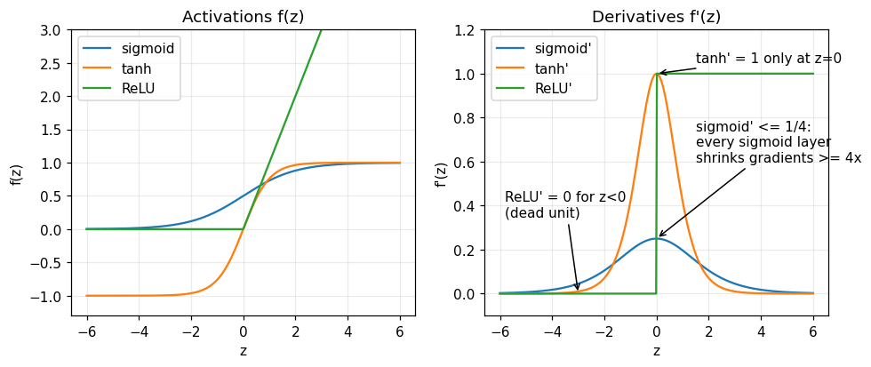
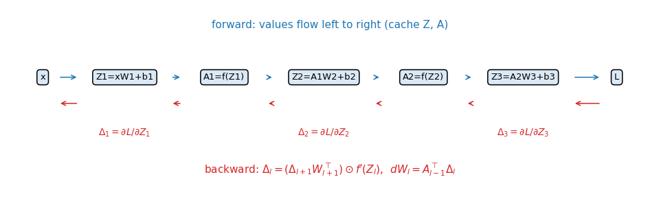
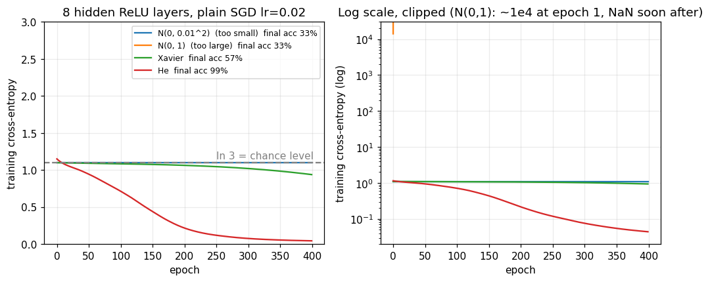
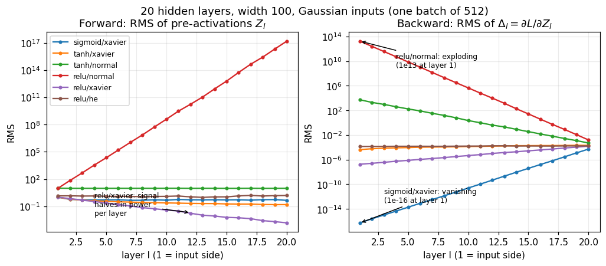
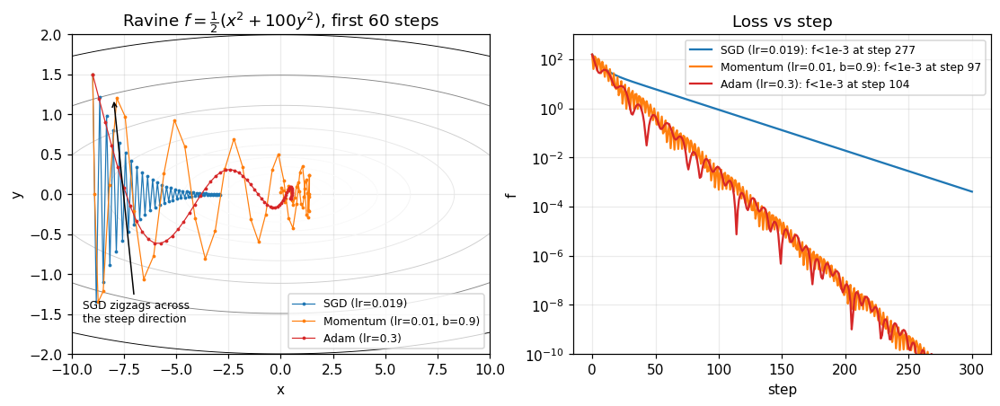
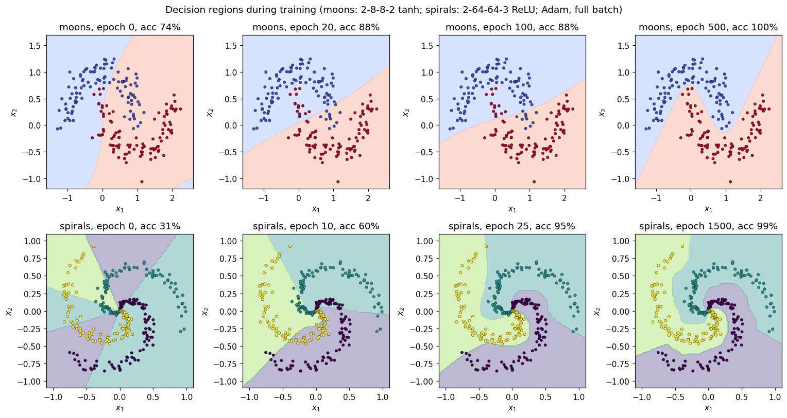

# Neural network from scratch

Everything here is NumPy only. Every number quoted below is printed by `python3 demo.py`
(or asserted in `tests/test_nn.py`); every figure is produced by `python3 make_figures.py`.

```
python3 -m pytest tests -q     # 35 tests, a few seconds
python3 make_figures.py        # regenerates figures/*.png
python3 demo.py                # prints all numbers used below (~3 s)
```

## 1. Motivation and the one-sentence idea

A linear model can only draw a straight boundary. A neural network stacks affine maps with
simple nonlinearities, so the boundary can bend; and because the whole thing is a composition
of differentiable functions, **one application of the chain rule, organised as two matrix
multiplications per layer, gives the exact gradient of the loss with respect to every weight**.

> One sentence: *a neural network is a chain of (matrix multiply, elementwise nonlinearity) steps, and
> backpropagation is the chain rule written so that each step costs one extra matrix multiply.*

## 2. Notation

| Symbol | Meaning | Shape |
|---|---|---|
| $N$ | batch size (number of samples) | scalar |
| $L$ | number of Dense layers (for the running example $L=3$: two hidden layers + output) | scalar |
| $d_l$ | width of layer $l$ ($d_0$ = input dimension) | scalar |
| $X = A_0$ | input batch, one **row** per sample | $N\times d_0$ |
| $W_l$ | weights of layer $l$ | $d_{l-1}\times d_l$ |
| $b_l$ | bias of layer $l$ | $d_l$ (broadcast over rows) |
| $Z_l$ | pre-activation of layer $l$ | $N\times d_l$ |
| $A_l$ | activation of layer $l$, $A_l=f(Z_l)$ | $N\times d_l$ |
| $f, f'$ | elementwise activation and its derivative | |
| $Y$ | targets (one-hot rows, or real vectors for MSE) | $N\times d_L$ |
| $P$ | softmax probabilities | $N\times K$ |
| $\Delta_l$ | **error signal** $\partial \mathcal L/\partial Z_l$ | $N\times d_l$ |
| $\odot$ | elementwise (Hadamard) product | |
| $\mathbf 1$ | all-ones column vector of length $N$ | $N$ |
| $\mathcal L$ | scalar loss, always the *mean* over the batch | scalar |
| $\eta$ | learning rate | scalar |

The loss is the batch mean, so the factor $1/N$ appears once (in the loss gradient) and
nowhere else.

## 3. The base case: a single neuron is logistic regression

One sample $x\in\mathbb R^d$, weights $w\in\mathbb R^d$, bias $b$:

$$z = w^\top x + b,\qquad a=\sigma(z)=\frac{1}{1+e^{-z}} \tag{E1}$$

$a\in(0,1)$ is read as $P(y=1\mid x)$. For a label $y\in\{0,1\}$ the negative log-likelihood
(binary cross-entropy) is

$$\mathcal L = -\big[\,y\ln a + (1-y)\ln(1-a)\,\big]. \tag{E2}$$

**Derivative, every step.** First $\partial\mathcal L/\partial a$:

$$\frac{\partial\mathcal L}{\partial a} = -\frac{y}{a}+\frac{1-y}{1-a}.$$

Next $\sigma'(z)$. With $\sigma=(1+e^{-z})^{-1}$,
$\sigma'=e^{-z}(1+e^{-z})^{-2}=\sigma\cdot\frac{e^{-z}}{1+e^{-z}}=\sigma(1-\sigma)$, i.e. $\partial a/\partial z=a(1-a)$.
Chain rule:

$$\frac{\partial\mathcal L}{\partial z}=a(1-a)\Big[-\frac ya+\frac{1-y}{1-a}\Big]
=-y(1-a)+(1-y)a=-y+ya+a-ya=a-y. \tag{E3}$$

The messy factors cancel. Since $\partial z/\partial w=x$ and $\partial z/\partial b=1$:
$\ \nabla_w\mathcal L=(a-y)\,x,\ \ \partial\mathcal L/\partial b=a-y$.

**Tiny numeric check** (`demo.py`, "Sec. 3"): $x=(2,1)$, $w=(1,-1)$, $b=0$, $y=1$ gives
$z=1$, $a=0.7311$, $\mathcal L=0.3133$, $dz=a-y=-0.2689$, $\nabla_w=(-0.5379,-0.2689)$, $db=-0.2689$.

For a batch, $z=Xw+b\mathbf 1$ ($N$-vector) and $\nabla_w\mathcal L=\frac1N X^\top(a-y)$. The Hessian is
$\frac1N X^\top\mathrm{diag}(a(1-a))X\succeq0$, so logistic regression is convex. A
deep network is this same neuron, repeated and stacked; convexity is the thing we lose.
This is `Sequential([Dense(2,1)])` with `BCEWithLogits` ([`nn.py`](src/nn.py#L207);
tested in `test_logistic_regression_is_single_neuron`).

## 4. Layers as matrix operations (shapes tracked)

A Dense layer applies the neuron of Sec. 3 to $d_l$ output units and $N$ samples at once:

$$Z_l = A_{l-1}W_l + \mathbf 1\, b_l^\top,\qquad A_l = f(Z_l). \tag{E4}$$

Shapes: $(N\times d_{l-1})(d_{l-1}\times d_l)+ (N\times d_l)\to N\times d_l$. Row $n$ of $Z_l$ is the
layer applied to sample $n$; column $j$ of $W_l$ is the weight vector of unit $j$.
Code: [`Dense.forward`](src/nn.py#L56).

Example 784-128-64-10: $W_1:784\times128$, $W_2:128\times64$, $W_3:64\times10$, with parameter
count $\sum_l (d_{l-1}+1)d_l = 100480+8256+650=109386$ (`demo.py`).

**Why a nonlinearity is needed.** Without $f$, $A_2 = (XW_1+\mathbf1 b_1^\top)W_2+\mathbf1b_2^\top
= X(W_1W_2)+\mathbf 1(b_1^\top W_2+b_2^\top)$: still affine, so depth buys nothing.

## 5. Activations and their derivatives

| | $f(z)$ | $f'(z)$ | range of $f'$ |
|---|---|---|---|
| sigmoid | $1/(1+e^{-z})$ | $f(1-f)$ | $(0,\tfrac14]$ |
| tanh | $(e^z-e^{-z})/(e^z+e^{-z})$ | $1-f^2$ | $(0,1]$ |
| ReLU | $\max(0,z)$ | $\mathbf 1[z>0]$ | $\{0,1\}$ |

$$\sigma'=\sigma(1-\sigma),\qquad \tanh'=1-\tanh^2,\qquad \mathrm{ReLU}'=\mathbf 1[z>0]. \tag{E5, E6, E7}$$

* Sigmoid: derived in Sec. 3. Maximum at $z=0$ where $\sigma=\tfrac12$: $\sigma'=\tfrac14$ (`demo.py`: 0.2500).
* tanh: quotient rule with $u=e^z$, $v=e^{-z}$ ($uv=1$): $\tanh=\dfrac{u-v}{u+v}$, so
  $\tanh'=\dfrac{(u+v)(u+v)-(u-v)(u-v)}{(u+v)^2}=1-\Big(\dfrac{u-v}{u+v}\Big)^2=1-\tanh^2$ (using $\frac{d}{dz}(u-v)=u+v$ and $\frac{d}{dz}(u+v)=u-v$).
  Also $\tanh z=2\sigma(2z)-1$ (tested), so tanh is a rescaled sigmoid centred at 0. Maximum slope $1$ at $z=0$.
* ReLU: derivative undefined at $0$; the code uses $0$ there (measure-zero event).

Since $A_l=f(Z_l)$ acts entrywise, its Jacobian is diagonal and backward through it is just a
Hadamard product with $f'(Z_l)$ — no matrix needed. Code: `deriv()` of [`Sigmoid`](src/nn.py#L80),
[`Tanh`](src/nn.py#L97), [`ReLU`](src/nn.py#L108). `Sigmoid` is evaluated stably (no `exp` of a large positive).



The right panel is the whole story of Sec. 9: a sigmoid layer can only shrink the backward
signal (by at least a factor of 4 per layer: $0.25^{10}=9.5\times10^{-7}$, $0.25^{20}=9.1\times10^{-13}$),
tanh passes it unchanged only near 0, and ReLU passes it unchanged where active and kills it where not.

## 6. Loss functions

### 6.1 Mean squared error (regression)

$$\mathcal L=\frac1{2N}\sum_{n=1}^N\|a_n-y_n\|^2,\qquad \frac{\partial\mathcal L}{\partial a_n}=\frac{a_n-y_n}{N}. \tag{E8}$$

(The $\tfrac12$ cancels the 2 from differentiating the square.) Code: [`MSE`](src/nn.py#L159).

### 6.2 Softmax and cross-entropy (classification, $K$ classes)

Logits $z\in\mathbb R^K$ for one sample, probabilities

$$p_k=\frac{e^{z_k}}{S},\quad S=\sum_{j}e^{z_j}. \tag{E9}$$

With a one-hot label $y$ (true class $c$) the cross-entropy is

$$\mathcal L_n=-\sum_k y_k\ln p_k=-\ln p_c,\qquad \mathcal L=\frac1N\sum_n\mathcal L_n. \tag{E10}$$

**Softmax Jacobian.** For $i=j$: $\dfrac{\partial p_i}{\partial z_i}=\dfrac{e^{z_i}S-e^{z_i}e^{z_i}}{S^2}=p_i-p_i^2$.
For $i\ne j$: $\dfrac{\partial p_i}{\partial z_j}=\dfrac{-e^{z_i}e^{z_j}}{S^2}=-p_ip_j$. Together

$$\frac{\partial p_i}{\partial z_j}=p_i(\delta_{ij}-p_j). \tag{E11}$$

**Why softmax + CE gives $p-y$.** Chain rule through (E10) and (E11), for one sample:

$$\frac{\partial\mathcal L_n}{\partial z_j}=\sum_i\frac{\partial\mathcal L_n}{\partial p_i}\frac{\partial p_i}{\partial z_j}
=\sum_i\Big(-\frac{y_i}{p_i}\Big)p_i(\delta_{ij}-p_j)
=-\sum_i y_i\delta_{ij}+p_j\sum_i y_i=-y_j+p_j.$$

The $1/p_i$ from the log cancels the $p_i$ in the Jacobian, and $\sum_iy_i=1$. Direct route
(no Jacobian): $\mathcal L_n=-z_c+\ln S$, so $\partial\mathcal L_n/\partial z_j=-\delta_{jc}+e^{z_j}/S=p_j-y_j$. Same answer. Over the batch:

$$\frac{\partial\mathcal L}{\partial Z}=\frac1N(P-Y). \tag{E12}$$

Consequences: (i) the error signal is just "prediction minus target"; (ii) rows of (E12) sum to zero,
because softmax is invariant to adding a constant to all logits (tested); (iii) there is no
saturation factor: compare a sigmoid output with MSE, where $\partial\mathcal L/\partial z=(a-y)\,a(1-a)$.
For a confidently wrong output $z=-6$, $y=1$: BCE gives $-0.99753$, MSE gives $-0.002460$ (`demo.py`),
so MSE barely learns exactly when it is most wrong.

Numeric example (`demo.py`): logits $(2,1,0)$, true class 0: $e^z=(7.3891,2.7183,1)$, $S=11.1073$,
$p=(0.6652,0.2447,0.0900)$, $\mathcal L=-\ln0.6652=0.4076$, gradient $p-y=(-0.3348,0.2447,0.0900)$.

**Stability.** $\ln S$ is computed after subtracting $\max_j z_j$ (logsumexp trick), which leaves $p$ and
$\mathcal L$ unchanged and prevents overflow. Code: [`softmax`](src/nn.py#L140),
[`SoftmaxCrossEntropy`](src/nn.py#L171) (fused, (E12)). The unfused pair [`Softmax`](src/nn.py#L119)
(backward $=p\odot(g-\langle g,p\rangle)$, which is (E11) applied to $g$) + [`CrossEntropy`](src/nn.py#L191)
exists so the tests can check that chaining them reproduces (E12) (`test_softmax_plus_ce_equals_p_minus_y`).
Binary case: [`BCEWithLogits`](src/nn.py#L207) is (E2)-(E3) with $\ln(1+e^z)-yz$ evaluated stably.

## 7. Backpropagation

### 7.1 The network and what we need

Two hidden layers and an output layer ($L=3$):

$$Z_1=XW_1+\mathbf1b_1^\top,\ A_1=f(Z_1);\quad Z_2=A_1W_2+\mathbf1b_2^\top,\ A_2=f(Z_2);\quad Z_3=A_2W_3+\mathbf1b_3^\top .$$

$Z_3$ are the logits (or the regression output). Loss $\mathcal L=\ell(Z_3,Y)$. We want
$\partial\mathcal L/\partial W_l$ and $\partial\mathcal L/\partial b_l$ for $l=1,2,3$.

### 7.2 Output error signal

$$\Delta_L=\frac{\partial\mathcal L}{\partial Z_L}\ \ (N\times d_L)=\begin{cases}\frac1N(P-Y)&\text{softmax+CE (E12)}\\[2pt] \frac1N(Z_L-Y)&\text{MSE, linear output (E8)}\end{cases}\tag{E13}$$

### 7.3 The delta recursion, derived entry by entry

Fix a hidden layer $l<L$. $Z_{l+1}[n,j]=\sum_i A_l[n,i]\,W_{l+1}[i,j]+b_{l+1}[j]$ depends on
$A_l[n,i]$ only through sample $n$'s row, and $\mathcal L$ depends on $A_l[n,i]$ only through
$Z_{l+1}[n,\cdot]$. Chain rule over all $j$:

$$\frac{\partial\mathcal L}{\partial A_l[n,i]}=\sum_{j=1}^{d_{l+1}}\frac{\partial\mathcal L}{\partial Z_{l+1}[n,j]}\frac{\partial Z_{l+1}[n,j]}{\partial A_l[n,i]}
=\sum_j\Delta_{l+1}[n,j]\,W_{l+1}[i,j]=\big(\Delta_{l+1}W_{l+1}^\top\big)[n,i].$$

Then $A_l[n,i]=f(Z_l[n,i])$ gives one more factor $f'(Z_l[n,i])$, entry by entry:

$$\boxed{\ \Delta_l=\big(\Delta_{l+1}W_{l+1}^\top\big)\odot f'(Z_l)\ } \tag{E14}$$

Shapes: $(N\times d_{l+1})(d_{l+1}\times d_l)=N\times d_l$, Hadamard with $N\times d_l$. ✓

### 7.4 Parameter gradients

$Z_l[n,j]=\sum_iA_{l-1}[n,i]W_l[i,j]+b_l[j]$, so $\partial Z_l[n,j]/\partial W_l[i,j]=A_{l-1}[n,i]$ and
$\partial Z_l[n,j]/\partial b_l[j]=1$. Summing over samples (the parameter is shared by all $n$):

$$\frac{\partial\mathcal L}{\partial W_l[i,j]}=\sum_n A_{l-1}[n,i]\Delta_l[n,j]\ \Rightarrow\
\boxed{\frac{\partial\mathcal L}{\partial W_l}=A_{l-1}^\top\Delta_l}\ (d_{l-1}\times d_l)\tag{E15}$$

$$\boxed{\frac{\partial\mathcal L}{\partial b_l}=\Delta_l^\top\mathbf 1=\textstyle\sum_n\Delta_l[n,:]}\ (d_l) \tag{E16}$$

### 7.5 The whole 2-hidden-layer backward pass in matrix form

$$\begin{aligned}
\Delta_3&=\tfrac1N(P-Y) &&N\times d_3\\
\partial W_3&=A_2^\top\Delta_3,\ \ \partial b_3=\Delta_3^\top\mathbf 1 &&d_2\times d_3,\ d_3\\
\Delta_2&=(\Delta_3W_3^\top)\odot f'(Z_2) &&N\times d_2\\
\partial W_2&=A_1^\top\Delta_2,\ \ \partial b_2=\Delta_2^\top\mathbf1 &&d_1\times d_2,\ d_2\\
\Delta_1&=(\Delta_2W_2^\top)\odot f'(Z_1) &&N\times d_1\\
\partial W_1&=X^\top\Delta_1,\ \ \partial b_1=\Delta_1^\top\mathbf 1 &&d_0\times d_1,\ d_1
\end{aligned}$$

Two matrix multiplies per layer ((E15) and the $\Delta W^\top$ inside (E14)); no Python loop over samples.
Code: [`Dense.backward`](src/nn.py#L60) does (E15), (E16) and returns $\Delta W^\top$;
[`_Elementwise.backward`](src/nn.py#L76) multiplies by $f'$ ((E14), second half);
[`Sequential.backward`](src/nn.py#L238) walks the layers in reverse. The batch gradient is the
mean of per-sample gradients and independent of sample order (both tested).

### 7.6 Computational-graph view



Each node (`Dense`, activation, loss) stores what it needs on the forward pass (`self.X`, `self.out`,
`self.mask`) and, on the backward pass, receives the **upstream gradient** $\partial\mathcal L/\partial(\text{its output})$,
multiplies by its **local Jacobian**, and sends $\partial\mathcal L/\partial(\text{its input})$ downstream.
Where a value feeds one consumer (a chain), that is the whole story; where it feeds several, gradients add.
This is reverse-mode automatic differentiation. It is the right mode here because there is one
scalar output ($\mathcal L$) and millions of inputs (parameters): one backward sweep gives all
gradients, at about the cost of two forward passes (Sec. 15), whereas forward mode would need one sweep per parameter.
The $\Delta_l$ of (E14) are exactly the upstream gradients at the $Z_l$ nodes.

### 7.7 Verification: the numerical gradient check

For every parameter or input entry $\theta$, centred differences
$\dfrac{\mathcal L(\theta+\epsilon)-\mathcal L(\theta-\epsilon)}{2\epsilon}$ with $\epsilon=10^{-5}$ have error $O(\epsilon^2)$.
The tests compare against the analytic gradient with the relative error
$\|g_a-g_n\|/(\|g_a\|+\|g_n\|)<10^{-6}$ for **every layer** (Dense, Sigmoid, Tanh, ReLU, Softmax),
**every loss** (MSE, SoftmaxCE, CE-on-probabilities, BCE-with-logits) and whole networks
with each activation. Measured worst case on 3-8-8-3 nets (`demo.py`): sigmoid $1.2\times10^{-9}$,
tanh $1.4\times10^{-10}$, ReLU $5.5\times10^{-11}$.

## 8. Initialisation: the variance argument

If all weights start equal, all units in a layer receive identical gradients and stay identical
forever (symmetry; tested). So use random weights. What variance?

Take layer $l$ with $n_{in}$ inputs, $b=0$, weights i.i.d. mean 0 variance $\sigma^2$, independent of the inputs. For one unit
$Z=\sum_{i=1}^{n_{in}}A_iW_i$; with $E[W]=0$ the cross terms vanish and

$$E[Z^2]=\sum_iE[A_i^2]E[W_i^2]=n_{in}\,\sigma^2\,q_{l-1},\qquad q_{l-1}:=E[A_i^2].$$

* **Linear / tanh near 0** ($A\approx Z$): $q_l=n_{in}\sigma^2q_{l-1}$. To keep the forward signal
  size constant over depth we need $n_{in}\sigma^2=1$.
* **Backward**: by (E14), $\Delta_l[n,i]=\sum_j\Delta_{l+1}[n,j]W_{l+1}[i,j]\,f'$, giving
  $E[\Delta_l^2]=n_{out}\sigma^2E[\Delta_{l+1}^2]$ (for $f'\approx1$). So we also want $n_{out}\sigma^2=1$.
* Both cannot hold unless $n_{in}=n_{out}$; the compromise is the harmonic mean

$$\mathrm{Var}(W)=\frac{2}{n_{in}+n_{out}}\quad\text{(Xavier/Glorot)}\tag{E17}$$

* **ReLU**: $Z$ is symmetric about 0, so $E[A^2]=E[\max(0,Z)^2]=\tfrac12E[Z^2]$ (half the mass is zeroed).
  Then $q_l=\tfrac12n_{in}\sigma^2q_{l-1}$, and constant signal needs

$$\mathrm{Var}(W)=\frac{2}{n_{in}}\quad\text{(He)}\tag{E18}$$

Check (`demo.py`, 20 hidden layers of width 100, Gaussian input): with ReLU,

| init | RMS $Z_1$ | RMS $Z_{19}$ | prediction for $Z_{19}$ |
|---|---|---|---|
| Xavier | 0.991 | 0.00152 | $0.991\cdot2^{-9}=0.00195$ (each layer halves $q$; 18 steps) |
| He | 1.40 | 1.56 | constant |
| $N(0,1)$ | 9.91 | $1.5\times10^{17}$ | $9.91\cdot\sqrt{50}^{\,18}=1.9\times10^{16}$ |

The predictions are expectations; the realised numbers fluctuate (a product of 18 random factors),
which is why they agree to within a factor of about 1 to 8, not exactly. Empirical weight variances
match targets: Xavier 0.00286 vs 0.00286, He 0.00501 vs 0.00500 (width 400 to 300).
Code: [`init_weights`](src/nn.py#L22).



Training a 8-hidden-layer ReLU net on spirals with plain SGD (lr 0.02, 400 epochs; `demo.py`):

| init | initial loss | final loss | train acc |
|---|---|---|---|
| $N(0,0.01^2)$ | 1.099 | 1.099 | 33.3% (stuck at chance, $\ln3=1.099$) |
| $N(0,1)$ | $1.4\times10^4$ | NaN | 33.3% |
| Xavier | 1.099 | 0.9385 | 56.7% |
| He | 1.150 | 0.0441 | 98.7% |

## 9. Vanishing and exploding gradients

Unrolling (E14) down to layer $l$ (one sample, $D_k=\mathrm{diag}\,f'(Z_k)$ and row vectors):

$$\Delta_l=\Delta_L\,W_L^\top D_{L-1}\,W_{L-1}^\top D_{L-2}\cdots W_{l+1}^\top D_l .$$

so $\|\Delta_l\|\le\|\Delta_L\|\prod_{k=l+1}^{L}\|W_k\|\,\gamma_k$, with $\gamma=\max|f'|$. A product of $L-l$
factors: if each is $<1$ it shrinks geometrically (**vanishing**), if each is $>1$ it grows geometrically (**exploding**).
For sigmoid $\gamma=\tfrac14$, so even with the "right" Xavier weights each layer shrinks the signal;
measured per-layer factor on the 20-layer sigmoid net: $0.216$ (bound $0.25$), giving
$\mathrm{RMS}\,\Delta_1=5.4\times10^{-17}$ against $5.2\times10^{-5}$ at layer 19. Early layers
therefore learn $10^{12}$ times slower than late ones. With $N(0,1)$ weights the factor is $>1$ and
$\mathrm{RMS}\,\Delta_1=1.8\times10^{13}$ (ReLU) or $5.3\times10^3$ (tanh, saturated: $Z\approx9.9$ so $f'\approx0$ on most units, yet the weights are large enough to win).



Cures that follow from the above: ReLU-family activations ($\gamma=1$), He/Xavier init, normalisation
layers, residual connections (the gradient gets an identity path), and gradient-norm clipping for explosion.

## 10. Optimisers

We have the exact gradient $g_t=\nabla_\theta\mathcal L(\theta_t)$. All three methods below are
fixed update rules; they differ in how they use the history of $g_t$.

### 10.1 SGD

$$\theta_{t+1}=\theta_t-\eta g_t. \tag{E19}$$

Motivation: first-order Taylor, $\mathcal L(\theta-\eta g)\approx\mathcal L(\theta)-\eta\|g\|^2$, a decrease for small $\eta$.
*Mini-batch* SGD uses $g$ from a random subset; it is an unbiased estimate of the full gradient.

**Quadratic analysis (why ravines hurt).** For $f=\tfrac12\sum_i\lambda_i x_i^2$, SGD gives $x_i\leftarrow(1-\eta\lambda_i)x_i$. It converges iff
$|1-\eta\lambda_i|<1$ for all $i$, i.e. $\eta<2/\lambda_{\max}$, but the slow direction contracts only by $|1-\eta\lambda_{\min}|$:
the number of steps scales with the condition number $\kappa=\lambda_{\max}/\lambda_{\min}$. Our ravine
$f=\tfrac12(x^2+100y^2)$ has $\kappa=100$, stability limit $\eta<0.02$; with $\eta=0.019$ the factors are $0.981$ (slow, $x$) and
$-0.9$ (fast but oscillating, $y$): SGD zigzags in $y$ while crawling in $x$.

### 10.2 Momentum

$$v_{t+1}=\beta v_t+g_t,\qquad \theta_{t+1}=\theta_t-\eta v_{t+1}. \tag{E20}$$

Unrolling, $v_t=\sum_{k}\beta^{t-k}g_k$: a weighted sum of past gradients. If $g$ is constant it
approaches $g/(1-\beta)$, so the effective step is $10\times$ larger for $\beta=0.9$; if $g$ alternates in sign (the zigzag direction) the terms cancel.
On a quadratic direction with curvature $\lambda$: $v_t=(x_{t-1}-x_t)/\eta$, hence
$x_{t+1}-x_t=\beta(x_t-x_{t-1})-\eta\lambda x_t$, i.e.

$$x_{t+1}=(1+\beta-\eta\lambda)x_t-\beta x_{t-1},\qquad z^2-(1+\beta-\eta\lambda)z+\beta=0 .$$

When the roots are complex, $|z|=\sqrt\beta$ **independent of $\lambda$**; this holds for
$(1-\sqrt\beta)^2\le\eta\lambda\le(1+\sqrt\beta)^2$. For $\beta=0.9$, $\sqrt\beta=0.9487$, and
$\eta=0.01$ puts both ravine curvatures ($\lambda=1$: $\eta\lambda=0.01$; $\lambda=100$: $\eta\lambda=1$) in that window.
The rate no longer depends on $\kappa$ (a square-root improvement over SGD).

### 10.3 Adam

Keep exponential moving averages of the gradient and of its elementwise square:

$$m_t=\beta_1m_{t-1}+(1-\beta_1)g_t,\quad v_t=\beta_2v_{t-1}+(1-\beta_2)g_t^{\odot2},\quad m_0=v_0=0. \tag{E21}$$

Because they start at 0 they are biased low. Unrolling $m_t=(1-\beta_1)\sum_{k\le t}\beta_1^{t-k}g_k$; if $g$ is
stationary, $E[m_t]=(1-\beta_1)\frac{1-\beta_1^t}{1-\beta_1}E[g]=(1-\beta_1^t)E[g]$. Dividing removes the bias:

$$\hat m_t=\frac{m_t}{1-\beta_1^t},\ \ \hat v_t=\frac{v_t}{1-\beta_2^t},\qquad
\theta_{t+1}=\theta_t-\eta\frac{\hat m_t}{\sqrt{\hat v_t}+\epsilon}. \tag{E22}$$

At $t=1$: $\hat m=g$, $\hat v=g^2$, so the first step is $\eta\,g/(|g|+\epsilon)\approx\eta\,\mathrm{sign}(g)$
for *any* gradient scale (`demo.py`: gradient 123 moves the parameter by exactly $-0.010000=-\eta$; tested for gradients from $10^{-3}$ to 200).
Each coordinate gets its own step size $\eta/\sqrt{\hat v}$, which is what rescues ravines: the steep $y$ coordinate has large $\hat v$ and is damped,
the shallow $x$ coordinate has small $\hat v$ and is amplified.



Steps for $f<10^{-3}$ from $(-9,1.5)$ (`demo.py`): SGD ($\eta=0.019$) **277**, Momentum ($\eta=0.01,\beta=0.9$) **97**,
Adam ($\eta=0.3$) **104**. After 300 steps $f$ is $4\times10^{-4}$, $3\times10^{-12}$, $8\times10^{-13}$.
(Learning rates are hand-tuned per method; Adam and momentum are comparable here, both far ahead of SGD.)
Code: [`SGD`](src/nn.py#L273), [`Momentum`](src/nn.py#L284), [`Adam`](src/nn.py#L299).

## 11. Universal approximation: the intuition

Claim (Cybenko 1989, Hornik 1991): a network with one hidden layer of enough sigmoid or ReLU units
can approximate any continuous function on a compact set arbitrarily well. The mechanism, concretely in 1-D with ReLU:

$$\hat f(x)=f(x_0)+\sum_{k=0}^{H-1}c_k\,\mathrm{ReLU}(x-x_k),\quad c_0=s_0,\ c_k=s_k-s_{k-1},$$

where $x_0<\dots<x_H$ are knots and $s_k$ the slope of the chord of $f$ on $[x_k,x_{k+1}]$.
Each hidden unit adds one kink at $x_k$ and changes the slope by exactly $c_k$, so $\hat f$ is the piecewise-linear interpolant. This is literally
`Dense(1,H)`, `ReLU`, `Dense(H,1)` with $W_1=\mathbf 1$, $b_1=-x_k$, $W_2=c$, $b_2=f(x_0)$
([`relu_interpolant`](src/experiments.py)). Error: on a segment of width $h$ the linear-interpolation
error is $\frac{f''(\xi)}{2}(x-x_k)(x-x_{k+1})$, and $\max|(x-x_k)(x-x_{k+1})|=h^2/4$, so

$$\|f-\hat f\|_\infty\le\frac{h^2}{8}\max|f''|.$$

For $f=\sin$ on $[-\pi,\pi]$ ($\max|f''|=1$, $h=2\pi/H$), measured vs bound (`demo.py`):

| $H$ | 2 | 4 | 8 | 16 | 32 |
|---|---|---|---|---|---|
| max error | 1.0000 | 0.2105 | 0.0704 | 0.0188 | 0.0048 |
| bound $h^2/8$ | 1.2337 | 0.3084 | 0.0771 | 0.0193 | 0.0048 |

Error falls as $1/H^2$. (With sigmoids: a steep sigmoid is a step, a difference of two is a bump; a sum of bumps approximates anything.) Caveats: this is an
*existence* statement; it says nothing about whether gradient descent finds those weights, how many
units are needed in $d$ dimensions (the construction grows like $H^d$), or generalisation. Depth is
what lets networks represent such functions with far fewer units.

## 12. Geometric picture

Each layer maps the data to a new representation and the last layer is (essentially) a linear/softmax classifier on it. A ReLU
unit is a hyperplane $w^\top x+b=0$ plus a fold; a layer of them tiles space with convex polyhedral
regions and the next layer composes folds on top of folds, producing the piecewise-linear
decision regions seen below. Training gradually bends an initial near-linear boundary until it follows the data.



Moons (2-8-8-2 tanh): 74% at init, 88% after 20 epochs (still essentially a line), 100% at epoch 500.
Spirals (2-64-64-3 ReLU, Adam 0.01): 31% at init, 60% at epoch 10, 95% at epoch 25, 99% at epoch 1500 (all numbers in the panel titles come from `make_figures.py`).

## 13. A tiny example worked by hand (and reproduced by code)

Network $2\to2\to2\to1$, ReLU hidden, linear output, MSE with $N=1$ so $\mathcal L=\tfrac12(Z_3-y)^2$ and $\Delta_3=Z_3-y$. All biases 0.

$$x=(1,2),\ y=1,\quad W_1=\begin{pmatrix}1&-1\\0.5&1\end{pmatrix},\ W_2=\begin{pmatrix}0.5&1\\-0.5&0.5\end{pmatrix},\ W_3=\begin{pmatrix}1\\-0.5\end{pmatrix}.$$

**Forward.**
$Z_1=xW_1=(1\cdot1+2\cdot0.5,\ 1\cdot(-1)+2\cdot1)=(2,1)$; $A_1=(2,1)$ (both positive).
$Z_2=A_1W_2=(2\cdot0.5+1\cdot(-0.5),\ 2\cdot1+1\cdot0.5)=(0.5,2.5)$; $A_2=(0.5,2.5)$.
$Z_3=A_2W_3=0.5\cdot1+2.5\cdot(-0.5)=-0.75$. $\mathcal L=\tfrac12(-0.75-1)^2=\tfrac12(3.0625)=1.53125$.

**Backward** (all derivatives of ReLU are 1 here since $Z_1,Z_2>0$):

* $\Delta_3=Z_3-y=-1.75$. $\partial W_3=A_2^\top\Delta_3=(0.5,2.5)^\top(-1.75)=(-0.875,-4.375)^\top$, $\partial b_3=-1.75$.
* $\Delta_2=(\Delta_3W_3^\top)\odot f'(Z_2)=(-1.75\cdot1,\ -1.75\cdot(-0.5))=(-1.75,\ 0.875)$.
  $\partial W_2=A_1^\top\Delta_2=\begin{pmatrix}2\\1\end{pmatrix}(-1.75,\ 0.875)=\begin{pmatrix}-3.5&1.75\\-1.75&0.875\end{pmatrix}$, $\partial b_2=(-1.75,0.875)$.
* $\Delta_2W_2^\top=(-1.75\cdot0.5+0.875\cdot1,\ -1.75\cdot(-0.5)+0.875\cdot0.5)=(0,\ 1.3125)$, so $\Delta_1=(0,\ 1.3125)$.
  $\partial W_1=x^\top\Delta_1=\begin{pmatrix}1\\2\end{pmatrix}(0,\ 1.3125)=\begin{pmatrix}0&1.3125\\0&2.625\end{pmatrix}$, $\partial b_1=(0,1.3125)$.

`python3 src/hand_example.py` and `demo.py` print exactly these values (asserted in `test_hand_worked_example`).
Independent check (`demo.py`): a centred finite difference of $\mathcal L$ with respect to $W_1[1,1]$ gives $2.625$.
Note $\Delta_1[0]=0$ although $Z_1[0]>0$: the two signals arriving through $W_2$ cancel. That is a legitimate zero gradient, not a dead ReLU.

## 14. Algorithm

```
init:   for l in 1..L:  W_l ~ N(0, 2/n_in) [ReLU] or N(0, 2/(n_in+n_out)) [tanh/sigmoid];  b_l = 0
repeat for each epoch:
    for each mini-batch (X, Y) of size N:                         # fit()
        A_0 = X
        for l in 1..L:                                            # forward (E4)
            Z_l = A_{l-1} W_l + b_l ;  A_l = f(Z_l)   (no f at l = L)   # caches Z_l or A_l, A_{l-1}
        loss = ell(Z_L, Y)
        Delta = dell/dZ_L                                         # (E13), e.g. (P-Y)/N
        for l in L..1:                                            # backward
            dW_l = A_{l-1}^T Delta ;  db_l = Delta^T 1            # (E15),(E16)
            if l > 1:  Delta = (Delta W_l^T) * f'(Z_{l-1})        # (E14)
        optimiser.step(all (W_l, dW_l), (b_l, db_l))              # (E19)-(E22)
```

## 15. Complexity

Per layer and batch: forward $2Nd_{l-1}d_l$ flops (one matmul); backward $4Nd_{l-1}d_l$ (the matmuls for $\partial W_l$ and for $\Delta W_l^\top$); so a training step costs $\approx3\times$ a forward pass,
$O(N\sum_ld_{l-1}d_l)$. Memory: $O(N\sum_ld_l)$ activations (cached for backward) plus parameters; SGD stores 0 extra copies, momentum 1, Adam 2. The
numerical gradient check costs $2P$ forward passes for $P$ parameters, which is why it is a test and not a training method.

## 16. Failure modes and pitfalls

* **Forgetting the $1/N$** in the loss gradient: gradients scale with batch size and the "right" learning rate changes with $N$. Fix: the loss owns the $1/N$.
* **Softmax overflow**: $e^{1000}$. Subtract the row max (done; tested with logits $\pm10^4$).
* **Bad init**: Sec. 8 table. Zero or constant init: identical units forever (tested).
* **Vanishing / exploding gradients**: Sec. 9.
* **Dead ReLUs**: a unit with $Z<0$ for every input has zero gradient and never recovers. Large learning rates cause it.
* **Learning rate too large**: loss not monotone, may diverge. Test: with $\eta=0.05$ full-batch SGD on moons, the loss never increases between epochs (0.7467 to 0.2733 over 300 epochs, `demo.py`).
* **MSE with sigmoid/softmax outputs**: gradient vanishes when confidently wrong (Sec. 6.2).
* **Gradient bugs are silent**: the net still "trains" a bit with a wrong backward pass. Always run the numerical check, away from ReLU kinks.
* **Non-convexity**: results depend on the seed; compare over several seeds before drawing conclusions.
* **Overfitting**: spirals has 300 points and a 64-64 net can memorise; we report held-out accuracy from a fresh draw (seed 1): train 99.3%, test 99.0%.

## 17. Exercises with full solutions

**E1. Shapes and parameter count.** For 784-128-64-10 with batch $N=32$, give the shape of every $W_l,b_l,Z_l,\Delta_l$ and the parameter count.
*Solution.* $W:784\times128,128\times64,64\times10$; $b:128,64,10$; $Z_1,\Delta_1:32\times128$, $Z_2,\Delta_2:32\times64$, $Z_3,\Delta_3:32\times10$. Parameters $100352+128+8192+64+640+10=109386$ (`demo.py`).

**E2. XOR is not linearly separable.** Show no single neuron $\sigma(w_1x_1+w_2x_2+b)$ computes XOR.
*Solution.* We need the sign of $z$ to be $-,+,+,-$ at $(0,0),(0,1),(1,0),(1,1)$: $b<0$, $w_2+b>0$, $w_1+b>0$, $w_1+w_2+b<0$. Adding the middle two: $w_1+w_2+2b>0$, so $w_1+w_2+b>-b>0$, contradicting the fourth. A hidden layer fixes it: `test_learns_xor` trains 2-8-2 tanh to 100% (loss 0.702 to 0.00011).

**E3. Prove the softmax backward formula.** Show that $G\mapsto p\odot(G-\langle G,p\rangle)$ (row-wise) is the Jacobian-vector product of softmax, and that composing it with $dL/dp=-y/p$ gives $p-y$.
*Solution.* $\sum_i g_i\,\partial p_i/\partial z_j=\sum_ig_ip_i(\delta_{ij}-p_j)=g_jp_j-p_j\sum_ig_ip_i=p_j(g_j-\langle g,p\rangle)$ by (E11). With $g_i=-y_i/p_i$: $p_j(-y_j/p_j+\sum_iy_i)=-y_j+p_j$. Tested: `test_softmax_plus_ce_equals_p_minus_y`.

**E4. Why not sigmoid+MSE?** Compute $\partial\mathcal L/\partial z$ for sigmoid output with $\mathcal L=\tfrac12(a-y)^2$ and compare with BCE at $z=-6$, $y=1$.
*Solution.* $\partial\mathcal L/\partial z=(a-y)a(1-a)$. At $z=-6$: $a=0.00247$, MSE gives $-0.002460$, BCE gives $a-y=-0.99753$: 400 times smaller, exactly when the model is most wrong.

**E5. Momentum as a larger learning rate.** Show that for a constant gradient $g$, heavy-ball momentum is SGD with learning rate $\eta/(1-\beta)$ in the limit.
*Solution.* $v_t=g\sum_{k=0}^{t-1}\beta^k\to g/(1-\beta)$, so $\theta_{t+1}=\theta_t-\eta g/(1-\beta)$. For $\beta=0.9$ this is $10\times$. For oscillating gradients terms cancel, which is the damping in Sec. 10.2 (rate $\sqrt\beta=0.9487$).

**E6. Adam's first step.** Show Adam's first update is $-\eta\,g/(|g|+\epsilon)$ regardless of the scale of $g$.
*Solution.* $m_1=(1-\beta_1)g$, $v_1=(1-\beta_2)g^2$, $\hat m_1=g$, $\hat v_1=g^2$, step $=\eta g/(\sqrt{g^2}+\epsilon)$. For $|g|\gg\epsilon$ this is $\eta\,\mathrm{sign}(g)$ (`demo.py`: $g=123$ moves by $-0.01=-\eta$). Tested: `test_adam_first_step_is_lr_times_sign`.

**E7. He initialisation for Leaky ReLU** $f(z)=z$ for $z>0$, $\alpha z$ for $z\le0$. Find the variance.
*Solution.* $E[f(Z)^2]=\tfrac12E[Z^2]+\tfrac12\alpha^2E[Z^2]=\tfrac{1+\alpha^2}2E[Z^2]$ (symmetric $Z$). Constant signal needs $\tfrac{1+\alpha^2}2n_{in}\sigma^2=1$, so $\sigma^2=\dfrac{2}{(1+\alpha^2)\,n_{in}}$; $\alpha=0$ recovers He.

**E8. Verify one hand-example entry by finite differences.** Perturb $W_1[1,1]$ by $\pm10^{-5}$ in Sec. 13.
*Solution.* The central difference of $\mathcal L$ gives $2.625$, equal to $\partial W_1[1,1]$ from (E15). Reproduced in `demo.py`.

**E9. Convergence rate of SGD on the ravine.** With $\eta=0.019$ how many steps until the $x$-direction error shrinks by $10^3$?
*Solution.* Factor per step $0.981$, so $n=\ln(10^3)/(-\ln0.981)=6.908/0.01918\approx360$. For the measured stopping rule $f<10^{-3}$ the $y$ part dies quickly and we need $|x|<\sqrt{2\cdot10^{-3}}=0.0447$, a factor $9/0.0447\approx201$, giving $\ln201/0.01918\approx276$ steps, matching the 277 measured in `demo.py`.

## 18. Equation to code map

| Eq. | Meaning | Code |
|---|---|---|
| E1-E3 | neuron, BCE, $a-y$ | [`BCEWithLogits`](src/nn.py#L207) |
| E4 | affine layer | [`Dense.forward`](src/nn.py#L56) |
| E5-E7 | activations / derivatives | [`Sigmoid`](src/nn.py#L80), [`Tanh`](src/nn.py#L97), [`ReLU`](src/nn.py#L108) |
| E8 | MSE | [`MSE`](src/nn.py#L159) |
| E9 | softmax | [`softmax`](src/nn.py#L140) |
| E10, E12 | CE, $(P-Y)/N$ | [`SoftmaxCrossEntropy`](src/nn.py#L171) |
| E11 | softmax Jacobian | [`Softmax.backward`](src/nn.py#L135) |
| E13 | output error signal | `loss.backward()` |
| E14 | delta recursion | [`_Elementwise.backward`](src/nn.py#L76) with [`Dense.backward`](src/nn.py#L60) return value |
| E15, E16 | $\partial W,\partial b$ | [`Dense.backward`](src/nn.py#L60) |
| E17, E18 | Xavier, He | [`init_weights`](src/nn.py#L22) |
| E19 | SGD | [`SGD.step`](src/nn.py#L279) |
| E20 | momentum | [`Momentum.step`](src/nn.py#L290) |
| E21, E22 | Adam | [`Adam.step`](src/nn.py#L307) |
| Sec. 14 | training loop | [`fit`](src/nn.py#L325) |

Files: `src/nn.py` (library), `src/experiments.py` (experiments shared by figures and demo),
`src/hand_example.py` (Sec. 13), `tests/test_nn.py`, `make_figures.py`, `demo.py`, `figures/`.

Tests (all in `tests/test_nn.py`): numerical gradient check for each layer and loss and whole nets; XOR to 100%;
spirals (3 arms, 2-64-64-3 ReLU, Adam, 1500 full-batch epochs) train and held-out accuracy $>95\%$ (99.3% / 99.0%);
loss non-increasing every epoch for small-lr full-batch SGD; plus properties (softmax invariances, batch-mean and order invariance,
init variances, optimiser steps, ReLU interpolation bound, symmetry).
