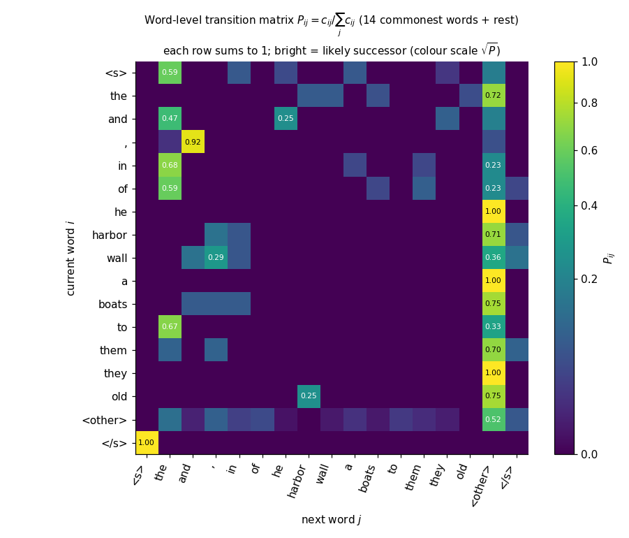
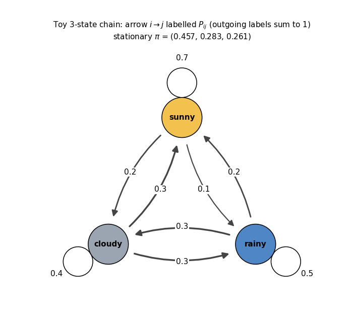
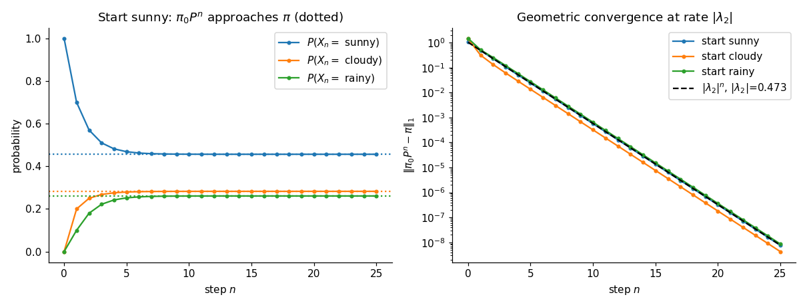
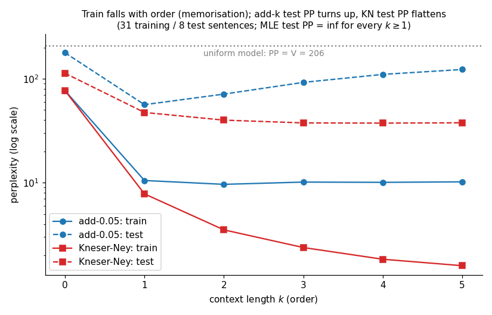
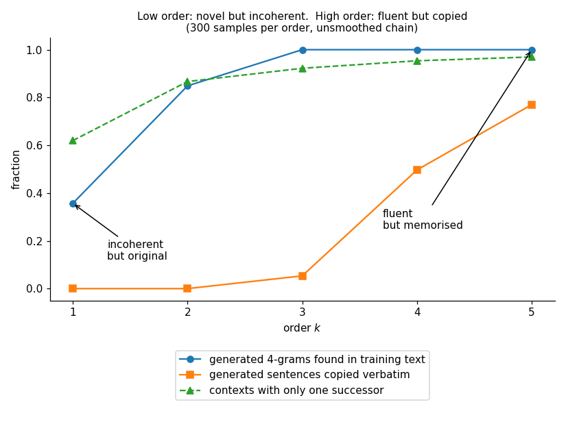

# Markov chain text generator

Word- and character-level text generation from counts, with the full theory: MLE, matrix powers, stationary
distributions, smoothing, perplexity. Implemented from scratch in NumPy + the standard library.

```
python -m pytest -q tests      # 35 tests
python make_figures.py         # regenerates figures/*.png (seeded)
python demo.py                 # ~2 s, prints every number quoted below
```

Layout: `src/markov.py` (library), `src/experiments.py` (shared split/tables), `data/corpus.txt` (39 sentences,
843 word tokens, original text written for this lesson and dedicated to the public domain, CC0), `tests/`,
`figures/`.

---

## 1. Motivation and the one-sentence idea

A language model assigns a probability to the next token. The simplest honest model says: *the next word depends only on
the last few words, and the dependence is read off from counts.*

> **Idea.** Treat text as a path of a Markov chain. Estimate the transition probabilities by relative frequency (this
> is the maximum-likelihood estimate), then generate by repeatedly sampling the next token from the row of the
> current state.

Everything else in this lesson answers the questions that sentence provokes: why relative frequency (Section 3), what
happens after many steps (Sections 5-6), how to sample correctly (Section 7), what to do with pairs never seen
(Section 8), and how to tell whether the model is any good (Section 9).

## 2. Notation

| Symbol | Meaning |
|---|---|
| $\mathcal S=\{1,\dots,V\}$ | finite state set (vocabulary, or tuples of tokens); $V=\lvert\mathcal S\rvert$ |
| $X_t$ | state (token) at time $t$ |
| $P=(P_{ij})$ | transition matrix, $P_{ij}=\Pr(X_{t+1}=j\mid X_t=i)$ |
| $\mathbf 1$ | all-ones column vector |
| $c_{ij}$ | number of observed transitions $i\to j$; $c_i=\sum_j c_{ij}$ |
| $\pi$ | stationary distribution (row vector) |
| $\mu_t$ | distribution of $X_t$ (row vector), $\mu_{t+1}=\mu_tP$ |
| $P^{(n)}_{ij}$ | $n$-step probability $\Pr(X_{t+n}=j\mid X_t=i)$ |
| $k$ (order) | number of previous tokens the model sees; the add-$k$ constant is written $\alpha$ below |
| $\alpha$ | add-$\alpha$ smoothing constant (`k=` in the code's `addk` option) |
| $d$ | absolute discount in Kneser-Ney (0.75) |
| $T$ | sampling temperature |
| $N$ | number of predicted tokens in an evaluation text |
| $H,\ \mathrm{PP}$ | cross-entropy (bits/token), perplexity $2^H$ |
| `<s>`, `</s>`, `<unk>` | start padding, end-of-sentence symbol, unseen-token stand-in |

## 3. Derivation

### 3.1 The Markov property and the transition matrix

A sequence $X_0,X_1,\dots$ is a (time-homogeneous, first-order) **Markov chain** if

$$\Pr(X_{t+1}=j\mid X_t=i,\;X_{t-1}=i_{t-1},\dots,X_0=i_0)=\Pr(X_{t+1}=j\mid X_t=i)=P_{ij}.\tag{1}$$

"The future is independent of the past given the present." Collect the $P_{ij}$ in a $V\times V$ matrix. Because row
$i$ is the distribution of the next state, every entry is non-negative and each row sums to one:

$$P_{ij}\ge 0,\qquad \sum_{j}P_{ij}=1\iff P\mathbf 1=\mathbf 1.\tag{2}$$

Such a matrix is **row-stochastic**. Distributions are row vectors and evolve as $\mu_{t+1}=\mu_t P$, because

$$\Pr(X_{t+1}=j)=\sum_i\Pr(X_t=i)\Pr(X_{t+1}=j\mid X_t=i)=\sum_i\mu_t(i)P_{ij}=(\mu_tP)_j .$$

Property (2) is preserved by products: if $P,Q$ satisfy (2), then $(PQ)\mathbf 1=P(Q\mathbf 1)=P\mathbf 1=\mathbf 1$
and $PQ\ge0$. Code: [`is_row_stochastic`](src/markov.py#L60).

### 3.2 Maximum-likelihood estimate of the transition probabilities

Observe a path $x_0,x_1,\dots,x_L$ (several sentences just give several paths; the argument is identical). Condition on
$x_0$. By (1) and the chain rule the likelihood is a product of one factor per step:

$$\mathcal L(P)=\prod_{t=0}^{L-1}P_{x_tx_{t+1}}=\prod_{i}\prod_{j}P_{ij}^{\,c_{ij}},$$

where we grouped steps by the pair $(i,j)$ they used. Taking logs,

$$\ell(P)=\sum_i\underbrace{\sum_j c_{ij}\log P_{ij}}_{\ell_i(P_{i\cdot})}.$$

Row $i$ of $P$ appears only in $\ell_i$, and the constraint $\sum_jP_{ij}=1$ involves only row $i$. So the problem
splits into $V$ independent problems, one per row. Fix a row and drop the index $i$: maximise
$f(p)=\sum_jc_j\log p_j$ subject to $\sum_jp_j=1$, $p_j\ge0$.

**Lagrange multiplier.** Form $\Lambda(p,\lambda)=\sum_jc_j\log p_j-\lambda\bigl(\sum_jp_j-1\bigr)$. Setting
$\partial\Lambda/\partial p_j=0$ for each $j$ with $c_j>0$:

$$\frac{c_j}{p_j}-\lambda=0\;\Longrightarrow\;p_j=\frac{c_j}{\lambda}.$$

Setting $\partial\Lambda/\partial\lambda=0$ returns the constraint. Sum $p_j=c_j/\lambda$ over $j$ and use $\sum_jp_j=1$:

$$1=\sum_j\frac{c_j}{\lambda}=\frac{c}{\lambda}\;\Longrightarrow\;\lambda=c=\sum_jc_j\;\Longrightarrow\;\boxed{P_{ij}=\frac{c_{ij}}{\sum_{j'}c_{ij'}}}\tag{3}$$

Any $j$ with $c_j=0$ contributes nothing to $f$, so to leave room for the others it is optimal to set $p_j=0$,
which (3) also gives.

**It is a maximum.** On the open simplex, $f$ is strictly concave in the $p_j$ with $c_j>0$ (Hessian
$-\mathrm{diag}(c_j/p_j^2)\prec0$), so the unique stationary point is the global maximiser. An alternative check without
calculus uses Gibbs' inequality: for any $q$ on the simplex, with $\hat p_j=c_j/c$,
$f(\hat p)-f(q)=c\sum_j\hat p_j\log(\hat p_j/q_j)=c\,\mathrm{KL}(\hat p\|q)\ge0$.

Code: [`count_matrix`](src/markov.py#L36) builds $c_{ij}$, [`mle_transition_matrix`](src/markov.py#L46) divides by row sums.
The property test `test_mle_maximises_likelihood` draws 200 random competitors and checks none beats (3).

### 3.3 n-gram (order-$k$) chains are first-order chains on tuples

An order-$k$ chain conditions on the last $k$ tokens: $\Pr(w_t\mid w_{t-1},\dots,w_1)=\Pr(w_t\mid w_{t-k},\dots,w_{t-1})$.
Define the **state** $S_t=(w_{t-k+1},\dots,w_t)$. Then $S_{t+1}=(w_{t-k+2},\dots,w_{t+1})$ shares $k-1$ entries with
$S_t$, and

$$\Pr(S_{t+1}\mid S_t,S_{t-1},\dots)=\Pr(w_{t+1}\mid w_{t-k+1..t})=\Pr(S_{t+1}\mid S_t),$$

which is exactly (1) on the state set $\mathcal S^k$. The transition matrix has $V^k$ rows but each row has at most
$V$ non-zeros (only the shift-compatible tuples), so it is extremely sparse, and so we store it as a dictionary
`context -> Counter` ([`MarkovChain.fit`](src/markov.py#L201)). Equation (3) applies unchanged:
$P(w\mid h)=c(h,w)/c(h)$. The code pads each sentence with $k$ copies of `<s>` so that the first real token also has a
full-length context, and appends `</s>`. [`lift_to_tuples`](src/markov.py#L151) shows the equivalence explicitly (tested by
`test_order_k_equals_first_order_on_tuples`). Order 0 is the unigram model, with a single state.

### 3.4 n-step probabilities: Chapman-Kolmogorov

Condition on the state at an intermediate time $m$ and use (1):

$$P^{(n+m)}_{ij}=\Pr(X_{t+n+m}=j\mid X_t=i)=\sum_{l}\Pr(X_{t+n}=l\mid X_t=i)\Pr(X_{t+n+m}=j\mid X_{t+n}=l)=\sum_lP^{(n)}_{il}P^{(m)}_{lj}.\tag{4}$$

In matrix form $P^{(n+m)}=P^{(n)}P^{(m)}$; with $P^{(1)}=P$ induction gives $P^{(n)}=P^n$. Thus
"probability of being in $j$ after $n$ steps from $i$" is the $(i,j)$ entry of the matrix power
([`n_step`](src/markov.py#L65), `test_chapman_kolmogorov`). Computing it by repeated squaring takes
$O(V^3\log n)$.

### 3.5 Stationary distribution

A row vector $\pi$ is **stationary** if the chain started from $\pi$ stays at $\pi$:

$$\pi P=\pi,\quad\pi\ge0,\quad\pi\mathbf 1=1.\tag{5}$$

Transposing, $P^{\top}\pi^{\top}=\pi^{\top}$: $\pi^\top$ is an **eigenvector of $P^\top$ with eigenvalue 1**.
Such an eigenvalue always exists: $P\mathbf 1=\mathbf 1$ shows 1 is an eigenvalue of $P$, and $P$ and $P^\top$ have the same
eigenvalues. [`stationary_eig`](src/markov.py#L70) solves it by `np.linalg.eig` and normalises (which also fixes the arbitrary
sign). Alternatively, **power iteration** $\mu_{t+1}=\mu_tP$ ([`stationary_power`](src/markov.py#L78)) finds it without
a decomposition, at cost $O(\mathrm{nnz}(P))$ per step.

**Detailed balance.** If a distribution $\pi$ satisfies

$$\pi_iP_{ij}=\pi_jP_{ji}\quad\text{for all }i,j,\tag{6}$$

then it is stationary: summing (6) over $i$ gives $\sum_i\pi_iP_{ij}=\pi_j\sum_iP_{ji}=\pi_j$. Such chains are called
*reversible* (the probability flow $i\to j$ equals the flow $j\to i$). Example: a random walk on an undirected weighted graph
with weights $W_{ij}=W_{ji}$, $P_{ij}=W_{ij}/w_i$, $w_i=\sum_jW_{ij}$; then $\pi_i=w_i/\sum_lw_l$ satisfies (6)
because $\pi_iP_{ij}=W_{ij}/\sum_l w_l$ is symmetric. Detailed balance is sufficient, not necessary: our weather chain
has a stationary distribution but a non-zero detailed-balance gap (Section 5). Code: [`detailed_balance_gap`](src/markov.py#L94).

**When is the stationary distribution unique, and does the chain converge to it?**

* *Irreducible*: every state can reach every other ($\forall i,j\ \exists n:\ P^n_{ij}>0$). Otherwise there are several
  closed classes and each carries its own stationary distribution. Code: [`is_irreducible`](src/markov.py#L100).
* *Aperiodic*: for each state $i$, $\gcd\{n:P^n_{ii}>0\}=1$. Otherwise the chain cycles, e.g.
  $1\to2\to3\to1$ has period 3 and $P^n$ never converges. Code: [`period`](src/markov.py#L107).
* A finite chain that is irreducible and aperiodic is **ergodic**.

**Theorem.** If $P$ is finite, irreducible and aperiodic, then it has a unique stationary distribution $\pi$ with all
$\pi_i>0$, and for every initial $\mu_0$, $\mu_0P^n\to\pi$ geometrically fast.

*Proof sketch.*

1. *Primitivity.* Irreducible plus aperiodic implies there is $m$ with $P^m>0$ entrywise (every state reaches every
   state in exactly $m$ steps). Reason: aperiodicity makes the set of return times to $i$ closed under addition and with
   gcd 1, so it contains all large integers (a number-theory fact, Schur's theorem); irreducibility then connects any two
   states with a path of some length.
2. *Perron-Frobenius.* A non-negative primitive matrix $A$ has a real eigenvalue $r>0$ (the spectral radius) that is
   algebraically simple, has a strictly positive eigenvector, and every other eigenvalue satisfies $|\lambda|<r$.
   For stochastic $P$, $P\mathbf 1=\mathbf 1$ gives a positive right eigenvector with eigenvalue 1, and
   $\rho(P)\le\|P\|_\infty=1$, hence $r=1$. Applying the theorem to $P^\top$ gives a unique positive left eigenvector, normalised to $\pi$.
3. *Convergence.* Write $P=\mathbf 1\pi+R$ with $R$ the remaining spectral part, $\pi R=0$, $R\mathbf 1=0$.
   (If $P$ is diagonalisable, $P^n=\mathbf 1\pi+\sum_{l\ge2}\lambda_l^n\,r_l\ell_l$.) All remaining eigenvalues have
   $|\lambda|<1$, so $R^n\to0$ at rate $|\lambda_2|^n$ (up to a polynomial factor if there are Jordan blocks), where $\lambda_2$
   is the eigenvalue of second-largest modulus. Hence $P^n\to\mathbf 1\pi$: every row of $P^n$ tends to $\pi$.

*Elementary alternative to step 3 (no spectral theory).* Let $\varepsilon=\min_{ij}P^m_{ij}>0$. For two distributions
$\mu,\nu$, the total-variation distance obeys $\|\mu P^m-\nu P^m\|_{TV}\le(1-V\varepsilon)\|\mu-\nu\|_{TV}$, because $P^m=V\varepsilon\,U+(1-V\varepsilon)Q$
with $U$ the uniform-row matrix and $Q$ stochastic, and the $U$ part cannot distinguish $\mu$ from $\nu$. Taking $\nu=\pi$,
$\|\mu P^{jm}-\pi\|_{TV}\le(1-V\varepsilon)^j\to0$. $\blacksquare$

For text this matters in a concrete way. A chain that ends sentences with `</s>` and never leaves is *absorbing*
(not irreducible): all long-run mass ends on `</s>`. We therefore close the chain with a wrap-around
`</s> -> <s>`. The resulting stationary distribution is just the token frequency, $\pi_w=\mathrm{count}(w)/\text{total}$,
since the flow into any state equals the flow out of it (exercise 7); it confirms nothing about *style*, which lives in the
transitions, and it is why the stationary distribution is mainly useful as a diagnostic.

### 3.6 Sampling: inverse CDF

To draw $J\sim p$ on $\{0,\dots,V-1\}$, let $F_j=\sum_{l\le j}p_l$ and draw $u\sim\mathrm{Uniform}[0,1)$:

$$J=\min\{j:\ F_j>u\}.\tag{7}$$

*Correctness:* $\Pr(J=j)=\Pr(F_{j-1}\le u<F_j)=F_j-F_{j-1}=p_j$. Implementation
([`sample_inverse_cdf`](src/markov.py#L131)): `np.searchsorted(cumsum(p), u, side='right')`, an $O(\log V)$ binary search after the
$O(V)$ cumulative sum, clipped to $V-1$ in case rounding leaves $F_{V-1}=1-10^{-16}<u$. Test
`test_inverse_cdf_boundaries` pins the half-open intervals: $u=0.2$ with $p=(0.2,0.5,0.3)$ selects index 1, not 0.

**Temperature.** Rescale the log-probabilities before sampling:

$$p^{(T)}_j=\frac{p_j^{1/T}}{\sum_lp_l^{1/T}}=\operatorname{softmax}\!\left(\frac{\log p_j}{T}\right).\tag{12}$$

$T=1$ leaves $p$ unchanged; $T\to0$ concentrates on the arg-max (greedy decoding); $T\to\infty$ tends to uniform over the
support (zero-probability tokens stay at zero). Code: [`temperature_scale`](src/markov.py#L138), used in
[`MarkovChain.generate`](src/markov.py#L304).

### 3.7 The zero-count problem and smoothing

The MLE (3) gives probability 0 to anything unseen. For a held-out text, one unseen bigram makes the whole likelihood zero
and the perplexity infinite. With vocabulary size $V$ in the order-$k$ model, there are $V^{k+1}$ possible $n$-grams and a
small corpus sees a vanishing fraction of them, so this is the normal case, not a corner case.

**Add-$\alpha$ (Laplace for $\alpha=1$).** Pretend every $n$-gram was seen $\alpha$ extra times:

$$P_\alpha(w\mid h)=\frac{c(h,w)+\alpha}{c(h)+\alpha V}.\tag{8}$$

The denominator is the sum of the numerators over the $V$ possible $w$, so the row still sums to one. This is the
posterior mean under a symmetric Dirichlet$(\alpha)$ prior on the row ($\alpha=1$ is Laplace's rule of succession), and the MAP estimate under Dirichlet$(\alpha+1)$ (exercise 9). Problem:
with $V$ large and $c(h)$ small, the $\alpha V$ in the denominator hands a huge share of the mass to unseen words.
In our corpus $V=206$ while a typical context has $c(h)\approx2$.

**Backoff and interpolation.** If the long context $h=(w_{t-k},\dots,w_{t-1})$ was never seen, use the shorter context
$h'$ (drop the oldest word). *Katz backoff* does this only when $c(h,w)=0$; *interpolation* always mixes,
$P(w\mid h)=\lambda_hP_{\text{ML}}(w\mid h)+(1-\lambda_h)P(w\mid h')$. The model's own `generate` uses a simple form of backoff for unseen user prefixes.

**Absolute discounting and Kneser-Ney.** Subtract a fixed discount $d\in(0,1)$ from every seen count and give the freed mass
to the lower-order model. Writing $N_{1+}(h\bullet)=\lvert\{w:c(h,w)>0\}\rvert$ (the number of distinct continuations):

$$P_{KN}(w\mid h)=\frac{\max\{c(h,w)-d,\,0\}}{c(h)}+\underbrace{\frac{d\,N_{1+}(h\bullet)}{c(h)}}_{\gamma(h)}\,P_{KN}(w\mid h').\tag{9}$$

*It is normalised.* $\sum_w\max\{c(h,w)-d,0\}=c(h)-dN_{1+}(h\bullet)$, so the first term sums to $1-\gamma(h)$ and the
second to $\gamma(h)$. If $c(h)=0$, use $P_{KN}(w\mid h')$ alone.

*The Kneser-Ney idea* is in what the lower-order model measures. The word "Francisco" is frequent, but it almost
only follows "San". A lower-order unigram model should answer *"how likely is this word in a **new** context?"*,
not *"how frequent is it?"*. So in all but the highest order, replace the raw count by the **continuation count**
$N_{1+}(\bullet\,h\,w)=\lvert\{v:c(v,h,w)>0\}\rvert$, the number of distinct words that precede it, and normalise those. The recursion
bottoms out at the empty context, where we additionally mix with the uniform distribution $1/V$ so that `<unk>` and
unseen words get non-zero probability. Code: [`_build_kn`](src/markov.py#L220) (continuation counts) and [`_kn`](src/markov.py#L269) (recursion); tests check normalisation
for seen and unseen contexts and that KN beats add-1 on held-out sentences.

### 3.8 Evaluation: cross-entropy and perplexity

Evaluate on held-out text $w_1,\dots,w_N$ (every predicted token including `</s>`; each is predicted from its context by the model $q$). The
average negative log-likelihood is the **cross-entropy**, in bits per token:

$$H(q)=-\frac1N\sum_{t=1}^N\log_2q(w_t\mid h_t),\qquad\mathrm{PP}=2^{H}=\Bigl(\prod_{t}q(w_t\mid h_t)\Bigr)^{-1/N}.\tag{10, 11}$$

*Why it is the right quantity.* If the test tokens are drawn from a true distribution $p$, then $H\to-\sum p\log_2q=H(p)+\mathrm{KL}(p\|q)\ge H(p)$:
the cross-entropy equals the true entropy plus the KL divergence of the model, so a lower value is a closer model, and minimising training cross-entropy is
exactly maximum likelihood (the MLE of 3.2 minimises $H$ on the training set). Perplexity is the geometric mean of the inverse probabilities, i.e. the **effective
number of equally likely choices** per token.

*Sanity anchor.* A model with $q\equiv1/V$ has $H=\log_2V$ and $\mathrm{PP}=2^{\log_2V}=V$. Any useful model must beat $V$. A deterministic model that
always predicts the right token has $\mathrm{PP}=1$. Both are tests (`test_perplexity_of_uniform_model_is_vocab_size`,
`..._deterministic_model_is_one`). If any $q(w_t\mid h_t)=0$, then $H=\infty$. Code: [`log2_probs`](src/markov.py#L286), [`cross_entropy`](src/markov.py#L295), [`perplexity`](src/markov.py#L299).

*Comparability.* Perplexities are only comparable for the same tokenisation and vocabulary. A character model's PP (per character) cannot be set against a
word model's PP (per word); convert to bits per character instead.

*Train/test split.* Training perplexity measures memorisation (MLE with large $k$ drives it to 1), only held-out perplexity measures generalisation. We split
**sentences** 80/20 with a fixed seed; test words absent from training become `<unk>`.

*Order and the bias-variance trade.* Raising $k$ buys longer-range structure but divides the data over $V^k$ contexts, most seen once or never. The estimate for
a context seen once is "the word that followed last time", i.e. copying. That is exactly what Figure 5 and the numbers in Section 6 show.

## 4. Geometric / intuitive picture

* **Heatmap** (Figure 1): row $i$ is a histogram of what follows word $i$. Bright cells are near-deterministic
  successors (`,` is followed by `and` 92% of the time here). Rows that are one bright cell are the reason high-order chains plagiarise.
* **Graph** (Figure 2): a state is a node, $P_{ij}$ is the width of the arrow $i\to j$. A path is a random walk that picks an outgoing arrow with probability
  proportional to its label. The stationary distribution is the fraction of time the walker spends at each node.
* **Convergence** (Figure 3): $\mu_0P^n$ is a distribution that "forgets" its starting point. The error is a sum of terms $\lambda^n$, dominated by
  $\lambda_2$, so it falls on a straight line on a log axis.


*Figure 1. Transition matrix of the word-level chain (fourteen commonest tokens, others pooled). Each row sums to 1.*


*Figure 2. The toy weather chain of the worked example, with its stationary distribution.*


*Figure 3. Convergence to the stationary distribution; the dashed line is $|\lambda_2|^n$ with $\lambda_2=0.473$.*

## 5. Worked examples (all numbers printed by `python demo.py`)

### 5.1 Counting, MLE, smoothing and perplexity on three sentences

Corpus: `the cat sat`, `the cat ran`, `the dog sat`; padded as `<s> the cat sat </s>`. Counting transitions (hand count, checked by `test_mle_matches_hand_count`):

| from \ to | the | cat | dog | sat | ran | `</s>` |
|---|---|---|---|---|---|---|
| `<s>` | 3 | | | | | |
| the | | 2 | 1 | | | |
| cat | | | | 1 | 1 | |
| dog | | | | 1 | | |
| sat | | | | | | 2 |
| ran | | | | | | 1 |

Divide each row by its sum, Eq. (3): $P(\text{cat}\mid\text{the})=2/3=0.6667$, $P(\text{dog}\mid\text{the})=1/3=0.3333$,
$P(\text{sat}\mid\text{cat})=P(\text{ran}\mid\text{cat})=1/2$, all other non-empty rows have a single entry equal to 1. (The `</s>` row has no observations; the code
makes it uniform so the matrix stays stochastic.)

*Order 2:* $P(\text{sat}\mid\text{the cat})=1/2$ but $P(\text{sat}\mid\text{the dog})=1$. The order-2 chain on the three sentences is a first-order chain on **9 bigram states** (printed by the demo).

*Cross-entropy of `the cat sat`:* the four predictions have probabilities $1,\ 2/3,\ 1/2,\ 1$, i.e. $\log_2$-probabilities $0,\,-0.585,\,-1,\,0$, so
$H=\tfrac14(0.585+1)=0.3962$ bits and $\mathrm{PP}=2^{0.3962}=1.3161$ ($=3^{1/4}$).

*Zero counts:* $V=7$ (five words, `</s>`, `<unk>`). The MLE gives `P(ran|the)=0`, so the unseen test sentence `the dog ran` has perplexity $\infty$.
With add-1, Eq. (8): $P(\text{cat}\mid\text{the})=(2+1)/(3+7)=0.3$ and $P(\text{ran}\mid\text{the})=1/10=0.1$; perplexity of `the dog ran` becomes 4.4721.

### 5.2 Toy weather chain

$P=\begin{pmatrix}.7&.2&.1\\.3&.4&.3\\.2&.3&.5\end{pmatrix}$ (sunny, cloudy, rainy).

* Two steps, Eq. (4): $P^2_{00}=.7\cdot.7+.2\cdot.3+.1\cdot.2=.57$ (the code prints the full $P^2$ whose first row is $(.57,.25,.18)$).
* Five steps from sunny: $(0.4685,\,0.2794,\,0.2521)$. A seeded simulation of 20 000 runs gives $(0.4692,0.2772,0.2535)$, agreeing within sampling error.
* $P^{50}$ has identical rows $(0.4565,\,0.2826,\,0.2609)$, which is $\pi$. $\pi P-\pi$ has maximum absolute entry $6\times10^{-17}$.
* Eigenvalues $1,\ 0.4732,\ 0.1268$: the chain is irreducible and aperiodic, power iteration needs 38 steps to reach $10^{-12}$, consistent with $0.4732^{38}\approx 4\times 10^{-13}$.
* A 100 000-step simulation spends fractions $(0.4566,0.2819,0.2615)$ of time in each state: time averages match $\pi$ (ergodic theorem).
* Detailed balance fails for this chain (gap 0.0065), yet $\pi$ is stationary: (6) is sufficient only. A two-state chain with $a=0.3,b=0.1$ always satisfies (6), with $\pi=(b,a)/(a+b)=(0.25,0.75)$ and $\lambda_2=1-a-b=0.6$ (checked).
* The 3-cycle $1\to2\to3\to1$ is irreducible but has period 3: $P^n$ rotates forever and never converges.

## 6. Results on the corpus

Corpus: 39 sentences, 843 word tokens, 226 word types (31/8 train/test sentences, vocabulary $V=206$ including `</s>` and `<unk>`; 17.6% of test tokens are unseen in training).
The uniform model has perplexity 206.0, as it must.

**Word-level perplexity by order** (Figure 4):

| order $k$ | add-0.05 train | add-0.05 test | KN train | KN test | MLE train | MLE test |
|---|---|---|---|---|---|---|
| 0 | 76.86 | 177.96 | 76.92 | 113.02 | 76.84 | inf |
| 1 | 10.51 | 56.33 | 7.81 | 47.41 | 3.87 | inf |
| 2 | 9.65 | 71.22 | 3.52 | 40.01 | 1.85 | inf |
| 3 | 10.15 | 92.30 | 2.38 | 37.61 | 1.41 | inf |
| 4 | 10.09 | 110.20 | 1.84 | 37.44 | 1.21 | inf |
| 5 | 10.20 | 122.81 | 1.59 | 37.72 | 1.18 | inf |

Reading: (i) training perplexity of the MLE collapses to 1.18 at $k=5$ since almost every context has a single successor (memorisation); (ii) the MLE test perplexity is infinite for
every $k$ (even $k=0$ since test words are unseen); (iii) with add-$\alpha$ the best test perplexity is at $k=1$ (56.3) and then worsens as contexts get rarer: classic overfitting;
(iv) Kneser-Ney, which backs off sensibly, improves up to $k=4$ (37.44) and then flattens, and is far better than add-$\alpha$ at every order. With this small test set (8 sentences, ~200 tokens) differences of a few points are noise.

**Coherence versus memorisation** (300 samples per order from the unsmoothed chain trained on the training split, Figure 5):

| order | distinct contexts | contexts with 1 successor | generated 4-grams found in training | sentences copied verbatim |
|---|---|---|---|---|
| 1 | 205 | 0.620 | 0.357 | 0.000 |
| 2 | 420 | 0.867 | 0.849 | 0.000 |
| 3 | 540 | 0.922 | 1.000 | 0.053 |
| 4 | 602 | 0.953 | 1.000 | 0.497 |
| 5 | 623 | 0.970 | 1.000 | 0.770 |

Order 2 samples are grammatical for a few words and wander ("...the fishing boats rocked gently against the windows, and he gave the boat to the harbor in the sun"), order 1 yields word salad, and from order 4 half the output is a verbatim training sentence. Because a corpus this small has so few branches (92-97% single-successor contexts at orders 3-5), there is no freedom left
to create anything new. Large corpora push the same curve to the right but do not remove it.


*Figure 4. Train/test perplexity versus order.*


*Figure 5. Generated text copies more of the source as order grows.*

**Temperature** (order 2, same seed 7): $T=0.3$ reproduces a training sentence ("...the smell of warm bread filled the cold street"), $T=2$ takes less likely branches. Directly on the next-word
distribution after "the harbor" (6 candidates): $T=0.5,1,2$ give maximum probability $0.818,0.500,0.311$ and entropy $1.048,2.126,2.483$ bits. Temperature cannot create branches that do not exist; in a corpus this small it only
shifts weight among the few successors.

**Smoothed generation.** The KN model really assigns mass to unseen continuations (generation from it, order 2, gives ungrammatical strings such as "the young sailor night women came and out"). Smoothing is for *scoring*; use the
sharp MLE chain, or a small temperature, for generation.

**Character level.** Vocabulary 27 (letters, space, comma, `</s>`, `<unk>`). KN test perplexity (per character) falls 17.29, 8.86, 5.72, 4.21, 3.70, 3.58 for orders 0, 1, 2, 3, 5, 8. Samples go from letter noise
(order 0: "tenah oeuh l auk ab"), to pseudo-words (order 1: "this mantheat sked ththey"), to real words and phrases (order 3: "the fishermen to the young sailed the boat less of their soung sounded lanter"), to copied
clauses (order 8).

**Stationary distribution of the word chain.** Closing the chain with `</s> -> <s>`, the chain is irreducible and aperiodic; its $\pi$ equals the token frequency to $5\times10^{-17}$: "the" 0.1574, "and" 0.0575, "," 0.0543.

## 7. Algorithm

```
FIT(sentences, order k, smoothing)
    for s in sentences:
        s' = [<s>]*k + s + [</s>]
        for t in k .. len(s')-1:
            counts[ tuple(s'[t-k:t]) ][ s'[t] ] += 1            # c(h, w)
    if smoothing == KN: build continuation counts N1+(. h w) level by level

PROB(h, w)                       # h = last k tokens, unseen words -> <unk>
    none : c(h,w) / c(h)                                  # Eq. 3
    addk : (c(h,w) + a) / (c(h) + a*V)                    # Eq. 8
    KN   : max(c-d,0)/c(h) + d*N1+(h.)/c(h) * PROB(h[1:], w)    # Eq. 9

GENERATE(T, max_len)
    out = []
    repeat:
        h = last k tokens of out (padded with <s>)
        tokens, p = successors(h) and their probabilities
        q = p^(1/T) / sum p^(1/T)                         # Eq. 12
        F = cumsum(q);  u = Uniform[0,1);  w = tokens[ searchsorted(F, u, side='right') ]   # Eq. 7
        if w == </s> or len(out) == max_len: stop
        out.append(w)

PERPLEXITY(sentences):  H = -mean over all predicted tokens of log2 PROB;  return 2**H     # Eq. 10-11
```

## 8. Complexity

| step | time | memory |
|---|---|---|
| count $N$ tokens, order $k$ | $O(N)$ (hash per $k$-tuple: $O(kN)$) | $O(\#\text{distinct }(k{+}1)\text{-grams})\le O(N)$ |
| dense transition matrix, $V$ states | $O(V^2)$ | $O(V^2)$ |
| dense matrix for order $k$ | $O(V^{2k})$ | infeasible; use the dictionary |
| draw one token | $O(s)$ cumsum + $O(\log s)$ search, $s$ = successors (alias tables give $O(1)$) | |
| $P^n$ by repeated squaring | $O(V^3\log n)$ | $O(V^2)$ |
| power iteration | $O(\mathrm{nnz}(P))$ per step; $O(\log(1/\epsilon)/\log(1/\lvert\lambda_2\rvert))$ steps | |
| full-vocabulary distribution (used for smoothed scoring) | $O(V\cdot k)$ per call (KN recursion) | |
| KN construction | $O(kN)$ | one counter per order |

## 9. Failure modes and pitfalls

1. **Zero probabilities.** The MLE has $q=0$ for unseen events, so held-out perplexity is infinite. Always smooth (or at least map rare words to `<unk>`) before scoring.
2. **Evaluating on training text.** Training perplexity falls monotonically with order (Table, MLE and KN columns) and says nothing about generalisation.
3. **Absorbing / reducible chains.** If a state has no outgoing transitions (`</s>` here) its row is undefined. We either stop generation there or wrap `</s> -> <s>`. A chain with two closed classes has two stationary
   distributions; a periodic chain does not converge ($P^n$ rotates).
4. **Row-normalisation direction.** Our $P$ is row-stochastic, distributions are row vectors ($\mu P$), and $\pi$ is an eigenvector of $P^{\top}$. Using the column
   convention with a row-stochastic matrix silently gives the wrong answer.
5. **Unnormalised eigenvectors.** `np.linalg.eig` returns a vector of norm 1, not sum 1, with arbitrary sign. Divide by the sum.
6. **Smoothing in generation.** Smoothed models spread probability over unseen words (see the KN sample above).
7. **Memorisation.** At high order the generator is a lookup table: samples are verbatim source sentences (77% at order 5). Check n-gram overlap against the training set.
8. **Rounding in inverse-CDF.** $F_{V-1}$ can be slightly below 1; clip the index.
9. **Incomparable perplexities.** Different vocabularies, tokenisations (characters vs words) or `<unk>` handling make PP numbers incomparable.
10. **Low temperature on sparse data.** $T\to0$ is greedy and can get stuck repeating a cycle of high-probability words; `max_len` guards against it.
11. **Tiny test sets.** The 8-sentence test set makes the table above noisy. The qualitative pattern is robust; differences of a few perplexity points are not.
12. **State-space explosion.** Order $k$ has $V^k$ potential states; never build the dense matrix, only the observed contexts.

## 10. Exercises with full solutions

**Exercise 1 (MLE).** From a text over states $\{A,B\}$ you count $c_{AA}=6,\ c_{AB}=2,\ c_{BA}=1,\ c_{BB}=3$. Find the MLE $P$ and its stationary distribution.

*Solution.* Row sums 8 and 4. $P=\begin{pmatrix}6/8&2/8\\1/4&3/4\end{pmatrix}=\begin{pmatrix}.75&.25\\.25&.75\end{pmatrix}$. This is a two-state chain with $a=.25,b=.25$, so $\pi=(b,a)/(a+b)=(.5,.5)$.
Check: $(.5,.5)P=(.5\cdot.75+.5\cdot.25,\ .5\cdot.25+.5\cdot.75)=(.5,.5)$. The demo prints exactly this.

**Exercise 2 (cross-entropy).** Using the three-sentence corpus and the order-1 MLE, compute the perplexity of `the dog sat`.

*Solution.* Predictions: $P(\text{the}\mid\langle s\rangle)=1$, $P(\text{dog}\mid\text{the})=1/3$, $P(\text{sat}\mid\text{dog})=1$, $P(\langle/s\rangle\mid\text{sat})=1$. Product $=1/3$ over $N=4$ predictions, so
$\mathrm{PP}=(1/3)^{-1/4}=3^{1/4}=1.316$, $H=\tfrac14\log_23=0.396$ bits. (The same value as `the cat sat`, whose factors are $2/3\cdot1/2=1/3$.)

**Exercise 3 (Chapman-Kolmogorov).** For the weather chain, find the probability that it is sunny two days from now given that it is rainy today.

*Solution.* $P^2_{\text{rainy},\text{sunny}}=\sum_lP_{\text{rainy},l}P_{l,\text{sunny}}=.2\cdot.7+.3\cdot.3+.5\cdot.2=.14+.09+.10=.33$, the third row first column of $P^2$ (the demo's printed matrix: 0.33).

**Exercise 4 (add-$\alpha$).** In the three-sentence corpus ($V=7$), compute $P(\text{ran}\mid\text{the})$ under add-1, and check that the row $\text{the}\to\cdot$ sums to one.

*Solution.* $c(\text{the})=3$, so the denominator is $3+1\cdot7=10$. $P(\text{cat})=3/10$, $P(\text{dog})=2/10$, $P(\text{ran})=1/10$, and each of the other five symbols
(`the`, `sat`, `ran`, `</s>`, `<unk>`) has $1/10$. Total $=3/10+2/10+5\cdot1/10=1$. Hence $P(\text{ran}\mid\text{the})=0.1$.

**Exercise 5 (periodicity and laziness).** The 3-cycle $P_{12}=P_{23}=P_{31}=1$ has period 3. Show the lazy chain $Q=\tfrac12(I+P)$ is aperiodic and has the same stationary distribution.

*Solution.* $Q_{ii}=\tfrac12>0$, so each state has return time 1 and the gcd is 1; $Q$ is still irreducible, hence ergodic. If $\pi P=\pi$ then $\pi Q=\tfrac12(\pi+\pi P)=\pi$. For the cycle,
$\pi=(1/3,1/3,1/3)$ (the columns of $P$ also sum to 1). So laziness repairs periodicity without changing $\pi$; $Q$ converges although $P$ does not.

**Exercise 6 (temperature).** Show that for any $p$ the entropy of $p^{(T)}$ is non-decreasing in $T$, and find the limits.

*Solution.* Let $E_j=-\log p_j$ and $p^{(T)}_j\propto e^{-E_j/T}$ (a Boltzmann distribution with $\beta=1/T$). With $Z(\beta)=\sum e^{-\beta E_j}$, entropy in nats is
$S(\beta)=\log Z+\beta\langle E\rangle$ and $dS/d\beta=-\beta\,\mathrm{Var}(E)\le0$; since $\beta=1/T$ decreases as $T$ grows, $S$ is non-decreasing in $T$. As $T\to\infty$, $p^{(T)}\to$ uniform on the support (entropy $\log s$); as $T\to0$,
$p^{(T)}\to$ point mass on the mode (entropy 0). The demo confirms 1.048, 2.126, 2.483 bits for $T=0.5,1,2$ with 6 candidates (maximum $\log_26=2.585$).

**Exercise 7 (stationary distribution of a closed text chain).** For the text chain with `</s> -> <s>` wrap-around, prove $\pi_w=\mathrm{count}(w)/M$ where $M$ is the total number of tokens in the wrapped stream.

*Solution.* Let $n_w$ be the number of occurrences of $w$ in the stream treated as a cycle. Every occurrence of $w$ is followed by exactly one token and preceded by exactly one token. Thus $n_w=\sum_ic_{iw}$ (arrivals)
and $n_w=\sum_jc_{wj}=c_w$ (departures). Then $\sum_i\frac{n_i}{M}P_{iw}=\sum_i\frac{n_i}{M}\frac{c_{iw}}{n_i}=\frac1M\sum_ic_{iw}=\frac{n_w}M$, which is (5). Uniqueness comes from irreducibility.
The code verifies this to $5.6\times10^{-17}$ (`test_stationary_of_closed_text_chain_is_token_frequency`).

**Exercise 8 (state count).** How many states and transitions does an order-$k$ chain over a vocabulary of $V$ tokens have in the worst case? Why do we not store the matrix?

*Solution.* $V^k$ states; each state has at most $V$ successors (only shifts of the form $(w_2,\dots,w_k,w)$ are legal), so at most $V^{k+1}$ non-zeros in a $V^k\times V^k$ matrix: a fraction $V^{-(k-1)}$ of the
entries. For $V=10^4$, $k=3$: $10^{12}$ rows. Only observed contexts (at most $N$) are stored.

**Exercise 9 (add-$\alpha$ is MAP).** Show that add-$\alpha$ smoothing, Eq. (8), is the MAP estimate for a row under a symmetric Dirichlet$(\alpha+1,\dots,\alpha+1)$ prior.

*Solution.* The log-posterior up to constants is $\sum_j c_j\log p_j+\sum_j\alpha\log p_j=\sum_j(c_j+\alpha)\log p_j$ (the Dirichlet density is $\propto\prod p_j^{\alpha}$). This has the form of Section 3.2 with counts $c_j+\alpha$, so the same Lagrange argument gives
$p_j=(c_j+\alpha)/\sum_l(c_l+\alpha)=(c_j+\alpha)/(c+\alpha V)$.
