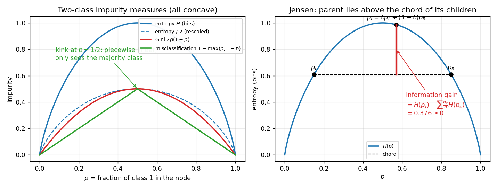
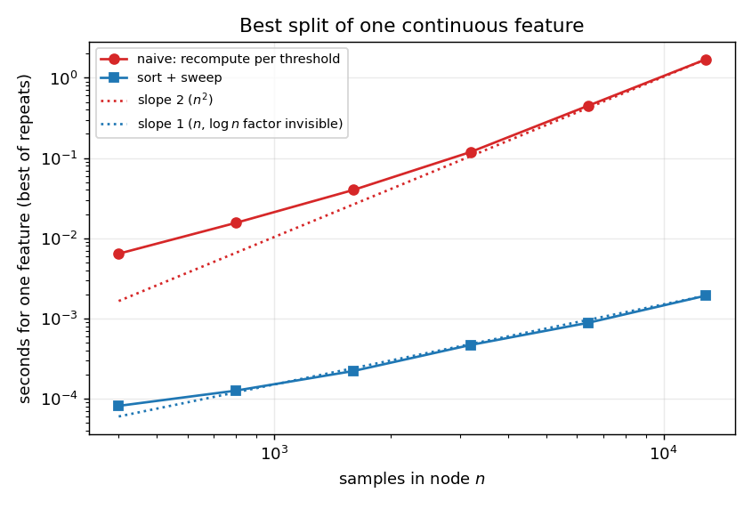
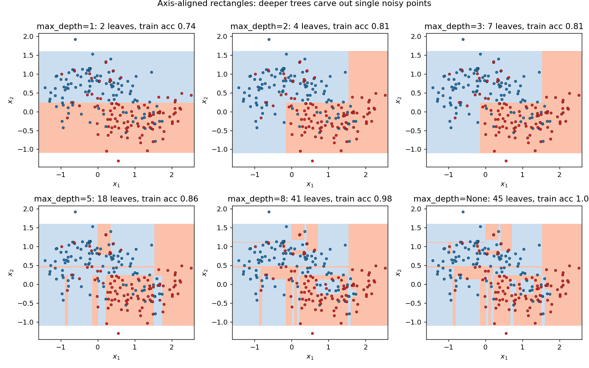
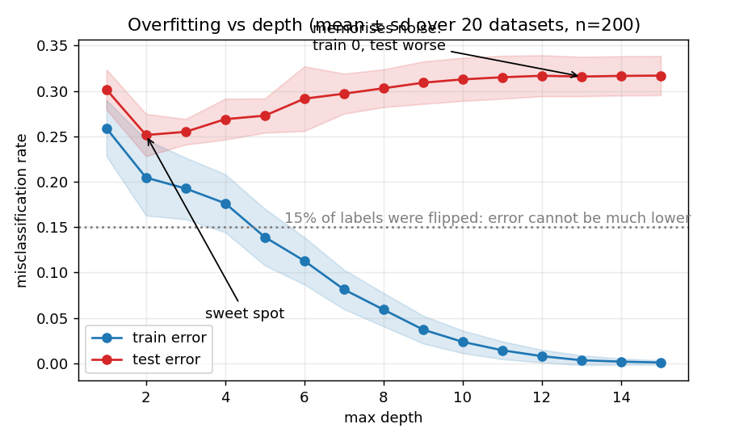
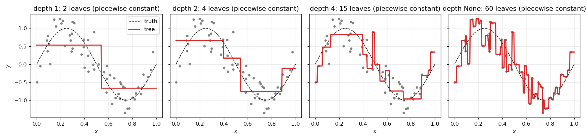
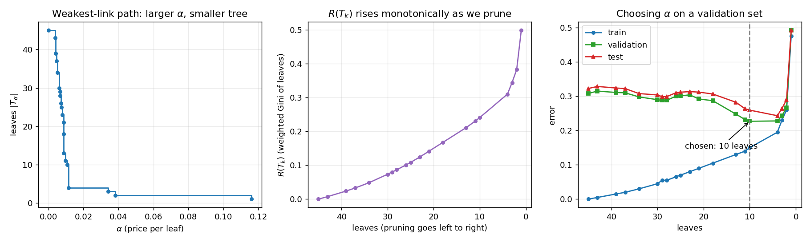
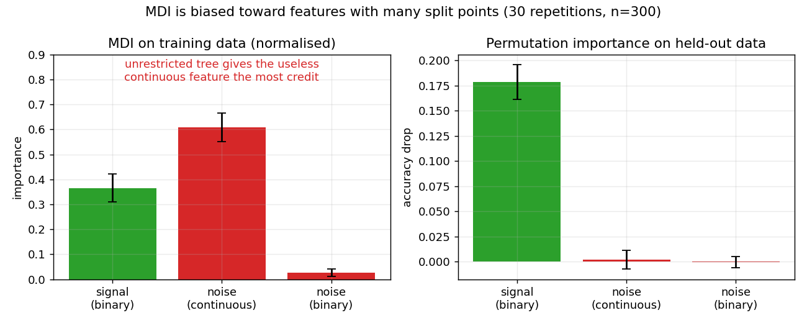
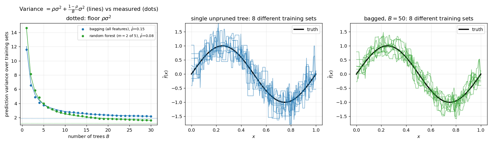
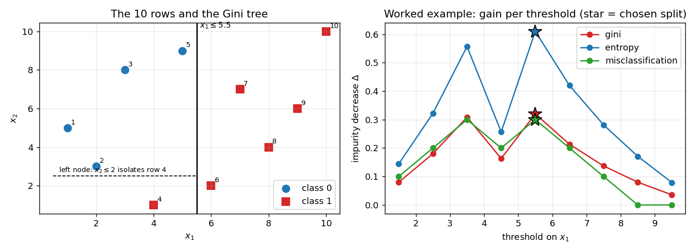

# Decision trees, from first principles

Classification and regression trees (CART), derived step by step and implemented in NumPy only.
Everything numeric below is reproduced by `demo.py` or checked by `tests/`.

```
python -m pytest -q          # 71 tests (sklearn comparison is skipped if sklearn is absent)
python demo.py               # about 10 s, prints every number quoted here
python make_figures.py       # regenerates figures/ (about 1 minute)
```

| File | Role |
|---|---|
| [`src/tree.py`](src/tree.py) | impurity measures, split search (fast and naive), classifier, regressor, pruning, MDI, bagging |
| [`tests/`](tests) | closed forms, fast == naive, sklearn agreement, invariants, brute-force pruning optimality |
| [`demo.py`](demo.py) | end-to-end run |
| [`make_figures.py`](make_figures.py) | all figures |

---

## 1. Motivation and the one-sentence idea

A linear model draws one global formula through the data. Many real relationships are *rule-like* ("if the cone
resistance is low and the depth is small then soft clay"), have interactions, and mix numeric and categorical inputs.

> **A decision tree repeatedly asks the single best yes/no question about one feature, splitting the data into two
> purer groups, until the groups are (nearly) pure; each final group predicts a constant.**

The tree is therefore a piecewise-constant function on axis-aligned boxes. The interesting mathematics is in
*what "best" means* (impurity), *how to find it fast* (sort and sweep), and *when to stop* (pruning).

## 2. Notation

| Symbol | Meaning |
|---|---|
| $n$, $N$ | samples in the current node, samples in the whole training set |
| $d$, $K$ | number of features, number of classes |
| $x_{ij}$, $y_i$ | feature $j$ of sample $i$, target (class index in $\{1..K\}$ or real number) |
| $t$, $L$, $R$ | a node, its left and right child ($x_j \le \tau$ goes left) |
| $n_t$, $n_{tk}$ | samples in node $t$, samples of class $k$ in node $t$ |
| $p_{tk}=n_{tk}/n_t$ | class proportion; $\mathbf p_t$ the vector |
| $I(t)=I(\mathbf p_t)$ | impurity of node $t$ ($0$ for pure nodes) |
| $\Delta(t;j,\tau)$ | impurity decrease of splitting $t$ on feature $j$ at threshold $\tau$ |
| $\bar y_t$ | mean target in node $t$ |
| $T$, $\lvert T\rvert$, $T_t$ | a tree, its number of leaves, the subtree rooted at $t$ |
| $R(t)=\frac{n_t}{N}I(t)$ | cost of node $t$ if it were a leaf |
| $R(T)=\sum_{\text{leaves}}R(t)$ | cost of tree $T$ |
| $\alpha$ | price per leaf in cost-complexity pruning |
| $B$, $\sigma^2$, $\rho$ | ensemble size, variance of one tree, pairwise correlation between trees |

## 3. Recursive partitioning

Fitting is greedy and top-down ([`_build`](src/tree.py#L273), [`_find_split`](src/tree.py#L292)):

1. If a stopping rule fires (section 8), make a leaf and return.
2. For every feature $j$ and every candidate threshold $\tau$, compute the impurity decrease $\Delta$.
3. Take the $(j,\tau)$ with the largest $\Delta$, send samples with $x_j\le\tau$ left and the rest right.
4. Recurse on both children.

Greedy means we never look ahead: the globally optimal tree is NP-hard to find (Hyafil and Rivest, 1976), and
the one-step lookahead is what makes the algorithm $O(n\log n)$-ish instead of exponential. The XOR dataset
shows the price: the first split has gain exactly $0$ for every feature, yet the *second* level fixes everything
(`test_xor_needs_depth_two_despite_zero_first_gain`). That is why the code splits even when $\Delta=0$ and only
stops when no valid split exists, a node is pure, or you ask it to stop.

## 4. Impurity measures

For class proportions $\mathbf p=(p_1,\dots,p_K)$ with $p_k\ge0$, $\sum_kp_k=1$:

$$H(\mathbf p)=-\sum_{k=1}^K p_k\log_2 p_k \quad(0\log0:=0)\tag{1}$$

$$G(\mathbf p)=1-\sum_{k=1}^K p_k^2=\sum_{k=1}^K p_k(1-p_k)\tag{2}$$

$$E(\mathbf p)=1-\max_k p_k\tag{3}$$

Code: [`entropy`](src/tree.py#L26), [`gini`](src/tree.py#L34), [`misclassification`](src/tree.py#L40).
The second form of (2) follows from $\sum_k p_k=1$: $\sum_kp_k(1-p_k)=\sum_kp_k-\sum_kp_k^2=1-\sum_kp_k^2$.



**Properties.** Write $I$ for any of $H,G,E$.

* *Zero iff pure.* If $p_m=1$ and the others are $0$: $H=-1\cdot\log_2 1=0$, $G=1-1=0$, $E=1-1=0$.
  Conversely, for $G$: $\sum_kp_k^2\le\max_kp_k\sum_kp_k=\max_kp_k\le1$, with equality in both steps only if some
  $p_m=1$. For $H$: every term $-p_k\log_2p_k\ge0$ and vanishes only when $p_k\in\{0,1\}$.
* *Concave in $\mathbf p$.*
  * $H$: the scalar function $h(x)=-x\log_2x$ has $h''(x)=-\frac{1}{x\ln2}<0$ on $(0,1]$, so $h$ is strictly
    concave; $H(\mathbf p)=\sum_kh(p_k)$ is a sum of concave functions, hence concave.
  * $G$: $G(\mathbf p)=1-\lVert\mathbf p\rVert^2$ and $\lVert\cdot\rVert^2$ is convex (Hessian $2I\succ0$), so $G$ is
    strictly concave.
  * $E$: $\max_k p_k$ is a maximum of linear functions, hence convex, so $E=1-\max_kp_k$ is concave, but only
    *piecewise linear*, not strictly concave (kink at ties).
* *Maximal at the uniform distribution.* Let $\pi$ permute the classes. $I(\pi\mathbf p)=I(\mathbf p)$ by symmetry,
  and $\frac1{K!}\sum_\pi\pi\mathbf p=(\tfrac1K,\dots,\tfrac1K)=:\mathbf u$. By concavity (Jensen),
  $I(\mathbf u)\ge\frac1{K!}\sum_\pi I(\pi\mathbf p)=I(\mathbf p)$. Values at $\mathbf u$: $H=\log_2K$, $G=1-\frac1K$, $E=1-\frac1K$.

**Gini is the expected misclassification rate under random labelling.** Take a node with proportions $\mathbf p$.
Pick a sample at random (true class $k$ with probability $p_k$) and assign it a label drawn independently from the
node's own distribution (label $k'$ with probability $p_{k'}$). Then

$$P(\text{wrong})=\sum_kp_k\,P(k'\ne k)=\sum_kp_k(1-p_k)=G(\mathbf p).\tag{4}$$

(Checked by Monte Carlo in `test_gini_is_expected_misclassification_under_random_labelling`.) So $G$ is the
error of a *randomised* classifier, whereas $E$ is the error of the *best deterministic* one. Equivalently,
$G=\sum_k\operatorname{Var}(\mathbf 1[Y=k])$, the total variance of the one-hot label vector.

## 5. Impurity decrease and information gain

Splitting node $t$ into $L,R$ with weights $w_L=n_L/n$, $w_R=n_R/n$ ($w_L+w_R=1$):

$$\Delta(t;j,\tau)=I(t)-\frac{n_L}{n}I(L)-\frac{n_R}{n}I(R).\tag{5}$$

With $I=H$ this is the *information gain*. The class proportions are additive over the split:
$n_{tk}=n_{Lk}+n_{Rk}$, so dividing by $n$,

$$\mathbf p_t=w_L\mathbf p_L+w_R\mathbf p_R .$$

**Theorem: $\Delta\ge0$ for $H$, $G$ and $E$.** By concavity of $I$ (Jensen with weights $w_L,w_R$):

$$I(\mathbf p_t)=I(w_L\mathbf p_L+w_R\mathbf p_R)\;\ge\;w_LI(\mathbf p_L)+w_RI(\mathbf p_R)
\quad\Longrightarrow\quad\Delta\ge0.\tag{6}$$

A split can never make the weighted impurity worse, so a pure-as-possible fully grown tree always exists.
For strictly concave $H,G$, equality holds iff $\mathbf p_L=\mathbf p_R$ (the question told us nothing).
For $E$ equality can hold *even for a useful split*: e.g. a parent $(400,400)$ split into $(300,100)+(100,300)$ and into
$(200,400)+(200,0)$ both give $E=25\%$, but the second isolates a pure node and has much lower Gini and entropy
(`test_misclassification_can_fail_to_see_a_useful_split`). This is why trees grow with $G$ or $H$, and
(if desired) prune with $E$.

**Second proof of (6) for entropy, as a mutual information.** Expand using $\sum_cw_c\mathbf p_c=\mathbf p_t$:

$$\begin{aligned}
\sum_cw_c\,\mathrm{KL}(\mathbf p_c\Vert\mathbf p_t)
&=\sum_cw_c\sum_kp_{ck}\log_2\frac{p_{ck}}{p_{tk}}
=\underbrace{\sum_cw_c\sum_kp_{ck}\log_2p_{ck}}_{-\sum_cw_cH(\mathbf p_c)}
-\sum_k\underbrace{\Big(\sum_cw_cp_{ck}\Big)}_{p_{tk}}\log_2p_{tk}\\
&=H(\mathbf p_t)-\sum_cw_cH(\mathbf p_c)=\Delta_H .
\end{aligned}\tag{7}$$

So information gain $=H(Y)-H(Y\mid\text{split})=I(Y;\text{split})$ is an average KL divergence, which is $\ge0$ by
Gibbs' inequality: using $\ln x\le x-1$, $-\mathrm{KL}(\mathbf p\Vert\mathbf q)=\sum_kp_k\ln\frac{q_k}{p_k}\le\sum_kp_k\big(\frac{q_k}{p_k}-1\big)=\sum_kq_k-1\le0$.

**Gini gain as a variance decomposition (6a).** Since $G(\mathbf p)=1-\lVert\mathbf p\rVert^2$,

$$\Delta_G=\Big(\sum_cw_c\lVert\mathbf p_c\rVert^2\Big)-\lVert\mathbf p_t\rVert^2=\sum_cw_c\lVert\mathbf p_c-\mathbf p_t\rVert^2,$$

the weighted spread of the children's class distributions around the parent's (expand the square and use
$\sum_cw_c\mathbf p_c=\mathbf p_t$). It is $\ge0$, and $=0$ iff $\mathbf p_L=\mathbf p_R$. (Test: `test_gini_gain_identity_weighted_squared_distance`.)

Code: the weighted child impurity in (5) is computed in [`best_split_classification`](src/tree.py#L102).

## 6. Regression trees

For a numeric target use the node variance as impurity,
$I(t)=\frac1{n_t}\sum_{i\in t}(y_i-\bar y_t)^2$, and the tree predicts a constant in each leaf.

**Theorem: the best constant for a leaf under squared error is the mean.** For a leaf containing $y_1,\dots,y_m$,
$S(c)=\sum_i(y_i-c)^2$. Add and subtract $\bar y$:

$$S(c)=\sum_i\big((y_i-\bar y)+(\bar y-c)\big)^2=\sum_i(y_i-\bar y)^2+2(\bar y-c)\underbrace{\sum_i(y_i-\bar y)}_{=0}+m(\bar y-c)^2
=S(\bar y)+m(\bar y-c)^2 .$$

The extra term is $\ge0$ and is zero only at $c=\bar y$, so

$$\hat c_{\text{leaf}}=\arg\min_cS(c)=\bar y_{\text{leaf}},\qquad\min_cS=\text{SSE of the leaf}.\tag{8}$$

(Test: `test_optimal_leaf_value_is_the_mean`.) For absolute error the minimiser is the median (Exercise 3). For
classification the analogue is: among all distributions $\mathbf q$, the average log loss $-\sum_kp_k\log q_k$ is minimised at
$\mathbf q=\mathbf p$ (Gibbs' inequality above), so a leaf should output its class proportions; with 0-1 loss it outputs the
majority class ([`predict_proba`](src/tree.py#L467), [`predict`](src/tree.py#L471)).

**Variance reduction has a closed form.** Splitting $n=n_L+n_R$ samples, let $\bar y_L,\bar y_R,\bar y$ be the means and
$d=\bar y_L-\bar y_R$. The parent mean is $\bar y=\frac{n_L\bar y_L+n_R\bar y_R}{n}$, therefore
$\bar y_L-\bar y=\frac{n_R}{n}d$ and $\bar y_R-\bar y=-\frac{n_L}{n}d$. Decompose the parent's sum of squares into
within-child and between-child parts (the same add-and-subtract trick applied inside each child):

$$\mathrm{SSE}(t)=\mathrm{SSE}(L)+\mathrm{SSE}(R)+n_L(\bar y_L-\bar y)^2+n_R(\bar y_R-\bar y)^2 .$$

Insert the two differences:

$$n_L\frac{n_R^2}{n^2}d^2+n_R\frac{n_L^2}{n^2}d^2=\frac{n_Ln_R(n_R+n_L)}{n^2}d^2=\frac{n_Ln_R}{n}d^2 .$$

Divide by $n$ to get the decrease (5) of the variance impurity:

$$\Delta=\frac{\mathrm{SSE}(t)-\mathrm{SSE}(L)-\mathrm{SSE}(R)}{n}=\frac{n_Ln_R}{n^2}\,(\bar y_L-\bar y_R)^2.\tag{9}$$

Maximising variance reduction = choosing the split whose two means are far apart, weighted by $n_Ln_R$ so that tiny
slivers are not rewarded. (Test: `test_variance_reduction_closed_form`.)

## 7. Efficient best-split search on a continuous feature

**Candidates.** Sort the feature values $x_{(1)}\le\dots\le x_{(n)}$. Any threshold in the open gap between two
*distinct* neighbours sends the same samples left, so only the midpoints $\tau_i=\frac{x_{(i)}+x_{(i+1)}}2$
with $x_{(i)}<x_{(i+1)}$ matter: at most $n-1$ candidates.

**Naive.** For each candidate recompute both children's class counts (or means and SSEs) from scratch:
$O(n)$ candidates $\times$ $O(nK)$ work $=O(n^2K)$ per feature
([`best_split_classification_naive`](src/tree.py#L109)).

**Sort once, sweep with running counts.** After sorting once ($O(n\log n)$), moving the split point one
sample to the right moves exactly that sample from right to left. With $\mathbf c^L_i$ the class-count vector of
the first $i$ sorted samples and $\mathbf c^{\text{tot}}$ the total:

$$\mathbf c^L_{i+1}=\mathbf c^L_i+\mathbf e_{y_{(i+1)}},\qquad\mathbf c^R_{i}=\mathbf c^{\text{tot}}-\mathbf c^L_i,\tag{10a}$$

and for regression, with running sums $S^L_i=\sum_{r\le i}y_{(r)}$, $Q^L_i=\sum_{r\le i}y_{(r)}^2$,

$$\mathrm{SSE}_L(i)=Q^L_i-\frac{(S^L_i)^2}{i},\qquad
\mathrm{SSE}_R(i)=(Q^{\text{tot}}-Q^L_i)-\frac{(S^{\text{tot}}-S^L_i)^2}{n-i}.\tag{10b}$$

(Derivation of 10b: $\sum(y-\bar y)^2=\sum y^2-2\bar y\sum y+m\bar y^2=\sum y^2-\frac{(\sum y)^2}{m}$.)
Each step costs $O(K)$ (or $O(1)$), so the sweep is $O(nK)$ and the whole search is $O(n\log n+nK)$.
`np.cumsum` performs all running updates at once: [`best_split_classification` L99-L106](src/tree.py#L99),
[`best_split_regression` L150-L152](src/tree.py#L150). The labels are centred first to avoid cancellation in (10b).



Measured by `demo.py` (Gini, two classes; your machine will differ): $n=2000$ takes about $0.3$ ms with the sweep
and about $150$ ms naively, and both return the identical split (`test_fast_split_equals_naive_*`, including data with
tied $x$ values). Doubling $n$ multiplies the naive time by about 4 and the fast time by about 2 (figure).

**Whole tree.** With $m$ samples in a node, $d$ features: $O(d\,m\log m)$. A balanced tree has $\log_2 N$ levels in
which the node sizes sum to $N$: $O(d\,N\log^2N)$ total (a degenerate chain: $O(dN^2\log N)$). Pre-sorting each feature once
and partitioning the sorted lists stably removes one $\log$ (not implemented; clarity first). Prediction costs
$O(\text{depth})$ per sample.

## 8. Stopping criteria

A node becomes a leaf when any of these holds (all are constructor arguments):

| Rule | Argument | Effect |
|---|---|---|
| node is pure ($I\le10^{-14}$) | always | nothing left to gain |
| no valid threshold (all $x$ equal, or `min_samples_leaf` blocks it) | always | cannot split |
| depth $\ge$ `max_depth` | `max_depth` | bounds complexity, easy to explain |
| $n<$ `min_samples_split` or $n<2\,$`min_samples_leaf` | `min_samples_split`, `min_samples_leaf` | avoids tiny noisy leaves |
| $\frac{n}{N}\Delta<$ `min_impurity_decrease` | `min_impurity_decrease` | pre-pruning |

Pre-pruning rules are myopic: the XOR example shows that a split of zero gain can enable great later splits,
which is why post-pruning (section 10) is usually preferred over a high `min_impurity_decrease`.

## 9. Overfitting

An unrestricted tree keeps splitting until every leaf is pure, so it fits the training set **exactly** unless two samples have
identical $x$ but different $y$ (`test_pure_leaf_property_and_exact_fit_classifier`, `test_duplicate_x_conflict_cannot_be_fit`).
Training error is therefore a useless guide; test error is U-shaped in depth.





Noisy moons with $15\%$ flipped labels ($n=200$, `demo.py` section 3, test set of 4000):

| max depth | leaves | train error | test error |
|---|---|---|---|
| 1 | 2 | 0.260 | 0.290 |
| 2 | 4 | 0.195 | 0.243 |
| 4 | 12 | 0.190 | 0.246 |
| 8 | 41 | 0.020 | 0.319 |
| none | 45 | 0.000 | 0.323 |

Deep trees carve tiny rectangles around single mislabelled points: low bias, high variance.

For regression the same happens ("piecewise constant interpolation of the noise"):



## 10. Cost-complexity pruning (weakest link)

Grow a big tree $T_0$, then trade training cost against size. With $R(t)=\frac{n_t}N I(t)$ and
$R(T)=\sum_{\text{leaves } t}R(t)$, define for a penalty $\alpha\ge0$ per leaf

$$R_\alpha(T)=R(T)+\alpha\,\lvert T\rvert .\tag{11}$$

([`cost_complexity`](src/tree.py#L390)). $\alpha=0$ keeps the full tree; $\alpha\to\infty$ keeps only the root.

**Splitting never raises $R$.** For any internal node $t$, $R(t)\ge R(T_t)$: by (6) each split satisfies
$n_tI(t)\ge n_LI(L)+n_RI(R)$, and applying this repeatedly down the subtree gives
$n_tI(t)\ge\sum_{\text{leaves of }T_t}n_sI(s)$.

**Derivation of $g(t)$.** Consider collapsing the subtree $T_t$ into the single leaf $t$.
Branch kept: $R_\alpha(T_t)=R(T_t)+\alpha\lvert T_t\rvert$. Branch collapsed: $R_\alpha(\{t\})=R(t)+\alpha$.
Collapsing is no worse iff

$$R(t)+\alpha\le R(T_t)+\alpha\lvert T_t\rvert\iff\alpha\ \ge\ g(t):=\frac{R(t)-R(T_t)}{\lvert T_t\rvert-1}.\tag{12}$$

$g(t)\ge0$ is the *cost per removed leaf* of collapsing at $t$. For fixed $\alpha$ the optimal subtree is computed bottom-up:
$\mathrm{best}(t)=\min\{R(t)+\alpha,\ \mathrm{best}(L)+\mathrm{best}(R)\}$; (12) says which branch wins.

**Weakest-link algorithm.** Start with $T_0$ and $\alpha_0=0$. Repeat: compute $g(t)$ for every internal node
([`_links`](src/tree.py#L394)), let $t^*=\arg\min g(t)$ and $\alpha_{k+1}=g(t^*)$, collapse $t^*$ to get $T_{k+1}$.
This produces a nested sequence $T_0\supset T_1\supset\dots\supset\{\text{root}\}$ where $T_k$ is the smallest minimiser of
$R_\alpha$ for every $\alpha\in[\alpha_k,\alpha_{k+1})$ ([`cost_complexity_path`](src/tree.py#L414), [`prune`](src/tree.py#L431)).
The test `test_pruned_tree_minimises_cost_complexity_exactly` verifies this against enumeration of *all* subtrees.

**Claim: $\alpha_k$ is nondecreasing.** Let $t^*$ be collapsed with $g(t^*)=\alpha^*$, which removes
$m=\lvert T_{t^*}\rvert-1$ leaves and raises $R$ by $R(t^*)-R(T_{t^*})=\alpha^*m$. Only the ancestors $a$ of $t^*$ change their
$g$. Before the collapse $g(a)\ge\alpha^*$ (minimality), i.e. $R(a)-R(T_a)\ge\alpha^*(\lvert T_a\rvert-1)$. After it,
$T_a'$ has $R(T_a')=R(T_a)+\alpha^*m$ and $\lvert T_a'\rvert=\lvert T_a\rvert-m$, so

$$R(a)-R(T_a')\ \ge\ \alpha^*(\lvert T_a\rvert-1)-\alpha^*m=\alpha^*(\lvert T_a'\rvert-1)\ \Longrightarrow\ g'(a)\ge\alpha^*.$$

Unchanged nodes already satisfy $g\ge\alpha^*$. Hence the next weakest link has $g\ge\alpha^*$. Also $R(T_k)$ is nondecreasing (each collapse adds
$\alpha m\ge0$), leaf counts strictly decrease, and *training accuracy never increases* (a collapsed leaf predicts the single majority class, which is never better on the training rows than its children's separate majorities). All are tested in `test_pruning_path_monotone` and
`test_pruned_tree_is_nested_and_training_error_monotone`; the alpha sequence also matches sklearn's `cost_complexity_pruning_path`.

**Choosing $\alpha$.** Evaluate every $T_k$ on held-out data (or cross-validate $\alpha$) and pick the minimum:



In `demo.py` section 4 the 45-leaf tree gives a path of 20 trees; the validation set picks $\alpha\approx0.0107$, a 10-leaf tree
with test error $0.259$ versus $0.323$ for the unpruned tree.

## 11. Categorical features

A numeric threshold is meaningless for unordered categories. A categorical split sends the samples whose category is in a subset
$S$ left. With $q$ categories there are $2^{q-1}-1$ non-trivial subsets (e.g. $q=20$: $524{,}287$), too many to scan.

**Theorem (Fisher 1958, Breiman et al. 1984).** For regression with squared error, order the categories by their mean response
$m_c$; an optimal subset split is a *prefix* of this order, so only $q-1$ splits need to be checked.

*Proof.* Let a split put category set $A$ left and $B$ right. By the add-and-subtract trick, the total SSE equals a constant
(the within-category SSE, same for all splits) plus $\sum_{c\in A}n_c(m_c-\mu_A)^2+\sum_{c\in B}n_c(m_c-\mu_B)^2$, where $\mu_A,\mu_B$
are the $n_c$-weighted means of the $m_c$ in each group. That is the cost of a *weighted 2-means clustering of the points $m_c$ on a line*.
At an optimal partition no category can be strictly closer to the other group's mean: otherwise moving it (with the means held fixed)
would strictly lower the cost, and re-centring the means can only lower it further. With $\mu_A<\mu_B$, "$c\in A\Rightarrow|m_c-\mu_A|\le|m_c-\mu_B|$"
means $m_c\le(\mu_A+\mu_B)/2$, a threshold on $m_c$. So $A$ is a prefix of the sorted categories. $\square$

For two-class problems the same ordering (by $P(y=1\mid c)$) is optimal for any concave impurity such as Gini or entropy (Breiman et al., Thm 4.5; not
re-proved here, but verified against brute force over all subsets in `test_categorical_split_matches_brute_force_over_subsets`). With $K>2$ classes no exact shortcut is
known; the code uses the share of the globally most common class as a heuristic ordering ([`categorical_split`](src/tree.py#L177)).
In `demo.py` section 5, six categories with means $(0,3,1,5,2,4)$ are ordered $0,2,4,1,5,3$ and the best subset $\{0,2,4\}$ is
found by scanning 5 prefixes instead of 31 subsets.

**Pitfalls.** Integer-coding categories and treating them as numbers imposes an arbitrary order; one-hot coding makes many weak one-vs-rest
splits. High-cardinality categoricals (IDs) can be split perfectly on the training set, the same overfitting mechanism as in section 12.

## 12. Feature importance (MDI) and its bias

**Mean decrease in impurity.** Credit each split to its feature:

$$\mathrm{Imp}(j)=\sum_{t:\ \text{split on } j}\frac{n_t}{N}\,\Delta_t ,\qquad\text{normalised so that }\textstyle\sum_j\mathrm{Imp}(j)=1.\tag{13}$$

([`feature_importances_`](src/tree.py#L339)). By (6) every term is $\ge0$, so importances are nonnegative. On the worked example
(section 14) the root split on $x_1$ contributes $0.32$ and the second split on $x_2$ contributes $0.16$, giving $(2/3,1/3)$.

**Bias.** MDI is computed *on the training data*, and a feature with many distinct values offers many candidate thresholds. Among $\approx n$ thresholds
on a pure-noise feature, the best one separates the classes better than chance, so noise has positive expected gain, and a deep tree keeps splitting noise until the leaves are pure.
A binary noise feature has only one threshold and little opportunity. In `demo.py` section 6 (informative binary feature $x_0$ with $20\%$ label noise, plus a useless
continuous $x_1$ and a useless binary $x_2$, $n=300$, unrestricted tree):

| | signal (binary) | noise (continuous) | noise (binary) |
|---|---|---|---|
| MDI (train) | 0.297 | **0.690** | 0.013 |
| permutation importance (test accuracy drop) | **0.162** | 0.000 | -0.002 |



The remedy is to measure importance out of sample: permutation importance
([`permutation_importance`](src/tree.py#L510)) shuffles one column of held-out data and records the score drop. It has its own flaw (correlated features share credit),
but it does not reward noise.

## 13. Instability, variance, and bagging

A fully grown tree has low bias but very high variance: changing a few training points can change the root split and
therefore *everything below it*. Averaging many such trees fixes exactly this.

**Bias-variance.** For $y=f(x)+\varepsilon$ with noise variance $\sigma_\varepsilon^2$ and an estimator $\hat f$ trained on a random training set,
$\mathbb E[(y-\hat f)^2]=\sigma_\varepsilon^2+(\mathbb E\hat f-f)^2+\operatorname{Var}\hat f$. Averaging does not change the bias of identically distributed
members but reduces the variance term.

**Variance of an average.** Let $\hat f_1,\dots,\hat f_B$ have common variance $\sigma^2$ and pairwise correlation $\rho$. Then
$\operatorname{Var}\big(\frac1B\sum_b\hat f_b\big)=\frac1{B^2}\Big[\sum_b\operatorname{Var}\hat f_b+\sum_{b\ne b'}\operatorname{Cov}(\hat f_b,\hat f_{b'})\Big]=\frac{B\sigma^2+B(B-1)\rho\sigma^2}{B^2}$, i.e.

$$\operatorname{Var}\Big(\frac1B\sum_{b=1}^B\hat f_b\Big)=\rho\,\sigma^2+\frac{1-\rho}{B}\sigma^2 .\tag{14}$$

The second term vanishes as $B\to\infty$; the first is a **floor** set by how correlated the trees are.

**Bagging** (bootstrap aggregation) manufactures $B$ different training sets by resampling the $n$ rows with replacement (each row is missing from a given
bootstrap sample with probability $(1-\frac1n)^n\to e^{-1}\approx0.368$, so a sample contains about $63.2\%$ distinct rows) and averages the trees
([`BaggedTrees`](src/tree.py#L531)). Because deep trees have low bias, averaging them reduces variance without adding much bias.
**Random forests** go one step further: each split only considers $m<d$ randomly chosen features (`max_features`), which makes the trees less alike and so lowers $\rho$ in (14).



`demo.py` section 7 (Friedman #1 regression, $n=80$, 25 fresh training sets, 20 trees; variance of the prediction over training sets, averaged over 40 test points):

| | Var, $B=1$ | $B=5$ | $B=20$ | $\hat\rho$ |
|---|---|---|---|---|
| bagging, all 5 features | 11.08 | 3.88 | 2.52 | 0.170 |
| random forest, $m=2$ | 13.65 | 3.93 | 1.92 | 0.085 |

A single tree has variance $11$; 20 bagged trees about $2.5$ (a factor 4.4). The random forest's individual trees are *noisier* but much less correlated, so it ends up lower.
(Here $\hat\rho$ is estimated from the pairwise covariances of the trees, so agreement of the measured values with (14) is an identity check of the estimator, not independent
evidence; the substantive findings are the decrease with $B$ and the lower floor for the random forest.) Tested in `test_bagging_reduces_variance`.

## 14. Worked example (reproduced by `demo.py` section 1 and `tests/test_tree.py::test_worked_example_numbers`)

Ten rows, two features, binary label:

| row | 1 | 2 | 3 | 4 | 5 | 6 | 7 | 8 | 9 | 10 |
|---|---|---|---|---|---|---|---|---|---|---|
| $x_1$ | 1 | 2 | 3 | 4 | 5 | 6 | 7 | 8 | 9 | 10 |
| $x_2$ | 5 | 3 | 8 | 1 | 9 | 2 | 7 | 4 | 6 | 10 |
| $y$ | 0 | 0 | 0 | 1 | 0 | 1 | 1 | 1 | 1 | 1 |

**Root.** Counts $(4,6)$, $\mathbf p=(0.4,0.6)$:
$G=1-0.4^2-0.6^2=0.48$, $H=-0.4\log_20.4-0.6\log_20.6=0.9710$, $E=1-0.6=0.40$.

**Candidate splits on $x_1$** (Gini; weighted child impurity $=\frac{n_L}{10}G_L+\frac{n_R}{10}G_R$):

| threshold | left $(n_0,n_1)$ | right $(n_0,n_1)$ | weighted $G$ | gain $\Delta_G$ |
|---|---|---|---|---|
| $x_1\le1.5$ | (1,0) | (3,6) | 0.4000 | 0.0800 |
| $\le2.5$ | (2,0) | (2,6) | 0.3000 | 0.1800 |
| $\le3.5$ | (3,0) | (1,6) | $0.7\cdot\frac{12}{49}=0.1714$ | 0.3086 |
| $\le4.5$ | (3,1) | (1,5) | 0.3167 | 0.1633 |
| $\le5.5$ | (4,1) | (0,5) | $0.5\cdot0.32+0=0.1600$ | **0.3200** |
| $\le6.5$ | (4,2) | (0,4) | 0.2667 | 0.2133 |
| $\le7.5$ | (4,3) | (0,3) | 0.3429 | 0.1371 |
| $\le8.5$ | (4,4) | (0,2) | 0.4000 | 0.0800 |
| $\le9.5$ | (4,5) | (0,1) | 0.4444 | 0.0356 |

Left child at $5.5$: $(4,1)$, $G=1-0.8^2-0.2^2=0.32$. The best split on $x_2$ is $x_2\le2.5$ with gain $0.08$, so $x_1\le5.5$ wins.

**Entropy** at $x_1\le5.5$: left $H(0.8,0.2)=0.7219$, right $0$; $\Delta_H=0.9710-0.5\cdot0.7219=0.6100$ (the same threshold wins).

**Misclassification** at $x_1\le3.5$: left $0$, right $\frac17$, weighted $0.7\cdot\frac17=0.10$, gain $0.40-0.10=0.30$; at $x_1\le5.5$: left $\frac15$, weighted $0.5\cdot0.2=0.10$,
gain $0.30$. A **tie**: $E$ cannot tell these apart and (taking the first) picks $x_1\le3.5$, whereas Gini ($0.3200$ vs $0.3086$) and entropy prefer $5.5$ (`demo.py` prints the
selected thresholds).

**Next level.** The left child holds rows 1-5 with labels $(0,0,0,1,0)$; the only misplaced row is row 4 with $x_2=1$, and $x_2\le2$ isolates it (gain $0.32$, both children pure).
The right child is pure. The final tree printed by `export_text`:

```
|--- x1 <= 5.50
|   |--- x2 <= 2.00
|   |   |--- class: 1  (n=1, counts=[0, 1])
|   |--- x2  > 2.00
|   |   |--- class: 0  (n=4, counts=[4, 0])
|--- x1  > 5.50
|   |--- class: 1  (n=5, counts=[0, 5])
```

**MDI.** Root: $\frac{10\cdot0.48-5\cdot0.32-5\cdot0}{10}=0.32$; second split: $\frac{5\cdot0.32-0}{10}=0.16$. Normalised: $x_1:\ 0.32/0.48=\mathbf{0.667}$, $x_2:\ \mathbf{0.333}$.



**Regression version** with the same $x_1$ and $y=(2,3,1,2,9,10,8,9,10,11)$: total $\mathrm{SSE}=142.5$ ($\mathrm{var}=14.25$). The best split is $x_1\le4.5$ with
$\bar y_L=2$ ($\mathrm{SSE}=0+1+1+0=2$) and $\bar y_R=9.5$ ($\mathrm{SSE}=5.5$). Variance reduction by direct computation: $(142.5-2-5.5)/10=13.5$;
by (9): $\frac{4\cdot6}{100}(2-9.5)^2=0.24\cdot56.25=13.5$. The leaf values are the means $2$ and $9.5$ (8).

## 15. Algorithms

```
FIT(node samples S, depth):
    value, I <- leaf statistics of S                  # counts or mean; impurity (1)-(3) or variance
    if stop(S, depth): return Leaf(value)
    best <- none
    for each feature j (all, or a random subset of size m):
        if j categorical: (gain, subset) <- CATEGORICAL_SPLIT(S, j)
        else:             (gain, tau)    <- BEST_SPLIT(x_j, y)
        keep the largest gain
    if no split or (|S|/N) * gain < min_impurity_decrease: return Leaf(value)
    node.split <- best;  node.left <- FIT(S_left, depth+1);  node.right <- FIT(S_right, depth+1)

BEST_SPLIT(x, y):                                   # O(n log n)
    sort (x, y) by x;  c_L <- 0;  c_R <- total
    for i = 1..n-1:
        move sample i from right to left (10a / 10b)
        if x_(i) < x_(i+1) and leaf-size limits hold:
            score_i <- (i/n) I(c_L) + ((n-i)/n) I(c_R)
    return parent impurity - min score,  midpoint threshold of the minimising i

PRUNE(T):                                           # weakest link
    path <- [(0, T)]
    while T is not a single leaf:
        t* <- argmin over internal t of g(t)  (12);  collapse t*;  path.append((g(t*), T))
    pick alpha by validation / cross-validation; return the tree in the path for that alpha

BAG(S, B):   for b = 1..B: S_b <- n rows drawn with replacement;  T_b <- FIT(S_b);   predict by averaging / voting
```

## 16. Complexity

| Operation | Naive | This code |
|---|---|---|
| best split, one continuous feature, $n$ samples | $O(n^2K)$ | $O(n\log n+nK)$ |
| grow a balanced tree, $N$ samples, $d$ features | $O(d N^2\log N)$ | $O(d N\log^2 N)$ (presorting: $O(dN\log N)$) |
| categorical feature, $q$ levels | $O(2^{q}\,n)$ | $O(n+q\log q)$ after one pass for category means |
| weakest-link path with $\ell$ leaves | | $O(\ell^2)$ here (recompute all $g$ each step; $O(\ell\log\ell)$ with a heap) |
| prediction | | $O(\text{depth})$ per sample |
| memory | | $O(\lvert T\rvert)$ nodes |

## 17. Failure modes and pitfalls

* **Overfitting** is the default (section 9). Always prune, limit depth, or bag.
* **Instability**: small data changes flip the root split. Use bagging or random forests.
* **Axis-aligned bias**: a diagonal boundary needs a staircase of many splits (see the moons figure); rotate features or use oblique/ensemble methods.
* **No extrapolation**: a regression tree predicts a constant outside the training range; trends are approximated by steps.
* **Greedy myopia**: XOR-like interactions have zero first-level gain.
* **MDI bias** toward continuous and high-cardinality features; use held-out permutation importance.
* **Class imbalance** pushes leaves toward the majority class; consider weights or the leaf probabilities rather than hard labels.
* **Duplicate $x$, different $y$** cannot be separated; trees will not reach zero training error there.
* **Ties in gain** make the chosen split implementation-dependent (this code takes the first feature/threshold; sklearn uses a random feature order, so trees can differ at exactly tied nodes: the
  sklearn tests assert exact agreement for depth $\le3$ and agreement of training predictions and leaf counts for deeper trees on continuous data).
* **Misclassification as a growing criterion** is too coarse (section 5).
* **Choosing $\alpha$ on the test set** leaks information; use a separate validation set or CV.

## 18. Exercises with solutions

**Exercise 1.** A node has class proportions $(0.5,0.3,0.2)$. Compute $G$, $H$ and $E$.

*Solution.* $G=1-(0.25+0.09+0.04)=0.62$. $H=-(0.5\log_20.5+0.3\log_20.3+0.2\log_20.2)=0.5+0.5211+0.4644=1.4855$ bits. $E=1-0.5=0.5$.
(`test_exercise_1_three_class_node`.)

**Exercise 2.** Show that the Gini gain of a split is $0$ iff the two children have the same class distribution, and give a *useful* split with $\Delta_E=0$.

*Solution.* By (6a), $\Delta_G=w_L\lVert\mathbf p_L-\mathbf p_t\rVert^2+w_R\lVert\mathbf p_R-\mathbf p_t\rVert^2$, a sum of nonnegative terms with $w_L,w_R>0$, so it vanishes iff
$\mathbf p_L=\mathbf p_t=\mathbf p_R$. For $E$: the $(400,400)\to(300,100)+(100,300)$ versus $(200,400)+(200,0)$ example in section 5 both give weighted error $200/800$, yet the second is a purer partition.
On the worked example, $x_1\le3.5$ and $x_1\le5.5$ tie under $E$ ($0.30$) but not under $G$.

**Exercise 3.** Show that the constant minimising $\sum_i|y_i-c|$ is a median, so a tree trained with absolute error should use medians in its leaves.

*Solution.* $F(c)=\sum_i|y_i-c|$ is piecewise linear; away from the data points its slope is $\#\{y_i<c\}-\#\{y_i>c\}$. The slope is negative while more than half of the points lie above $c$ and positive once more than half lie below, so $F$ decreases and then increases, with its minimum at the median. Numerical check in `test_median_minimises_absolute_loss_numerically`.
Contrast with (8): the squared-error argument needed the mean because the cross term $\sum_i(y_i-\bar y)$ vanishes.

**Exercise 4.** For $n=10^5$ samples in a node, how many times more work is the naive split search than sort-and-sweep (ignore constants and $K$)?

*Solution.* Naive $\approx n^2=10^{10}$; sweep $\approx n\log_2n=10^5\cdot16.6=1.66\cdot10^6$; ratio $\approx6020$. (`test_exercise_cost_ratio_and_bootstrap_and_bagging`.) The measured ratio at $n=2000$ is about $450$ for the constants of this implementation.

**Exercise 5.** A node $t$ with $R(t)=0.10$ has two leaf children with $R=0.03$ and $R=0.04$. At which $\alpha$ is it collapsed? What if instead $T_t$ has three leaves and $R(T_t)=0.05$ with $R(t)=0.11$?

*Solution.* First case: $g(t)=\frac{0.10-0.07}{2-1}=0.03$. Second: $g(t)=\frac{0.11-0.05}{3-1}=0.03$. Same $\alpha$, even though the second removes two leaves for a cost of $0.06$: $g$ is cost *per leaf*.
(`test_exercise_pruning_alpha`.)

**Exercise 6.** Trees have $\sigma^2=1$ and pairwise correlation $\rho=0.3$. What is the variance of the average of $B=10$ trees, the limit as $B\to\infty$, and the smallest $B$ with variance $\le0.32$?

*Solution.* By (14): $0.3+0.7/10=0.37$. Limit $0.3$. Need $0.7/B\le0.02\Rightarrow B\ge35$ ($B=34$ gives $0.3206>0.32$). Lesson: past a point more trees do not help; reduce $\rho$ (random forests) instead.

**Exercise 7.** A categorical feature has $q=20$ levels. How many subset splits exist and how many does the ordering trick need to examine for regression?

*Solution.* $2^{19}-1=524{,}287$ versus $19$ prefixes. Proof of sufficiency: section 11.

**Exercise 8.** What fraction of the training rows appear in a bootstrap sample for $n=10$ and for $n\to\infty$? What does this suggest for out-of-bag evaluation?

*Solution.* Each row is absent with probability $(1-\frac1n)^n$: $0.3487$ for $n=10$, and $\to e^{-1}=0.3679$. So $\approx63.2\%$ of rows are present and each tree can be validated for free on its $\approx36.8\%$ out-of-bag rows.

**Exercise 9.** Explain, using the number of candidate thresholds, why MDI favours a continuous noise feature over a binary one, and what you would change to fix it.

*Solution.* A binary feature offers exactly one split per node; a continuous feature with $m$ distinct values offers $m-1$. The maximum of $m-1$ chance gains is larger than a single chance gain
(extreme-value effect), and an unrestricted tree keeps cutting noise until leaves are pure, so the continuous noise feature accumulates training-set impurity decrease (section 12 table: $0.69$ vs $0.013$).
Fixes: compute importance on held-out data (permutation importance, $0.000$ vs $0.162$ for the signal), use `min_samples_leaf`/pruning so noise splits are not made, or use out-of-bag importances.

**Exercise 10 (derivation).** Prove $\operatorname{Var}(\frac1B\sum\hat f_b)\ge\rho\sigma^2$ for $\rho\ge0$ and explain why bootstrap trees do not reach $0$ variance.

*Solution.* From (14), $\frac{1-\rho}{B}\sigma^2\ge0$ when $\rho\le1$, so the variance is at least $\rho\sigma^2$ and equals it only as $B\to\infty$. Bootstrap trees are trained on overlapping resamples of the *same*
data and share its idiosyncrasies (the strongest features always win the top splits), so $\rho>0$ (estimated $0.17$ in section 13).

---

*Reference:* Breiman, Friedman, Olshen, Stone, *Classification and Regression Trees* (1984); Breiman, *Bagging predictors* (1996) and *Random forests* (2001);
Hastie, Tibshirani, Friedman, *The Elements of Statistical Learning*, ch. 9 and 15.
